# Cámara de seguridad de andar por casa


## ¿Qué vamos a hacer?
Vamos a montar un sistema de  detección de intrusos  muy sencillo: cuando la cámara detecte movimiento, recibiremos una fotografía en nuestro teléfono móvil mediante Telegram.

## ¿Cómo lo haremos?

Usaremos una  placa ESP-EYE que se puede conseguir por unos 20€ (existen versiones, como la ESP-CAM, aún más baratas). Esta placa monta un chip ESP32 junto con una cámara de 2 Megapixels y un micrófono. Además, incorpora WiFI y Bluetooth, lo que permite conectar el sistema fácilmente. Hemos creado un pequeño programa, que ya está instalado en cada una de las placas que tenéis, que se encarga de detectar movimiento a través de la cámara.

En este ejercicio vamos a conectar la placa mediante WiFI a un servidor Node-Red usando el protocolo MQTT.  MQTT es un protocolo típico del Internet de las Cosas (IoT) que funciona sobre TCP/IP y que sigue un modelo publicar/suscribir. Existen *canales* (**topics**) a los que podemos publicar información o a los que podemos suscribirnos para recibir información.

Node-Red es una herramienta de programación visual para aplicaciones basadas en eventos:  permite suscribirnos a **topics** MQTT, procesar fácilmente la información recibida y representarla o enviarla a otro destino. En nuestro caso, 
 enviaremos las imágenes recibidas a un bot de Telegram para recibir notificaciones en nuestro teléfono.


## Configuración del entorno Node-Red

Vamos a trabajar en una máquina virtual en la que ya hemos instalado todas las herramientas necesarias. Los ordenadores están arrancados en Linux (sistema nativo) y hemos arrancado ya la máquina virtual (con un programa gratuito llamado Virtual Box), en el que tendremos....¡otro sistema Linux! (concretamente, una distribución de Ubuntu).

Necesitamos arrancar y configurar el servicio de Node-Red para que sepa a qué canal MQTT suscribirse y qué hacer con la información recibida. Vamos a ir haciendo todo paso a paso, pero aquí está descrito todo el proceso por si alguien se pierde en algún punto.

### 1. Lanzar Node-Red

Vamos a abrir un Terminal para poder escribir comandos. Para ello, pulsa sobre el icono que parece una pantalla:


Escribimos el comando `node-red` en la línea del terminal y pulsar Enter.

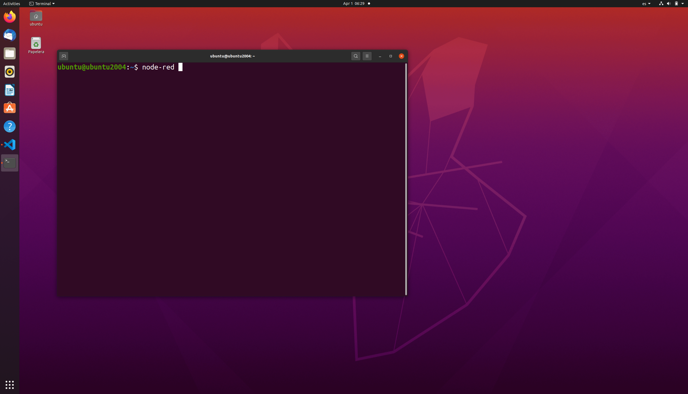

### 2.  Abrir Firefox y conectar al servidor de Node-Red
A continuación, abrid una pestaña de Firefox y teclead `127.0.0.1:1880` en la barra de direcciones.

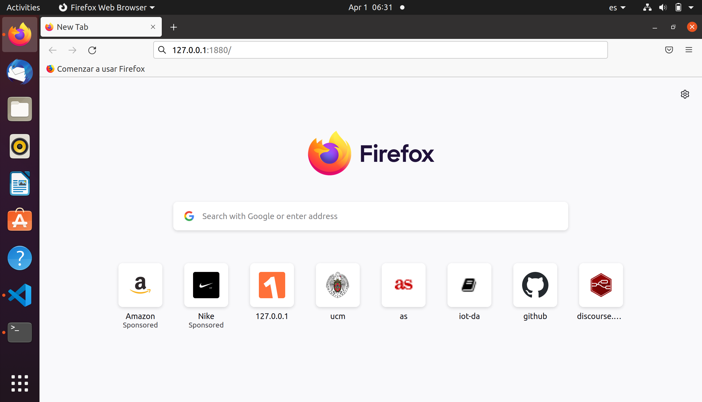

Node-Red tarda unos segundos (a veces casi un minuto) en lanzarse completamente, por lo que quizás os aparezca algún error diciendo que no se encuentra nada. Paciencia. En algún momento, saldrá una web similar a esta:

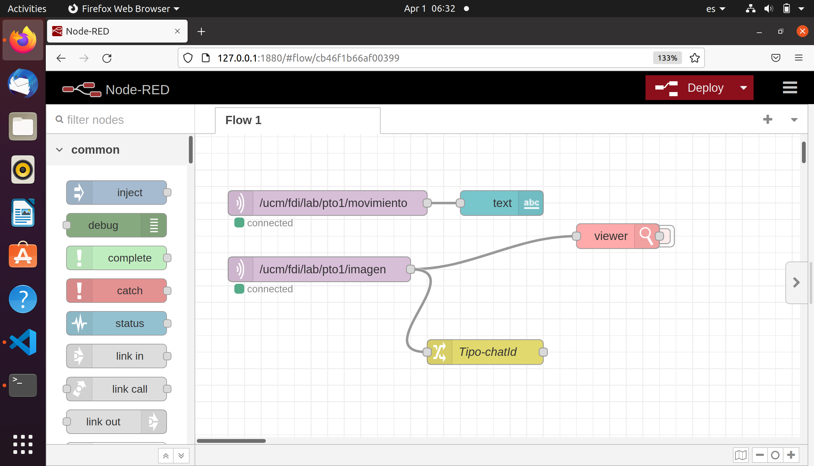

### 3. Configurar el canal de MQTT por el que recibiremos la información de la cámara

Como decíamos en la introducción, la cámara enviará un mensaje de texto y una imagen usando el protocolo MQTT. Cada una de las cámaras está configurada para enviar su información a un canal diferente. Concretamente, la cámara etiquetada como '1' envía un texto al canal `/ucm/fdi/lab/pto1/movimiento` y una imagen al canal  `/ucm/fdi/lab/pto1/imagen`. La cámara etiquetada como '2' lo enviará al canal   `/ucm/fdi/lab/pto2/movimiento` y `/ucm/fdi/lab/pto2/imagen`; y así sucesivamente.

El programa Node-Red que aparece por defecto está preparado para recibir información de la cámara '1'. Si tenéis esa cámara.... podéis saltar este paso.  Si no es el caso, es necesario editar los dos nodos  MQTT que hay al comienzo de la zona de trabajo. Para ello, hacemos doble click en el primero (correspondiente el *canal*  `/ucm/fdi/lab/pto1/movimiento`), y editaremos el campo `Topic` con el número de cámara que tengáis:

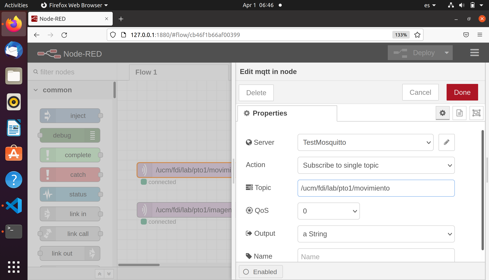

!!! note "Configuración de canales MQTT"
	Cambiad los dos nodos MQTT de Node-Red, tanto el que finaliza con *movimiento* como el que finaliza con *imagen*. Aseguraos de escribid el número de vuestra cámara.
	


### 4. Determinar el ID de vuestro chat en Telegram

Si tenéis vuestro móvil con Telegram instalado, y habéis creado algún *bot*, podréis enlazar Node-Red con ese *bot*. Para ello, lo primero es determinar el *chatID* de vuestro *bot* (ojo; no es el *Token* que os muestra *BotFather* cuando creáis un nuevo *bot*).

Para conocer el *chatID*, vamos a crear un nodo receptor de Telegram para investigar el contenido del paquete recibido.  Empezaremos añadiendo un nodo **Receiver**  desde el panel izquierdo de Node-Red (puedes teclear "Telegram" en la caja de búsqueda para que aparezcan solo los nodos relacionados con Telegram). 

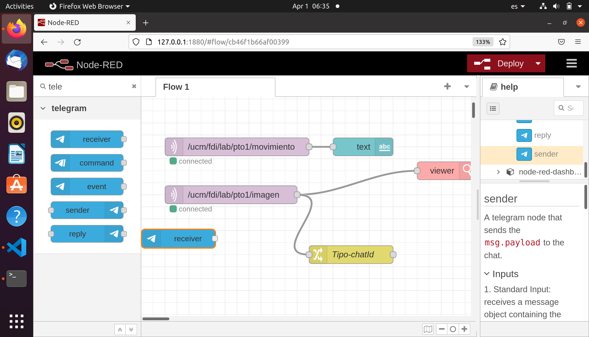

Una vez tengamos ese nodo en nuestra zona de trabajo, haremos doble click en él para editarlo. Aparecerá una ventana similar a la de la imagen, y pulsaremos sobre el icono del lápiz para incluir la información del *bot*:

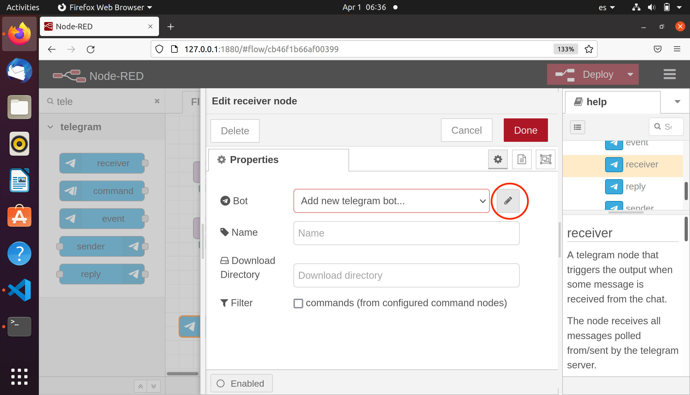

Rellenad los campos ´Name´ y ´Token´ con la información proporcionada por el *BotFather* cuando creasteis el *bot* en Telegram.  En mi caso es:

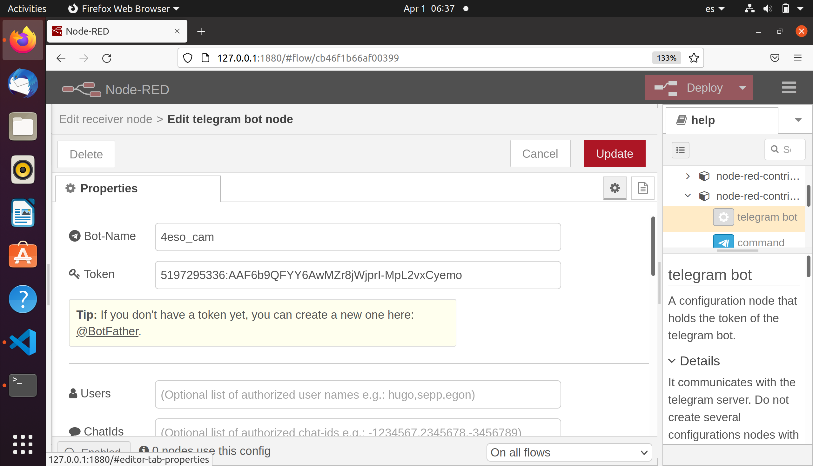

Guarda la configuración y vuelve al espacio de trabajo. Incluye un nodo de tipo *Debug* al espacio de trabajo y, a continuación, únelo con el nodo *Receiver* anterior. Una vez hecho esto, pulsa el botón *Deploy* en la parte superior derecha de la web. Los 3 pasos si ilustran en la siguiente figura:

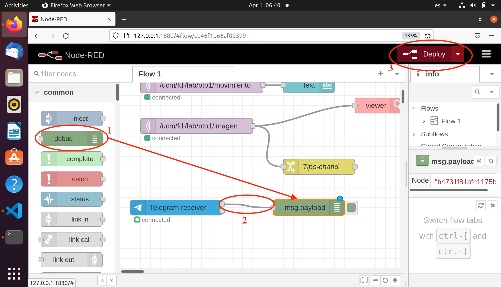

Abre la ventana de depuración 	seleccionando *Debug messages* en el panel derecho:

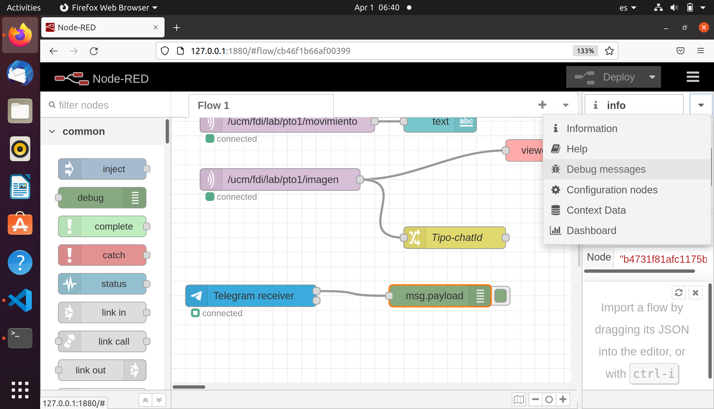

Ahora, envía un mensaje desde tu *bot* de Telegram. Puede ser cualquier texto. En la figura se muestra la información que recibimos si se envió el mensaje *Hola*. Entre otras cosas, conseguiremos nuestro *chatID*:

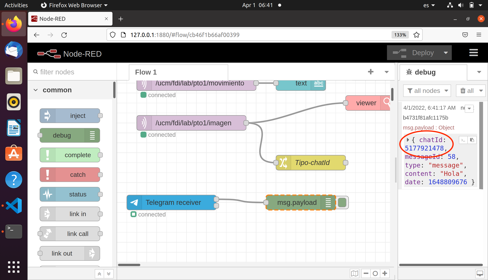

### 5. Configurar el envío de información desde Node-Red.

Entre los nodos que aparecían al abrir por primera vez Node-Red, debería haber un nodo llamado *Tipo-chatId*. Edita dicho nodo haciendo doble click sobre él e incluye el *chatID* en el campo correspondiente:

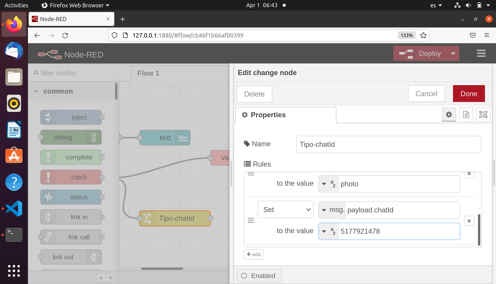
 
De este modo, hemos modificado la información que nos llega desde MQTT (es decir, lo que nos envía la cámara), para incluir en el mensaje el *chatId* de nuestro *bot*, y hacer posible la comunicación con Telegram. 

A continuación sólo debemos incluir un nodo tipo *Sender* de Telegram:

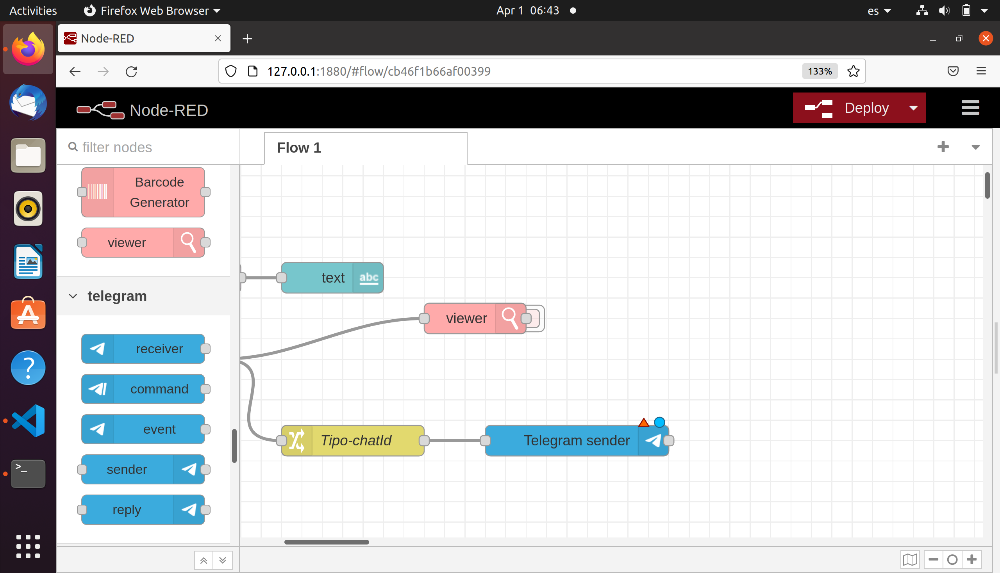

y  editarlo para incluir la información de nuestro *bot*, para que reciba los mensajes que lleguen desde MQTT:


## Conectad la cámara.

Ya tenemos preparado todo el sistema de recepción y procesamiento de información. Sólo queda encender la cámara para que comience a enviar los datos.

Sacad la placa de la caja y tratad de dejarla con la cámara hacia arriba y sujeta, de modo que esté lo más estable posible.
Conectad el cable microUSB al  conector de la placa.  Conectad el otro extremo a cualquier puesto del PC para alimentar la placa a través de ese equipo.

A partir de ese momento, la cámara estará tomando imágenes constantemente y comparándolas entre sí para detectar variaciones. Si detecta un cambio, enviará la foto por MQTT y se quedará inactiva durante 5 segundos (para evitar el envío de demasiadas imágenes).

La conexión de la cámara al PC  en este momento se hace únicamente para alimentar la cámara, pero el PC no es necesario.  Se podría conectar a un enchufe con un adaptador y funcionaría igualmente: la comunicación de la cámara con el PC NO se produce por USB, sino por WiFi mediante MQTT.


## ¿Cómo crear un bot en Telegram?
Si tienes Telegram, puedes crear *bots* que permiten configurar algunas acciones de forma automática. Existen aplicaciones (externas a Telegram) que ofrecen funcionalidad mediante *bots* (Wikipedia, YouTube. Netflix....). Pero también podemos crear nuestros propios *bots* y darles la funcionalidad que queramos.

Para crear un *bot* primero deberás buscar el *BotFather*. Una vez incluido, basta con utilizar el comando `/newbot`. Después daremos un nombre nuestro *bot* (`4eso_cam` en mi caso) y un nombre de usuario.  Finalmente, obtendremos  
el *token* de este *bot*. que utilizaremos para interaccionar con él desde el exterior (con un interfaz HTTP; lo que se conoce como un a API REST).

En la siguiente imagen se muestra el proceso de creación de mi *bot*:

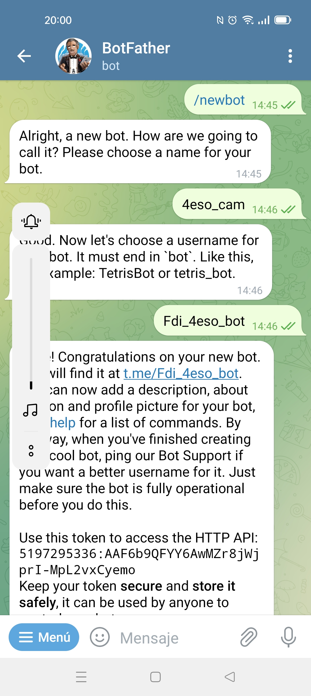


## Reprogramación de la cámara 

Las cámaras (en realidad, el chip ESP32 que controla toda la placa) se programan usando los lenguajes C/C++ en un entorno llamado ESP-IDF (y ESP-WHO), desarrollados por Espressif, la compañía que diseña y fabrica estas placas. Hay muchos detalles del proceso que conoceréis cuando estudiéis *Ingeniería de Computadores* en la UCM, pero hoy vamos a ver lo más básico.

Primero debemos configurar un terminal para poder utilizar el entorno de ESP. Para ello, abre un nuevo terminal y escribe los siguientes comandos:


```console
ubuntu@ubuntu2004:~$ cd esp-idf
ubuntu@ubuntu2004:~$ source ./export.sh 
```
Con esos comandos hemos establecido el entorno necesario para poder comunicarnos con la placa. Ahora iremos al directorio en el que se encuentra el proyecto desarrollado y escribiremos la aplicación nuevamente en la placa. 

Pero antes de hacerlo, debemos conectar la placa (el dispositivo USB) con la máquina virtual Ubuntu en la que estamos haciendo el trabajo.  Asegúrate de tener la cámara conectada al PC;  En el menú *Dispositivos* (o *Devices*) de VirtualBox debe aparecer un dispositivo de tipo USB, llamado *USB to UART* (quizás *CP2102N*). Seleccionando para que la máquina virtual pueda acceder al dispositivo.

Ahora sí, podemos proceder a abrir una conexión USB con la placa mientras está en funcionamiento. En el mismo terminal anterior, teclearemos los siguientes comandos:

```console
ubuntu@ubuntu2004:~$ cd
ubuntu@ubuntu2004:~$ cd  esp-who/examples/mot-detect-mqtt/terminal
ubuntu@ubuntu2004:~$ idf.py monitor
```

A partir de ese momento, comenzaremos a ver información de depuración que la placa está enviando por su puerto serie, vía USB, al PC. El envío de imágenes prosigue por WiFi mediante MQTT a Node-Red; esta información de depuración es útil durante el desarrollo de la aplicación.

Vamos a hacer una variación en el código para volver a escribirlo en la placa. Para ello, usaremos VSCode (Visual Studio Code) como editor.  Abrimos VSCode haciendo click sobre su icono:


Debería abrirse directamente el proyecto que está volcado en la placa. De entre los ficheros del proyecto, ahora nos interesa abrir el fichero `app_main.cpp`:

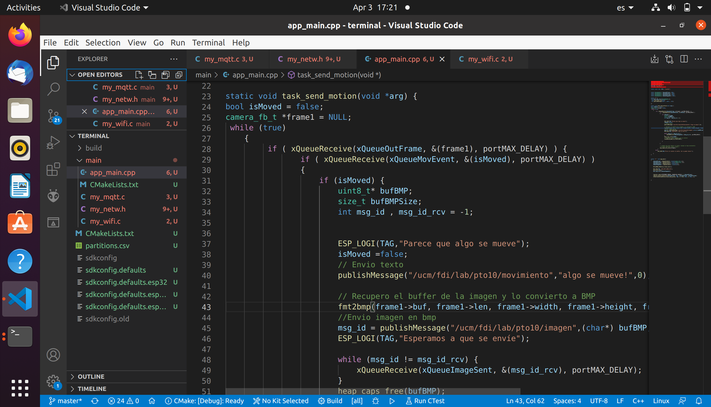

Es un fichero escrito en C++ que contiene el bucle principal del código volcado en la placa (líneas 26 a 66).
Si modificamos cualquier cosa de este fichero (o cualquier otro fichero) del proyecto, deberemos volver a compilarlo y generar así la imagen que volcaremos en la placa (lo que a veces se conoce como *firmware*, que no es más que el código de nuestra aplicación junto con el sistema operativo FreeRTOS, que es el usado en ESP-IDF).  

Para compilar el proyecto y posteriormente escribir la aplicación modificada en la placa, escribiremos los siguientes comandos en el mismo terminal que venimos utilizando en este apartado:

```console
ubuntu@ubuntu2004:~$ idf.py build
ubuntu@ubuntu2004:~$ idf.py flash monitor
```

!!! note "Ejercicio final"
	Tratad de cambiar el canal MQTT por el que vuestra cámara enviará la información. Poned el que queráis, siempre que comience por el carácter /. Modificadlo en el código C++  y volcad el nuevo código en la placa. Modificad asimismo la aplicación de Node-Red y haced un nuevo *Deploy*. Comprobad que todo sigue funcionando correctamente.

!!! danger "Para investigar..."
	Nuestra cámara está publicando información por MQTT. La aplicación Node-Red está suscrita a dos canales por los que espera recibir esa información. Pero.... ¿dónde se envía la información?¿Dónde nos suscribimos? Nos falta por hablar del papel del *broker* MQTT, que es quien hace ese papel intermedio. ¿Sabrías encontrar qué *broker* MQTT estamos usando en este ejemplo? ¿Sabrías localizar en qué país está esa máquina?


