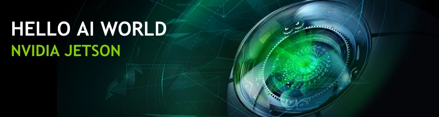
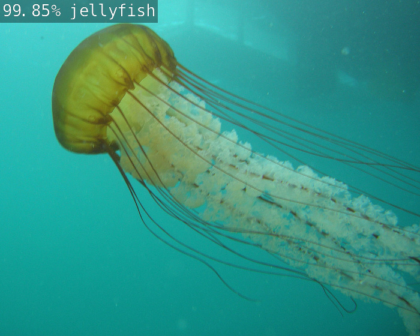
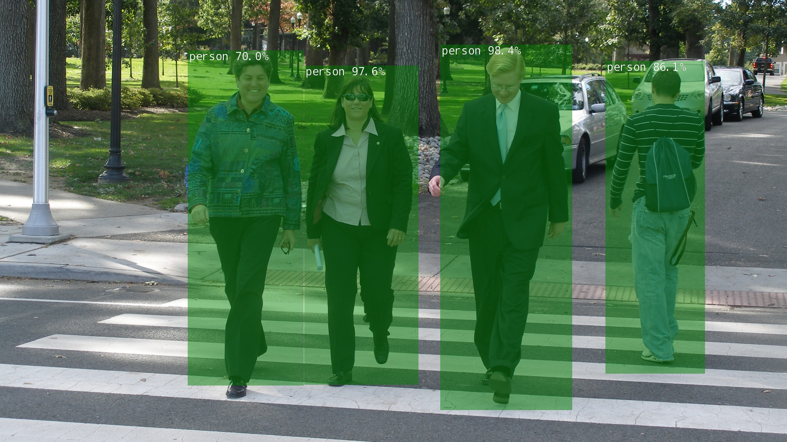

# Week1: Introduction & Setup JetsonNano
* Most of this workshop is available in [YouTube](https://www.youtube.com/watch?v=QXIwdsyK7Rw&list=PL5B692fm6--uQRRDTPsJDp4o0xbzkoyf8&index=10). Fell free to watch by yourself

## Hello AI World
Hello AI World can be run completely onboard your Jetson, including inferencing with TensorRT and transfer learning with PyTorch.  The inference portion of Hello AI World - which includes coding your own image classification and object detection applications for Python or C++, and live camera demos - can be run on your Jetson in roughly two hours or less, while transfer learning is best left to leave running overnight.

### System Setup (previously done)

* [Setting up Jetson with JetPack](https://developer.nvidia.com/embedded/learn/get-started-jetson-nano-devkit#setup)
* [Running the Docker Container](https://github.com/dusty-nv/jetson-inference/blob/master/docs/aux-docker.md)

## Camera Setup
* Instruction about [How to connect CSI Camera](https://developer.nvidia.com/embedded/learn/get-started-jetson-nano-devkit#setup) to the Jetson-Nano can be followed 

!!! danger "Assignment 1"
	Test your camera is running according as the new instructions.
**Please send a message to the professor as soon as you finished**

* Testing your camera running. Most of the information is extracted from [this link](https://developer.nvidia.com/embedded/learn/tutorials/first-picture-csi-usb-camera)
    * To check CSI camera, you can run ```nvgstcapture-1.0```, which will start capture and preview display it on the screen:

```shell
nano@jetson-nano:~/jetson-inference$ more /tmp/test.md 
nano@jetson-nano:~$ nvgstcapture-1.0 
Encoder null, cannot set bitrate!
Encoder Profile = High
Supported resolutions in case of ARGUS Camera
  (2) : 640x480
  (3) : 1280x720
  (4) : 1920x1080
.....
```


* Check rotation 
   * This example command will rotate the image 180 degrees (vertical flip)

```shell
nano@jetson-nano:~$ nvgstcapture-1.0 --orientation 2
.....
```

### Take a picture and save to disk
1. Connect CSI camera
2. Execute in a shell the command *nvgstcapture-1.0 --automate --capture-auto*
3. Open File with *eog nvcamtest_XX.jpg*

### Capture a video and save to disk
1. Connect CSI camera
2. Execute in a shell the command *nvgstcapture-1.0 --mode=2 --automate --capture-auto*
3. Application will record 10 seconds of video
6. Play File recorded with *totem nvcamtest_XX.mp4*

!!! note "Homework (Optional)"
	According to the [options available in the nvgstcapture-1.0 functionality](https://docs.nvidia.com/jetson/l4t/index.html#page/Tegra%20Linux%20Driver%20Package%20Development%20Guide/accelerated_gstreamer.html#wwpID0E0UC0HA), control and adjust the lighting conditions
**Please send a message to the professor as soon as you finished**

## Setup Container
* There are several pre-configured containers to be able to use the Jetson-Nano board
* The most common are related to their use for artificial intelligence and machine learning. The most [popular containers](https://github.com/dusty-nv/jetson-containers) hosted on NVIDIA GPU Cloud (NGC) are the following Docker container images for machine learning on Jetson:
    * l4t-ml
    * l4t-pytorch
    * l4t-tensorflow

### Running Docker Container
* The **pre-built Docker container images** for this lab are hosted on [DockerHub](https://hub.docker.com/r/dustynv/jetson-inference/tags)
    * The containers use the [l4t-pytorch](https://ngc.nvidia.com/catalog/containers/nvidia:l4t-pytorch) base container, so support for transfer learning / re-training is already included




### Inference instructions
* Follow the [github repo instructions](https://github.com/dusty-nv/jetson-inference/blob/master/docs/aux-docker.md) to install the docker image in the Jetson-Nano

```shell
nano@jetson-nano:~$ git clone --recursive https://github.com/dusty-nv/jetson-inference
Cloning into 'jetson-inference'...
remote: Enumerating objects: 20861, done.
....
```

### Launching the Container
*  It's recommended to use the script [**docker/run.sh**](https://github.com/dusty-nv/jetson-inference/blob/master/docker/run.sh) script to run the container
    * ```docker/run.sh``` will automatically pull the correct container tag from DockerHub based on your currently-installed version of JetPack-L4T
    * IMPORTANT: if you are using CSI (Rpi Camera): **--volume /tmp/argus_socket:/tmp/argus_socket**

```shell
nano@jetson-nano:~$ cd jetson-inference/
nano@jetson-nano:~/jetson-inference$ docker/run.sh --volume /tmp/argus_socket:/tmp/argus_socket
reading L4T version from /etc/nv_tegra_release
L4T BSP Version:  L4T R32.6.1
[sudo] password for nano: 
size of data/networks:  79397 bytes
.....
```

* For reference, the following paths automatically get mounted from your host device into the container:
    * *jetson-inference/data* (stores the network models, serialized TensorRT engines, and test images)
    * *jetson-inference/python/training/classification
/data* (stores classification training datasets)
    * *jetson-inference/python/training/classification/models* (stores classification models trained by PyTorch)
    * *jetson-inference/python/training/detection/ssd/data* (stores detection training datasets)
    * *jetson-inference/python/training/detection/ssd/models* (stores detection models trained by PyTorch)

## Running applications
* Once the container is up and running, you can then run example programs from the tutorial like normal inside the container:

```shell
root@jetson-nano:/jetson-inference# cd build/aarch64/bin
root@jetson-nano:/jetson-inference/build/aarch64/bin# ./video-viewer
# (press Ctrl+D to exit the container)
```

!!! danger "Assignment 3"
	Test your camera is running in the Docker Image through the **video-viewer** script
**Please send a message to the professor as soon as you finished**

### Inference of Image Classification
```shell
root@jetson-nano:/jetson-inference# cd build/aarch64/bin
root@jetson-nano:/jetson-inference/build/aarch64/bin# ./imagenet images/jellyfish.jpg images/test/jellyfish.jpg
```
* Note that ```imagenet``` app **classifies** the image *jellyfish.jpg* as a **jellyfish** and store the image solution in the path *data/images/test* with a confidence of 99.85\%



!!! danger "Assignment 4"
	Test Image Classification example running in the Docker Image through the **imagenet** script
**Please send a message to the professor as soon as you finished**

### Inference of Object Detection
```shell
root@jetson-nano:/jetson-inference# cd build/aarch64/bin
root@jetson-nano:/jetson-inference/build/aarch64/bin# ./detectnet images/peds_0.jpg images/test/peds_0.jpg
```
* Note that ```detectnet``` app detects four persons with a confidence of 70.0\%, 97.6\%, 98.4\% and 86.1\% and store the image solution in path *data/images/test*




!!! danger "Assignment 5"
	Test Pedestrian Detection example running in the Docker Image through the **detectnet** script
**Please send a message to the professor as soon as you finished**

### Using other IA Models
* You can Download other models with the script **download-models.sh**


```shell
nano@jetson-nano:~$ cd jetson-inference/tools
nano@jetson-nano:~/jetson-inference$ ./download-models.sh
```


!!! note "Homework (Optional)"
	You can test other image classification models, object detection, etc. by making use of the **download-models.sh** script and launching the inference with the option ```--network```
**Please send a message to the professor as soon as you finished**
