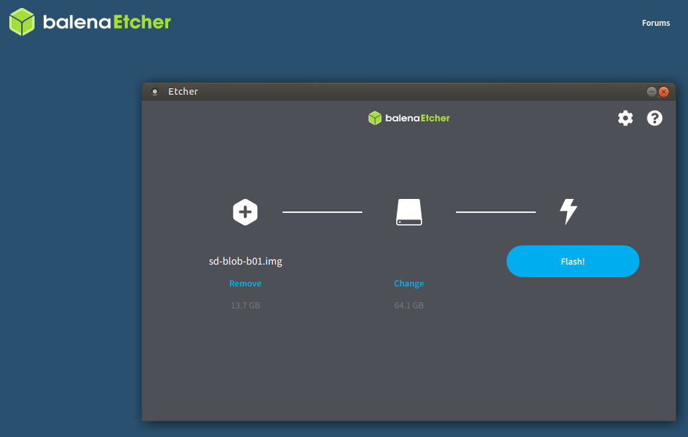
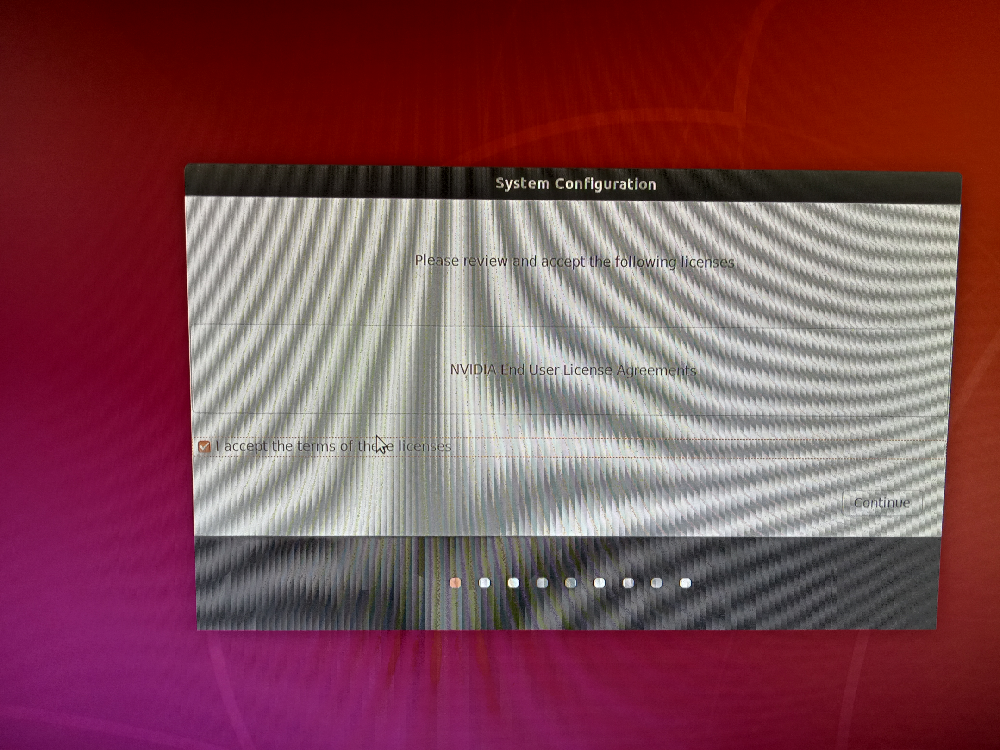
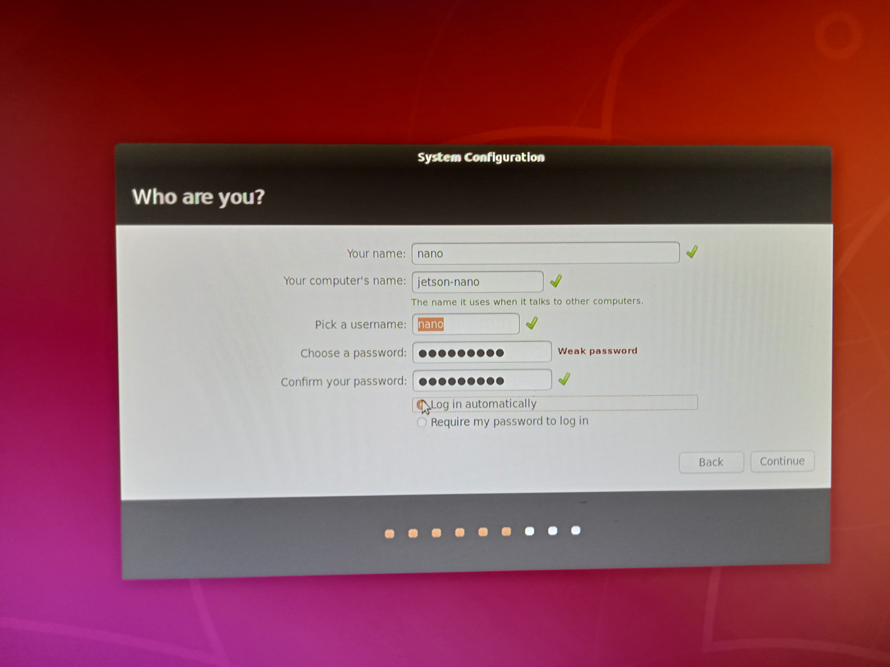
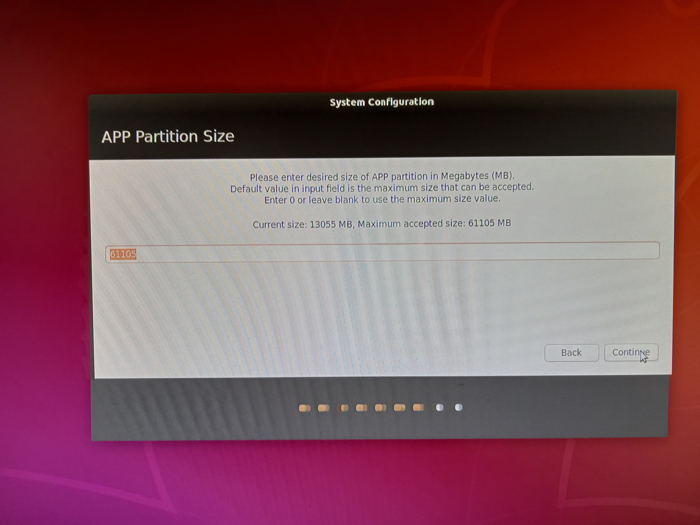
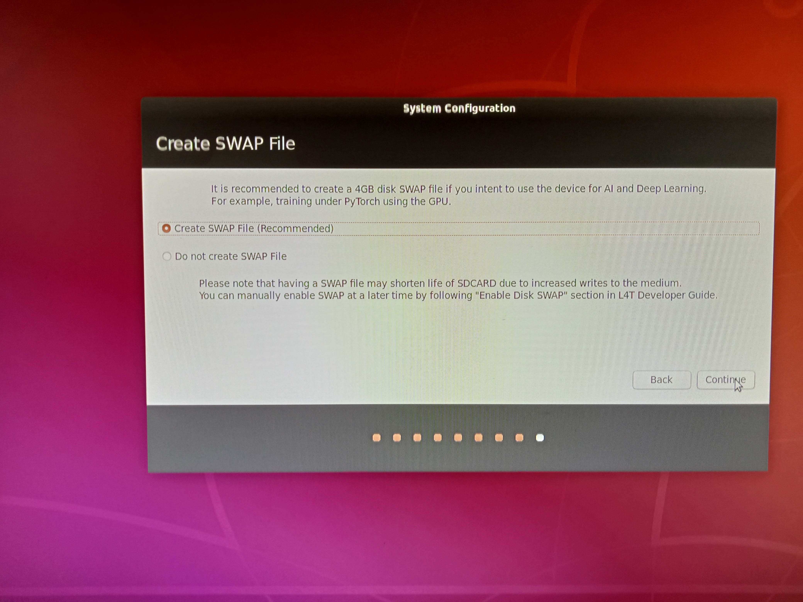
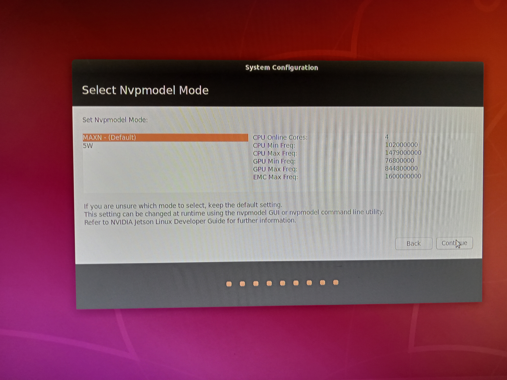
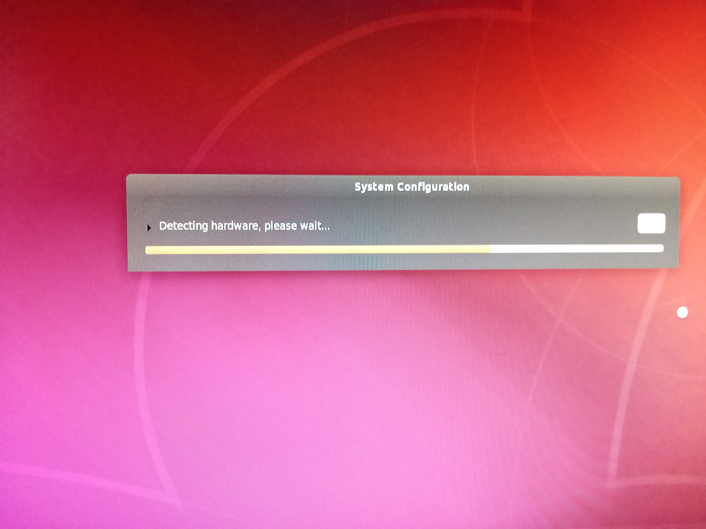
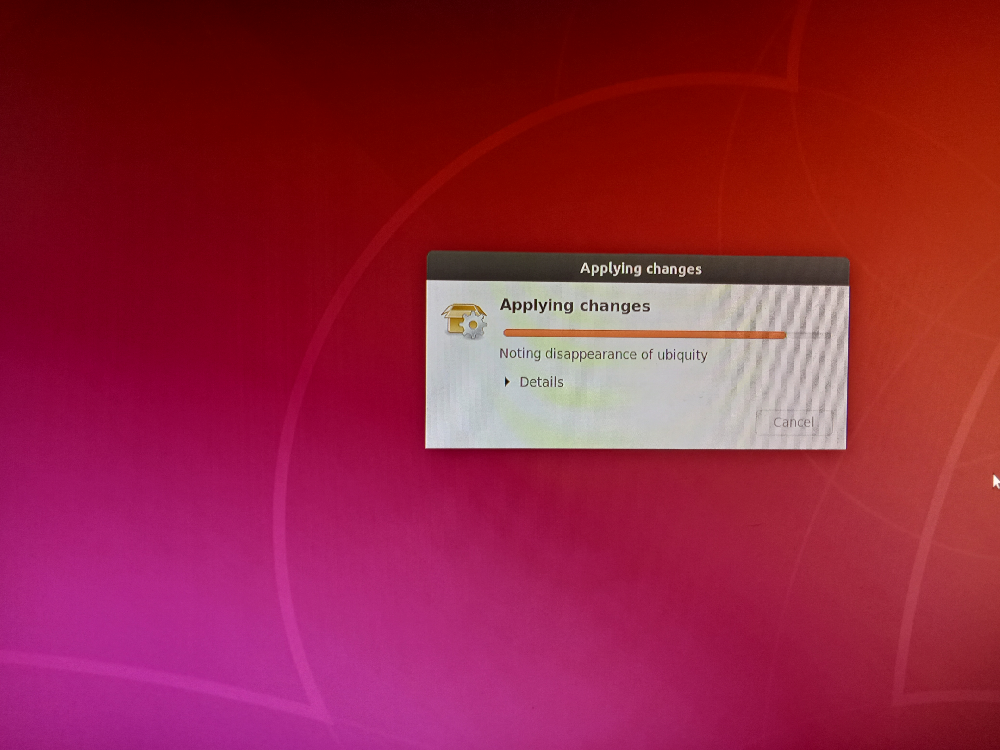
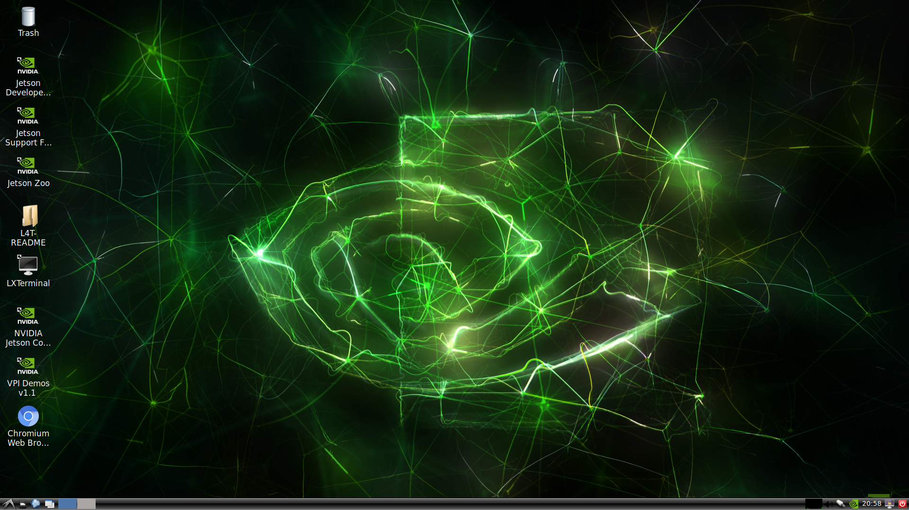

# Week1: Introduction & Setup JetsonNano
* Most of this workshop is available in [YouTube](https://www.youtube.com/watch?v=QXIwdsyK7Rw&list=PL5B692fm6--uQRRDTPsJDp4o0xbzkoyf8&index=10). Fell free to watch by yourself

## System Installation

* [Setting up Jetson with JetPack](https://developer.nvidia.com/embedded/learn/get-started-jetson-nano-devkit#setup)

### Get Stated 
1. Write Image to the microSD Card
2. Setup and First Boot

### Write Image to the microSD Card
* Download SD image from \url{https://developer.nvidia.com/embedded/downloads}
    * IMPORTANT: if you have Jetson-Nano 2GB please download [Jetson Nano 2GB Developer Kit SD Card Image v4.6.1](https://developer.nvidia.com/embedded/l4t/r32_release_v7.1/jp_4.6.1_b110_sd_card/jetson_nano_2gb/jetson-nano-2gb-jp461-sd-card-image.zip)
* Burn the image in a SD Card depending on you own PC Operating System
    * [For Windows link](https://developer.nvidia.com/embedded/learn/get-started-jetson-nano-devkit#collapse-write_windows) 
    * [For MacOS link](https://developer.nvidia.com/embedded/learn/get-started-jetson-nano-devkit#collapse-write_macos) 
    * [For Linux link](https://developer.nvidia.com/embedded/learn/get-started-jetson-nano-devkit#collapse-write_linux)

#### Burning tool
* Flash OS image to SD card with [balena](https://www.balena.io/etcher/)
* **Superuser rights** are required 



### Setup and First Boot
1. Connect the Jetson-Nano board to HDMI connector
2. Insert the SD-Card **previously burnt**
3. Power on your computer display and connect it
4. Connect the USB **keyboard** and **mouse**
    * It is mandatory to first boot
5. Connect your Micro-USB power supply 
    * **The developer kit will power on and boot automatically**


# First Boot
* Green LED will be lighted on
* When you boot the first time, the developer kit will take you through some initial setup, including:
    1. Review and accept NVIDIA Jetson software EULA
    2. Select system language, keyboard layout, and time zone
    3. Create username, password, and computer name (user: **nano**, passwd: **nano_pass**)
    * Select APP partition size-it is recommended to use the max size suggested

## Steps

### Step 1
* Review and accept NVIDIA Jetson software EULA



### Step 2
* Select system language, keyboard layout, and time zone


### Step 3
* Create username, password, and computer name (user: **nano**, passwd: **nano_pass**)



### Step 4
* Select APP partition size-it is recommended to use the max size suggested





### Step 5
* Final system configuration




### Desktop


### Updating the system
```shell
nano@jetson-nano~:$ sudo apt-get update
nano@jetson-nano~:$ sudo apt-get upgrade
```

