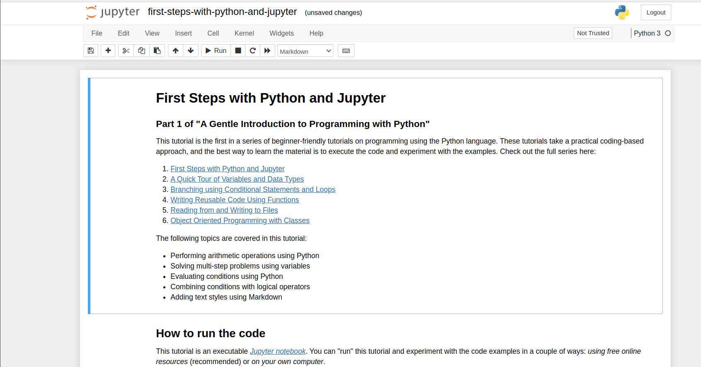

# Week3: Setup ML Container

* The l4t-ml docker image contains TensorFlow, PyTorch, JupyterLab, and other popular ML and data science frameworks such as scikit-learn, scipy, and Pandas pre-installed in a Python 3 environment. You can find all information in [NVIDIA L4T ML](https://catalog.ngc.nvidia.com/orgs/nvidia/containers/l4t-ml)

## Machine Learning Container
* The **l4t-ml** docker image contains *TensorFlow*, *PyTorch*, *JupyterLab*, and other popular ML and data science frameworks such as scikit-learn, scipy, and Pandas pre-installed in a Python 3.6 environment
    * Latest ```l4t-ml:r32.6.1-py3```
        * TensorFlow 1.15.5
        * PyTorch v1.9.0
        * torchvision v0.10.0
        * torchaudio v0.9.0
        * onnx 1.8.0
        * CuPy 9.2.0
        * numpy 1.19.5
        * numba 0.53.1
        * OpenCV 4.5.0 (with CUDA)
        * pandas 1.1.5
        * scipy 1.5.4
        * scikit-learn 0.23.2
        * JupyterLab 2.2.9

## Running the Container on your Jetson-Nano
* First pull one of the **l4t-ml** container:
```shell
nano@jetson-nano:~$ sudo docker pull nvcr.io/nvidia/l4t-ml:r32.6.1-py3
....
```

* Then to start an interactive session in the container, run the following command:

```shell
nano@jetson-nano:~$ sudo docker run --it --gpus all -e DISPLAY=:0 -v /tmp/.X11-unix:/tmp/.X11-unix --network host nvcr.io/nvidia/l4t-ml:r32.6.1-py3
```

## Mounting Directories
* To mount scripts, data, ect. from your Jetson's filesystem to run inside the container, use Docker's -v flag when starting your Docker instance:
```shell
nano@jetson-nano:~$ sudo docker run -it --rm --runtime nvidia --network host -v /home/user/project:/location/in/container nvcr.io/nvidia/l4t-ml:r32.6.1-py3
```

* You should then be able to start a Python3 interpreter

## Connecting to JupyterLab Server
* A JupyterLab server instance is automatically started along with the container.
* You can connect [http://localhost:8888](http://localhost:8888) (or substitute the IP address of your Jetson device)
    * Password: **nvidia**



!!! danger "Assignment 1"
	Run the [Jupyter Notebook](JupyterNotebooks/lab.tar.gz) on Jetson Nano. You can look for more information about how to use the [Jupyter-Notebook](https://realpython.com/jupyter-notebook-introduction/)
**Please send a message to the professor as soon as you finished**

!!! danger "Assignment 2"
	Try to follow the examples of [First Steps of Jupyter and Python](JupyterNotebooks/first-steps-with-python-and-jupyter.ipynb) on your Jetson Nano.
**Please send a message to the professor as soon as you finished**

