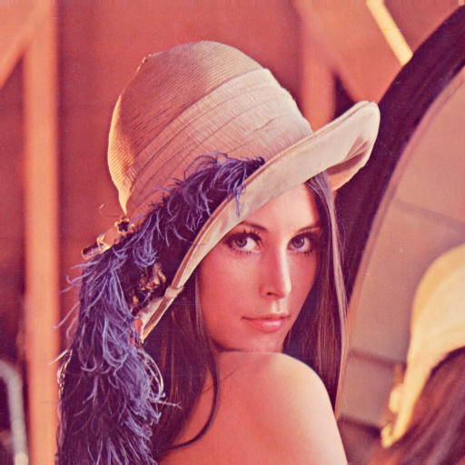

# Week4: Introduction to OpenCV

## Sumary
*  During this week we have worked on the OpenCV image processing library that allows us to interact with images and perform transformations.


## Assigments
* All the assigments related to the setup of Jetson-Nano should be sent to professor by email. As a **Subject** write "[IoT-DA Edge] Assignments Weeks4"
 
### Basic Operations

#### Assigment 1: BasicOperations
!!! danger "Assign 1"
    * Inspect the pixel x=300, y=25 of **../images/input.jpg**
        * Which values have the RGB channels?


#### Assigment 2: BasicOperations
!!! danger "Assign 2"
    * Crop the image "input.jpg" to centered rectangle with half the width and half the height of the **pyramid** in the photo


#### Assigment 3: BasicOperations
!!! danger "Assign 3"
    * Develop a script which create a puzzle of an image (swapping four regions of a picture in clockwise), and one of the quarter only is shown the green channel as in the example
        1. Taking as input the Lena image avaliable in images directory


        2. As an output the image (swapped) should be created


### Image Processing

#### Assigment 4: BitWise Operations
!!! danger "Assign 4"
    * Detecting lane lines on a binary mask
        * Create a masks to be applied e.g. ROI (trapezoid) to lane detection
   


#### Assigment 5: BitWise Operations
!!! danger "Assign 5"
    * Create a code that segmentated the ball of a video using ```cv2.inRange``` function
    * A video can be found in the [link](images/ball_example.mp4) 
   


#### Assigment 6: Contours
!!! danger "Assign 6"
    * Create an application that count the number of coins through an image as in the following images
    * Extra: can be extended using CSI camera in real-time and counting


#### Assigment 7: Hough Transform
!!! danger "Assign 7"
    * Detecting lane lines on a binary mask
       1. Create a masks to be applied e.g. ROI (trapezoid) to lane detection
       2. Detect lane from the road appling the Hough transform

#### Assigment 8: Hough Transform
!!! danger "Assign 8"
    * Using Hough transform, it is also possible to detect [circles](https://en.wikipedia.org/wiki/Circle_Hough_Transform)
       * Use the OpenCV function ```HoughCircles()``` to detect circles in an image. Take as input images the coins examples
           * More info related to ```HoughCircles``` function can be found in [OpenCV documentation](https://docs.opencv.org/3.4/d4/d70/tutorial_hough_circle.html)
