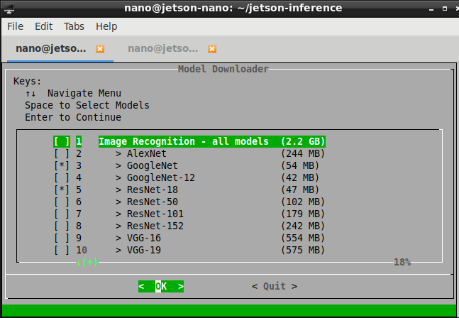

# Classifying Images with ImageNet
* **Note:** information extracted from [NVIDIA laboratories](https://github.com/dusty-nv/jetson-inference/blob/master/docs/imagenet-console-2.md) 

There are multiple types of deep learning networks available, including recognition, detection/localization, and semantic segmentation.  The first deep learning capability we're highlighting in this tutorial is **image recognition**, using classifcation networks that have been trained on large datasets to identify scenes and objects.


The [`imageNet`](https://github.com/dusty-nv/jetson-inference/blob/master/c/imageNet.h) object accepts an input image and outputs the probability for each class.  Having been trained on the ImageNet ILSVRC dataset of **[1000 objects](https://github.com/dusty-nv/jetson-inference/blob/master/data/networks/ilsvrc12_synset_words.txt)**, the GoogleNet and ResNet-18 models were automatically downloaded during the build step.

As an example of using the `imageNet` class, we provide sample programs for C++ and Python:

- [`imagenet.cpp`](https://github.com/dusty-nv/jetson-inference/blob/master/examples/imagenet/imagenet.cpp) (C++) 
- [`imagenet.py`](https://github.com/dusty-nv/jetson-inference/blob/master/python/examples/imagenet.py) (Python) 

These samples are able to classify images, videos, and camera feeds. 


### How to use ImageNet Program on Jetson

First, let's try using the `imagenet` program to test imageNet recognition on some example images.  It loads an image (or images), uses TensorRT and the `imageNet` class to perform the inference, then overlays the classification result and saves the output image. The project comes with sample images for you to use located under the `images/` directory.

After [building](Week1/setup_Jetson-Nano/setup_MLcontainer.md) the project, make sure your terminal is located in the `aarch64/bin` directory:

``` bash
nano@jetson-nano:~$ cd jetson-inference/
nano@jetson-nano:~/jetson-inference$ docker/run.sh 
root@jetson-nano:/jetson-inference# cd jetson-inference/build/aarch64/bin
root@jetson-nano:/jetson-inference/build/aarch64/bin#
```

Next, let's classify an example image with the `imagenet` program, using either the [C++](https://github.com/dusty-nv/jetson-inference/blob/master/examples/imagenet/imagenet.cpp) or [Python](https://github.com/dusty-nv/jetson-inference/blob/master/python/examples/imagenet.py) variants. The [Docker container](Week1/setup_Jetson-Nano/setup_MLcontainer.md) have the `images/test` mounted directory.  These images will then be easily viewable from your host device in the `jetson-inference/data/images/test` directory.  

``` bash
# C++
root@jetson-nano:/jetson-inference/build/aarch64/bin# ./imagenet images/orange_0.jpg images/test/output_0.jpg  # (default network is googlenet)

# Python
root@jetson-nano:/jetson-inference/build/aarch64/bin# ./imagenet.py images/orange_0.jpg images/test/output_0.jpg  # (default network is googlenet)
```


``` bash
# C++
root@jetson-nano:/jetson-inference/build/aarch64/bin# ./imagenet images/strawberry_0.jpg images/test/output_1.jpg

# Python
root@jetson-nano:/jetson-inference/build/aarch64/bin# ./imagenet.py images/strawberry_0.jpg images/test/output_1.jpg
```


### Downloading Other Classification Models

By default, the project will download the GoogleNet and ResNet-18 networks during the build step.

There are other pre-trained models that you can use as well, you could use the **download-models.sh** script to download them:

| Network       | CLI argument   | NetworkType enum |
| --------------|----------------|------------------|
| AlexNet       | `alexnet`      | `ALEXNET`        |
| GoogleNet     | `googlenet`    | `GOOGLENET`      |
| GoogleNet-12  | `googlenet-12` | `GOOGLENET_12`   |
| ResNet-18     | `resnet-18`    | `RESNET_18`      |
| ResNet-50     | `resnet-50`    | `RESNET_50`      |
| ResNet-101    | `resnet-101`   | `RESNET_101`     |
| ResNet-152    | `resnet-152`   | `RESNET_152`     |
| VGG-16        | `vgg-16`       | `VGG-16`         |
| VGG-19        | `vgg-19`       | `VGG-19`         |
| Inception-v4  | `inception-v4` | `INCEPTION_V4`   |




```shell
nano@jetson-nano:~$ cd jetson-inference/tools
nano@jetson-nano:~/jetson-inference$ ./download-models.sh
```

Generally the more complex networks can have greater classification accuracy, with increased runtime.

### Using Different Classification Models

You can specify which model to load by setting the `--network` flag on the command line to one of the corresponding CLI arguments from the table above.  By default, GoogleNet is loaded if the optional `--network` flag isn't specified.

Below are some examples of using the ResNet-18 model:

``` bash
# C++
root@jetson-nano:/jetson-inference/build/aarch64/bin#  ./imagenet --network=resnet-18 images/jellyfish.jpg images/test/output_jellyfish.jpg

# Python
root@jetson-nano:/jetson-inference/build/aarch64/bin#  ./imagenet.py --network=resnet-18 images/jellyfish.jpg images/test/output_jellyfish.jpg
```


``` bash
# C++
root@jetson-nano:/jetson-inference/build/aarch64/bin#  ./imagenet --network=resnet-18 images/stingray.jpg images/test/output_stingray.jpg

# Python
root@jetson-nano:/jetson-inference/build/aarch64/bin#  ./imagenet.py --network=resnet-18 images/stingray.jpg images/test/output_stingray.jpg
```


``` bash
# C++
root@jetson-nano:/jetson-inference/build/aarch64/bin#  ./imagenet --network=resnet-18 images/coral.jpg images/test/output_coral.jpg

# Python
root@jetson-nano:/jetson-inference/build/aarch64/bin#  ./imagenet.py --network=resnet-18 images/coral.jpg images/test/output_coral.jpg
```


### Processing a Video

The [Camera Streaming and Multimedia](../Week1/setup_Jetson-Nano/#camera-setup) can pass the video directly to `imagenet`.  

Here is an example of running it on a video from disk:

``` bash
# Download test video (thanks to jell.yfish.us)
$ wget https://nvidia.box.com/shared/static/tlswont1jnyu3ix2tbf7utaekpzcx4rc.mkv -O jellyfish.mkv

# C++
root@jetson-nano:/jetson-inference/build/aarch64/bin#  ./imagenet --network=resnet-18 jellyfish.mkv images/test/jellyfish_resnet18.mkv

# Python
root@jetson-nano:/jetson-inference/build/aarch64/bin#  ./imagenet.py --network=resnet-18 jellyfish.mkv images/test/jellyfish_resnet18.mkv
```

!!! note "Homework"
	Evaluate the accuracy and inference time of *fruit_0.jpg*, *strawberry_1.jpg* for the image classification models launching the inference with the option ```--network``` for AlexNet, GoogleNet, ResNet-50, VGG-16, Inception-v4
**Please send a message to the professor as soon as you finished**

