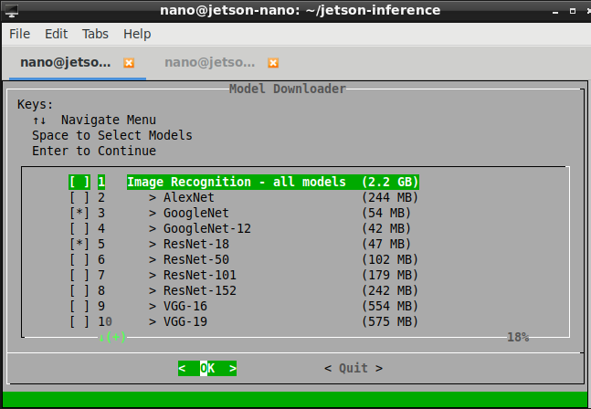

# Objects Detection with DetectNet
The previous recognition examples output class probabilities representing the entire input image.  Next we're going to focus on **object detection**, and finding where in the frame various objects are located by extracting their bounding boxes.  Unlike image classification, object detection networks are capable of detecting many different objects per frame.


The [`detectNet`](https://github.com/dusty-nv/jetson-inference/blob/master/c/detectNet.h) object accepts an image as input, and outputs a list of coordinates of the detected bounding boxes along with their classes and confidence values.  [`detectNet`](https://github.com/dusty-nv/jetson-inference/blob/master/c/detectNet.h) is available to use from [Python](https://rawgit.com/dusty-nv/jetson-inference/python/docs/html/python/jetson.inference.html#detectNet) and [C++](https://github.com/dusty-nv/jetson-inference/blob/master/c/detectNet.h).  See below for various [pre-trained detection models](#pre-trained-detection-models-available)  available for download.  The default model used is a [91-class](https://github.com/dusty-nv/jetson-inference/blob/master/data/networks/ssd_coco_labels.txt) SSD-Mobilenet-v2 model trained on the MS COCO dataset, which achieves realtime inferencing performance on Jetson with TensorRT. 

As examples of using the `detectNet` class, we provide sample programs for C++ and Python:

- [`detectnet.cpp`](https://github.com/dusty-nv/jetson-inference/blob/master/examples/detectnet/detectnet.cpp) (C++) 
- [`detectnet.py`](https://github.com/dusty-nv/jetson-inference/blob/master/python/examples/detectnet.py) (Python) 

These samples are able to detect objects in images, videos, and camera feeds. The [Camera Streaming and Multimedia](../Week1/setup_Jetson-Nano/#camera-setup) can pass the video directly to `detectNet`.  


### Detecting Objects from Images

First, let's try using the `detectnet` program to locates objects in static images.  In addition to the input/output paths, there are some additional command-line options:

- optional `--network` flag which changes the [detection model](objectDetection.md#pre-trained-detection-models-available) being used (the default is SSD-Mobilenet-v2).
- optional `--overlay` flag which can be comma-separated combinations of `box`, `lines`, `labels`, `conf`, and `none`
	- The default is `--overlay=box,labels,conf` which displays boxes, labels, and confidence values
	- The `box` option draws filled bounding boxes, while `lines` draws just the unfilled outlines
- optional `--alpha` value which sets the alpha blending value used during overlay (the default is `120`).
- optional `--threshold` value which sets the minimum threshold for detection (the default is `0.5`).  

If you're using the [Docker container](../Week1/setup_Jetson-Nano/), it's recommended to save the output images to the `images/test` mounted directory.  These images will then be easily viewable from your host device under `jetson-inference/data/images/test`. 

Here are some examples of detecting pedestrians in images with the default SSD-Mobilenet-v2 model:

``` bash
# C++
root@jetson-nano:/jetson-inference/build/aarch64/bin# ./detectnet --network=ssd-mobilenet-v2 images/peds_0.jpg images/test/output.jpg     # --network flag is optional

# Python
root@jetson-nano:/jetson-inference/build/aarch64/bin# ./detectnet --network=ssd-mobilenet-v2 images/peds_0.jpg images/test/output.jpg     # --network flag is optional
```


``` bash
# C++
root@jetson-nano:/jetson-inference/build/aarch64/bin# ./detectnet images/peds_1.jpg images/test/output.jpg

# Python
root@jetson-nano:/jetson-inference/build/aarch64/bin# ./detectnet.py images/peds_1.jpg images/test/output.jpg
```


> **note**:  the first time you run each model, TensorRT will take a few minutes to optimize the network. <br/>
> &nbsp;&nbsp;&nbsp;&nbsp;&nbsp;&nbsp;&nbsp;&nbsp;&nbsp;&nbsp;this optimized network file is then cached to disk, so future runs using the model will load faster.

Below are more detection examples output from the console programs.  The [91-class](https://github.com/dusty-nv/jetson-inference/blob/master/data/networks/ssd_coco_labels.txt) MS COCO dataset that the SSD-based models were trained on include people, vehicles, animals, and assorted types of household objects to detect.


Various images are found under `images/` for testing, such as `cat_*.jpg`, `dog_*.jpg`, `horse_*.jpg`, `peds_*.jpg`, ect. 

### Processing Video Files

You can also process videos from disk. 
``` bash
# Download test video
root@jetson-nano:/jetson-inference/build/aarch64/bin# cd images
root@jetson-nano:/jetson-inference/build/aarch64/bin/images# wget https://nvidia.box.com/shared/static/veuuimq6pwvd62p9fresqhrrmfqz0e2f.mp4 -O pedestrians.mp4

# C++
root@jetson-nano:/jetson-inference/build/aarch64/bin# ./detectnet pedestrians.mp4 images/test/pedestrians_ssd.mp4

# Python
root@jetson-nano:/jetson-inference/build/aarch64/bin# ./detectnet.py pedestrians.mp4 images/test/pedestrians_ssd.mp4
```

<a href="https://www.youtube.com/watch?v=EbTyTJS9jOQ" target="_blank"></a>

``` bash
# Download test video
root@jetson-nano:/jetson-inference/build/aarch64/bin# cd images
root@jetson-nano:/jetson-inference/build/aarch64/bin/images# wget https://nvidia.box.com/shared/static/i5i81mkd9wdh4j7wx04th961zks0lfh9.avi -O parking.avi

# C++
root@jetson-nano:/jetson-inference/build/aarch64/bin# ./detectnet parking.avi images/test/parking_ssd.avi

# Python
root@jetson-nano:/jetson-inference/build/aarch64/bin# ./detectnet.py parking.avi images/test/parking_ssd.avi
```

<a href="https://www.youtube.com/watch?v=iB86W-kloPE" target="_blank"></a>

Remember that you can use the `--threshold` setting to change the detection sensitivity up or down (the default is 0.5).

### Pre-trained Detection Models Available

Below is a table of the pre-trained object detection networks available for [download](https://github.com/dusty-nv/jetson-inference/blob/master/docs/building-repo-2.md#downloading-models), and the associated `--network` argument to `detectnet` used for loading the pre-trained models:

| Model                   | CLI argument       | NetworkType enum   | Object classes       |
| ------------------------|--------------------|--------------------|----------------------|
| SSD-Mobilenet-v1        | `ssd-mobilenet-v1` | `SSD_MOBILENET_V1` | 91 ([COCO classes](https://github.com/dusty-nv/jetson-inference/blob/master/data/networks/ssd_coco_labels.txt))     |
| SSD-Mobilenet-v2        | `ssd-mobilenet-v2` | `SSD_MOBILENET_V2` | 91 ([COCO classes](https://github.com/dusty-nv/jetson-inference/blob/master/data/networks/ssd_coco_labels.txt))     |
| SSD-Inception-v2        | `ssd-inception-v2` | `SSD_INCEPTION_V2` | 91 ([COCO classes](https://github.com/dusty-nv/jetson-inference/blob/master/data/networks/ssd_coco_labels.txt))     |
| DetectNet-COCO-Dog      | `coco-dog`         | `COCO_DOG`         | dogs                 |
| DetectNet-COCO-Bottle   | `coco-bottle`      | `COCO_BOTTLE`      | bottles              |
| DetectNet-COCO-Chair    | `coco-chair`       | `COCO_CHAIR`       | chairs               |
| DetectNet-COCO-Airplane | `coco-airplane`    | `COCO_AIRPLANE`    | airplanes            |
| ped-100                 | `pednet`           | `PEDNET`           | pedestrians          |
| multiped-500            | `multiped`         | `PEDNET_MULTI`     | pedestrians, luggage |
| facenet-120             | `facenet`          | `FACENET`          | faces                |



```shell
nano@jetson-nano:~$ cd jetson-inference/tools
nano@jetson-nano:~/jetson-inference$ ./download-models.sh
```


### Running Different Detection Models

You can specify which model to load by setting the `--network` flag on the command line to one of the corresponding CLI arguments from the table above.  By default, SSD-Mobilenet-v2 if the optional `--network` flag isn't specified.

For example, if you chose to download SSD-Inception-v2 with the [Model Downloader](https://github.com/dusty-nv/jetson-inference/blob/master/docs/building-repo-2.md#downloading-models) tool, you can use it like so:

``` bash
# C++
root@jetson-nano:/jetson-inference/build/aarch64/bin# ./detectnet --network=ssd-inception-v2 input.jpg output.jpg

# Python
root@jetson-nano:/jetson-inference/build/aarch64/bin# ./detectnet.py --network=ssd-inception-v2 input.jpg output.jpg
```


!!! danger "Assignment"
	Evaluate the accuracy and inference time of *peds_3.jpg*, *humans_7.jpg* for the object detection models launching the inference with the option ```--network``` for PedNet, SSD-Mobilenet-v2, SSD-Inception-v2, MultiPed
**Please send a message to the professor as soon as you finished**

