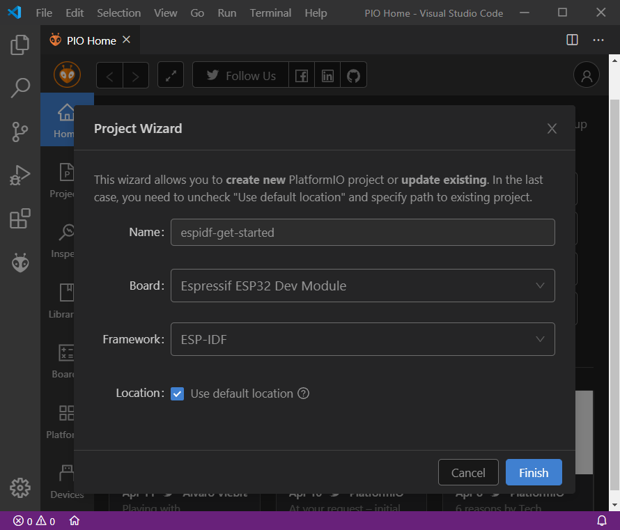

# Introduction to ESP-IDF and Platform IO. First project

## Goals

* Build your first project using PlatformIO
* Connect your ESP32 meshkit-sense  board to the computer and upload a simple application
* Monitor your application using the serial port


## Create a PlatformIO project

Whenever you want to create a new project, you can add it using the PlatformIO interface.  First, click the *PlatformIo Home* icon:


From the "PIO Home" tab, select "New Project" and the *Project Wizard* window will show up:



In that window:

* Write your  project name (do not use white spaces)
* Select *Espressif ESP32 Dev Module*  as *Board*
* Select *Espressif IoT Development framework* as *Framework*
* If you want to choose an *ad-hoc* location for your project, unselect *Use default location*
* Press *Finish*

You are done! Your first ESP-IDF project in PlatformIO is already created.

!!! danger "Stop and Sync"
	If you reach this step, please contact the instructor in the chat to let him/her know. 
	
## Project configuration
Before proceeding with the application coding, you should configure the project so the framework knows where to find the device and how to communicate with it. There are two main options that we need to specify in the project configuration. Follow the next steps to do it;

* Double click the file *platformio.ini* to open it in the editor.
* By default it has three options included: `platform`, `board`, `framework`. We are going to include two more below those three:
	* `monitor_speed = 115200`
	* `upload_port = /tty/USB1`

Note that the `upload_port` specified above is the one used by default in the Virtual Machine provided. If you are not using it, make sure you write the correct port name.

## Including source code
The new project will automatically create a *src* folder, including a default *main.c* file with the following content:

```c
void app_main()
{
}
```
We are going to write a very simple *Hello World* application. Write the following code in *main.c* file:

```c
#include <stdio.h>
#include "freertos/FreeRTOS.h"
#include "freertos/task.h"

void app_main(void)
{

   while (1) {
   	printf("Hello world!\n");
        vTaskDelay(1000 / portTICK_PERIOD_MS);
  }
  vTaskDelete(NULL);
}
```
Once you have written the source code, you can proceed to build the project.  To do so, you can display the  *Project Tasks* (`View->Command Palette`) and execute  `PlatformIO: Build`. You could also press the `Build` button (*check* button in the bottom pane).


If the building process works ok (it may take a few minutes the first time)  you should see a message similar to:


!!! danger "Stop and Sync"
	If you reach this step, please contact the instructor in the chat to let him/her know. 
	

## Flashing the project
Once we have our application built (note that our source code is linked with the whole ESP-IDF environment, including *FreeRTOS*), we are ready to upload it to our ESP32 device (this operation is commonly known as *flash* because we will be writing the binary file in flash memory). 

First, plug the ESP32 MeshKit to the ESP-Prog board with the provided connection.  Then, connect the microUSB wire to the corresponding ESP-Prog port and plug the USB end of the wire to your computes USB port. If you are using a virtual machine, you will need to claim the device from the virtual machine, as the host will very likely keep the device by default.

Once you are done physically connecting the devices, you can proceed with the uploading. You can use the  `PlatformIO: Upload` task from *Project Tasks* or click in the corresponding button of the bottom pane:


## Monitoring the project

Finally, you can open a serial connection from your computer to the device to monitor the progress.  You can select `PlatformIO: Monitor` from the *Project Tasks* or click the *plug* button in the bottom pane:
 


Once done, you should see the message *Hello World" in your screen once every second.

Congrats! You have uploaded your first ESP32 project!

!!! danger "Stop and Sync"
	If you reach this step, please contact the instructor in the chat to let him/her know. 
	

## Tasks / Homework

!!! note "Task"
	Keep a snapshot of your screen at the end of every section (i.e. whenever a *Stop and Sync* message appears in these instructions) and paste them in a PDF file including the information of your group (names of each of the members of the group). Send the PDF file to the instructor (jigomez@ucm.es) **by the end of this session** (just one file per group).
	
	
!!! note "Homework"
	Modify the *Hello World* project so that it prints 10 messages, then it waits for 5 seconds and finally restarts the system. You can find which function you could use for the reset in the [official ESP-IDF documentation](https://docs.espressif.com/projects/esp-idf/en/latest/esp32/api-reference/system/system.html). Send the modified source code (only the file *main.c*) to the instructor before the start of next session (just one file per group).
