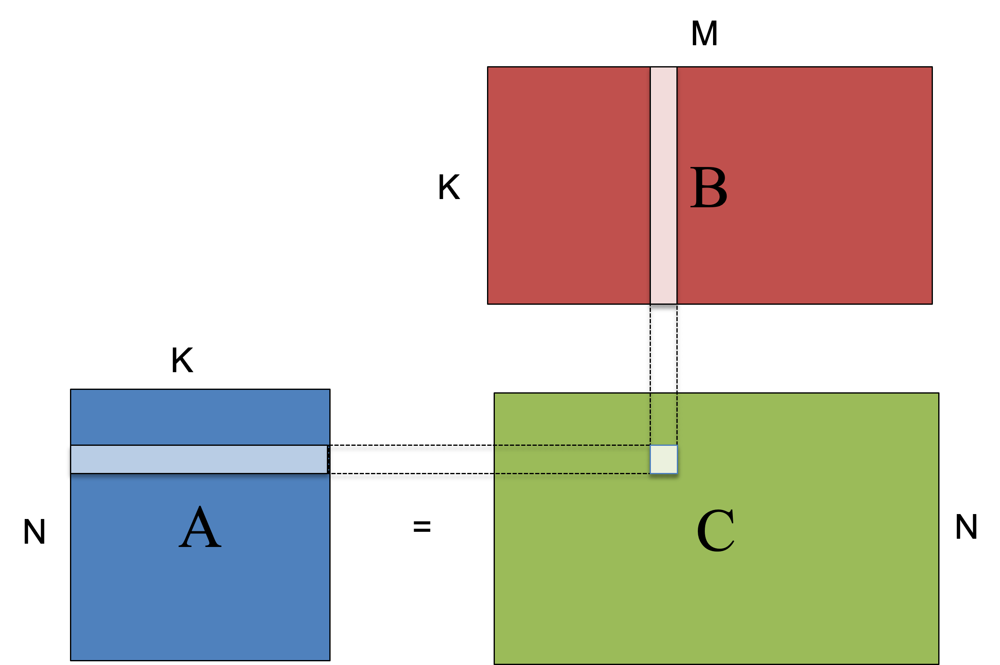

# Task management in FreeRTOS (ESP-IDF)

## Goals

* Learn the task related API offered by ESP-IDF
* Create multi-tasked applications where tasks effectively cooperate to a common goal.


## Matrix multiplication

Matrix multiplication is a key kernel in many applications (for example, in Neural Network training and inference). 
It is an example of a massively parallel computation, where all the elements of the output matrix (*C* in the image below) can be computed in parallel.



The most basic pseudo-code of the matrix multiplication is shown below:

```c
for i = 0 to N
  for j = 0 to M
	  C[i][j] = 0
 	  for k=0 to K
		 C[i][j] += A[i][k]*B[k][j]
```
where loops *i* and *j* are fully parallel. 


!!! danger "Assignment 1"
	Create a new project and write a function that will multiply two matrix (received as input arguments) and write the result in a third matrix (also provided as argument). You can choose N=8, M= 8, K =8 and *uint32_t* as element type. To make it easier to check the output, you can initialize B matrix as the identity matrix. **Please send a message to the professor as soon as you finished**
	
	
## Simple parallelisation

In this exercise you will create two tasks. The first task will process the even rows of *A* (*i=0,2,4,6...*) and the second task will take care of the even rows.

The main task (the one executing *app_main()*) will simply create both task and then destroy itself.

!!! danger "Assignment 2"
	Create a new project and implement the simple parallelization. Check the result with your previous sequential version. **Please send a message to the professor as soon as you finished**


## Work dispatching

In this last (optional) exercise, you will implement a different parallelisation strategy: a *Controller* task ) will write pairs *<i,j>* in a queue (from 0 to N-1).  A set of *Worker tasks* will read from that queue, obtain one pair *<i,j>* and multiply row *i* of matrix A by column *j* of matrix B, and write the result as element *[i,j]* of matrix C.

The *Controller* task will insert all the pairs in the queue and then *wait* in a semaphore for the *Worker* tasks to complete. 

	
!!! note "Homework (Optional)"
	Create a new project and implement this alternative. Try creating a different number of *Worker* tasks (from 1 to 4, for example) and measure the execution time. You may use`esp_timer_get_time()` to compute the total time.


