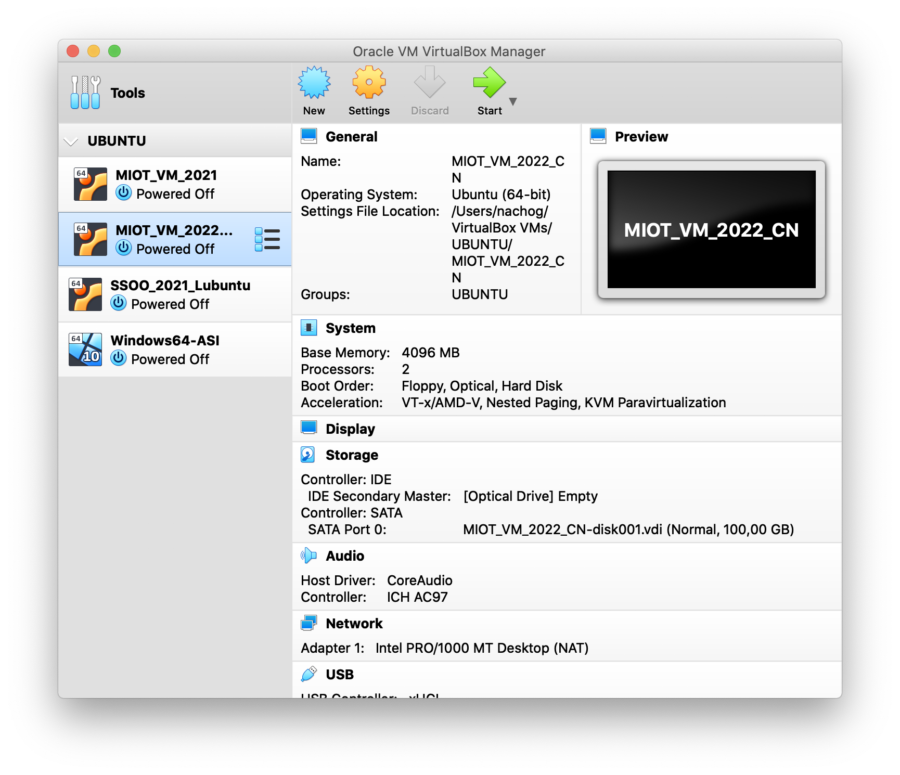
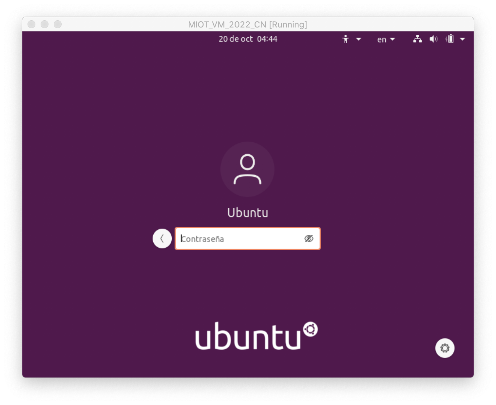
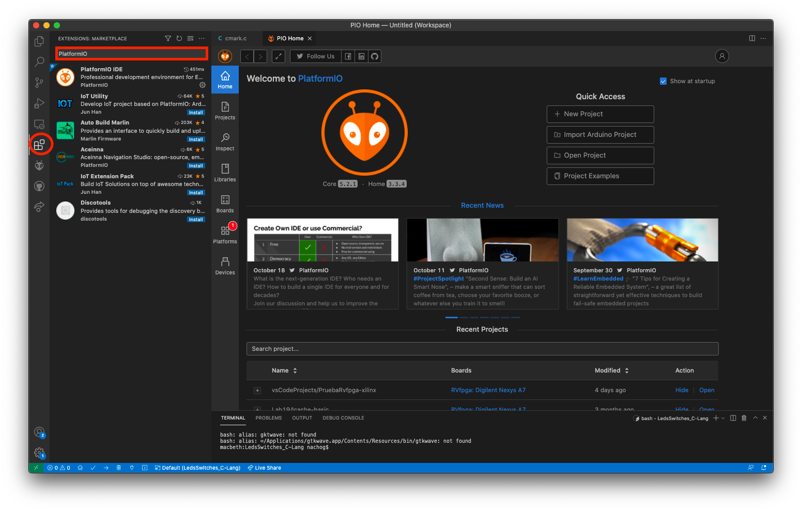

# Introduction to ESP-IDF and Platform IO (demo)

## Goals

* Meet the IDE we will be using during the Master: native ESP-IDF and the tool PlatformIO
* Learn how to run  the virtual machine and install the environments
* Learn how to connect our ESP32 board to the computer and upload a binary

## Using the Virtual Machine

We have provided a virtual machine with some of the tools we will be using already installed. Note that you can install everything natively in your system, and I will run faster. We provide the virtual machine just in case you prefer not to install new software in your own computer.

You can download the OVA file  from [Google Drive](https://drive.google.com/file/d/1PYeX4PDDk63yAljhoXuL_VtkmBD1wF4N/view) or [Baidu Netdisk](https://pan.baidu.com/s/1EhKZv6WzqXyZPpYrc7KxlQ) (with code 7spz).  An OVA file  contains a OVF  (Open Virtualizaion Format) file so it can be opened in any virtualization framework.

During the course, we will be using [Oracle VM Virtualbox](https://www.oracle.com/virtualization/technologies/vm/downloads/virtualbox-downloads.html) which is a free and open-source hosted hypervisor for x86 virtualization. In order to run the virtual machine just follow the steps:

* Download Virtual Box [from this link](https://www.oracle.com/virtualization/technologies/vm/downloads/virtualbox-downloads.html).
* Install Virtual Box in your machine.
* Download the OVA file provided.
* *Import* the OVA file from Virtual Box (Use "Import" or "Import Appliance" from the File menu. Do not just drag the OVA file in the Virtual Box window)

After importing the virtual machine is imported it should be listed in Virtual Box screen (the one named *MIOT_VM_2022_CN*)



Now, you can run the virtual machine. We have installed a recent version of Ubuntu operating system (Ubuntu 20.04.1 LTS). There is a sinlge user (named Ubuntu) whose password is *ubuntu* (small-caps). 



## Launching Visual Studio Code and PlatformIO

During this online demo, I will show you how to use Visual Studio Code and the PlatformIO plugin to create a new project, compile it and upload it to our board.

You can install this environment in your own machine, which is recommended since virtualization introduces some overheads.  You can download [Visual Studio Code from this link](https://code.visualstudio.com/). Once installed, you can easily install the [PlatformIO plugin](https://platformio.org/) from the *Extensions: Marketplace* in the same Visual Studio Code window:



## Installing the native ESP-IDF environment

There is an alternative to PlatformIO: installing the native [Espressif](https://www.espressif.com/) environment for ESP-IDF.  You have all the steps to install and setup their environment in [this link](https://docs.espressif.com/projects/esp-idf/en/stable/esp32/get-started/index.html)

Just a summary of the information there provided (please check the website, because it could be updated),  we include here the most relevant steps for the environment installation in the Ubuntu terminal machine. 

* Open a Terminal and make sure your package system is up to date:

```sh
sudo apt update
sudo apt upgrade
```

* Run the following command to install the pre-requisites (note that you will be using *sudo* to run it with superuser privileges. The user *Ubuntu*  has *sudo* privileges, so just use the same password as before when required: *ubuntu*).

```sh
sudo apt-get install git wget flex bison gperf python python3-pip python-setuptools cmake ninja-build ccache libffi-dev libssl-dev dfu-util
```

If you are installing the environment in your own Linux machine, make sure your user is also in the `dilaout` group. 


* Install Python 3 and make it the default distribution:

```sh
sudo apt-get install python3 python3-pip python3-setuptools
sudo update-alternatives --install /usr/bin/python python /usr/bin/python3 10
```

* Obtain ESP-IDF sources. We will install it under a folder called *esp*

```sh
mkdir -p ~/esp
cd ~/esp
git clone --recursive https://github.com/espressif/esp-idf.git
cd esp-idf
git fetch
git pull
git submodule update --init --recursive
```

* Now you can proceed to install the environment by using the provided script in *esp-idf* folder. This should be done only once.

```sh
sh install.sh
```

* Every time you are to use the environment after opening a new Terminal, you should export some environment variables by running the *export* script provided in the *esp-idf* folder:

```sh
. ./export.sh
```

* You are now ready to use the environment. *idf.py* is the front-end tool for everything: compiling, flashing , monitoring... You can now check the installed version by running:

```sh
$ idf.py --version
ESP-IDF v4.xxxxx
```


