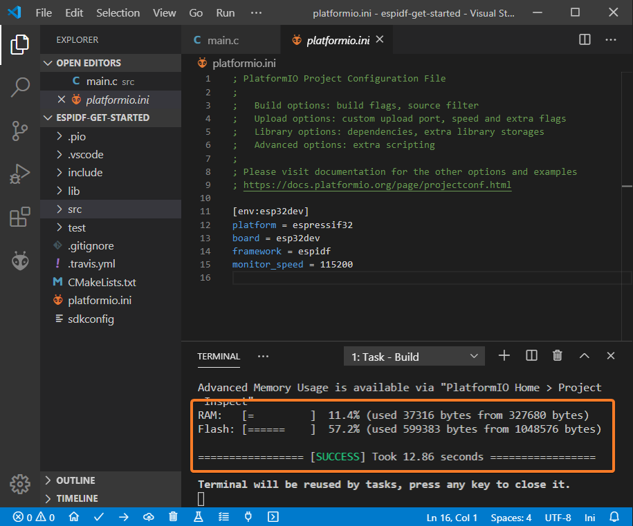
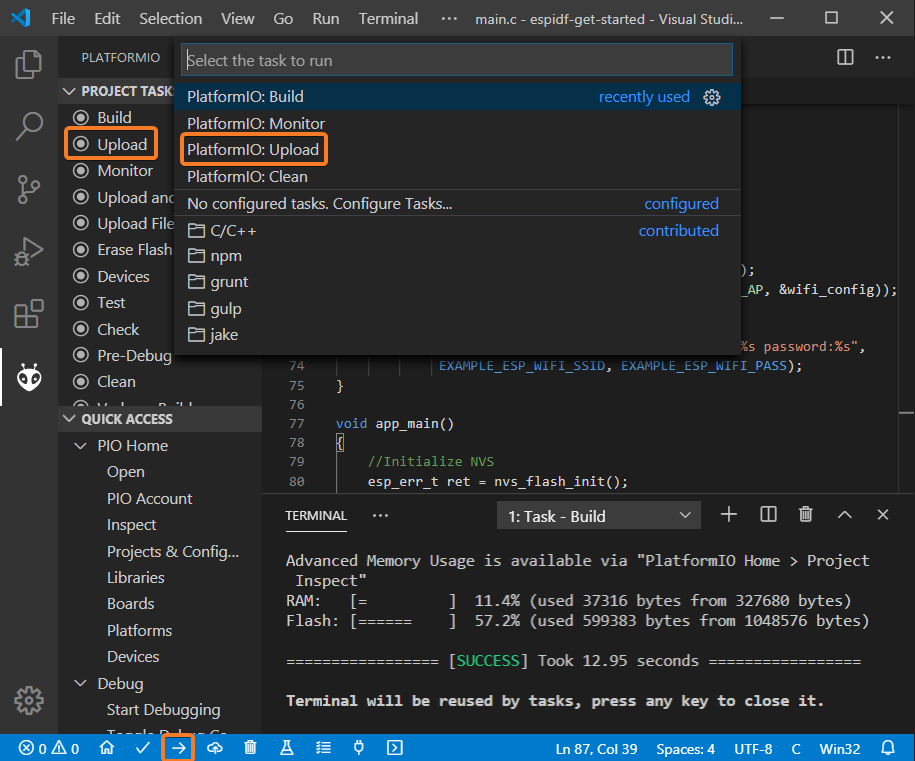

# Lab 1. Introduction to the ESP-IDF development environment

ESP-IDF (*Espressif IoT Development Framework*) is the official development
environment from Espressif for ESP32 and ESP32-S SoCs. It allows to develop
*efficient* firmwares for said boards using the WiFi and Bluetooth communication
interfaces, as well how to manage multiple characteristics of the SoCs that we
will be covering in future practices.

ESP-IDF uses [FreeRTOS](https://freertos.org) as RTOS for the construction of
the *firmware*, although it adds a multitude of components to offer support for
higher level interaction with communication protocols, both low and high level,
most of them in the field of the Internet of Things.

This lab assignment is intended to be a basic introduction to setting up
running the ESP-IDF development environment on a Linux operating system,
offering two basic alternatives: command line and a specific plugin
for VSCode (PlatformIO). In addition, we will see in a superficial way the
basic structure of a simple program developed using ESP-IDF, as well as examples
basic for the start-up of the WiFi interface on an ESP32 board.

## Work flow. Commnad line toolset

### Installation of prerequisites

ESP-IDF requires certain software packages installed on the system in order to
develop the codes and download them onto the ESP32. Below we show the
requirements and installation process for Ubuntu/Debian based machines (like the
virtual machine used for this course), although the ESP-IDF documentation
includes instructions for other distributions and operating systems, including
Windows and MacOS.

In your virtual machine, install the necessary packages using (like
Super user):

```sh
sudo apt install git wget flex bison gperf python python3-pip python-setuptools cmake ninja-build ccache libffi-dev libssl-dev dfu-util
```

In addition, it is necessary for the user to belong to the `dialout` group (you
can edit the `/etc/group` file by adding your user to the line that indicates
the corresponding group, and starting again your session). Alternativelly you
can use the *adduser* command.

Check the version of python that your system is using:
```sh
python --version
```
If it is not a version 3 but a version 2, you should install python3 on your
system and make it the default python. In modern debian based distros python3 is
already de default and you can install the *python-is-python3* package to have a
symbolic link called python pointing to python3.

```sh
sudo apt install python-is-python3
```

### Obtaining ESP-IDF

We will use the versions of ESP-IDF obtained directly from the
official Github repository. For it, run from your home directory:

```sh
mkdir -p ~/esp
cd ~/esp
git clone --recursive https://github.com/espressif/esp-idf.git
cd esp-idf
git submodule update --init --recursive
```

### Installation of additional tools

From the `esp-idf` directory, run the `install.sh` script to install
the tools (*toolchain*) specific to your version:

```sh
sh install.sh
```

### Environment preparation

After the start of each session, you will need to set correct values for certain
environment variables. Fortunately a script is provided (`export.sh`)
which will allow you to set them automatically:

```sh
. export.sh
```

You can add this line to any login file so you don't have I run the command
every time (for instance to your $HOME/.bashrc).

In any case, at this point you should have access to a program called
`idf.py`, that will be used to manage the workflow. Check it out.

### Project preparation

In this first part, we will use a simple code example. The goal is not to
analyze in detail the the structure of that code (at least not for now), but to
use it to illustrate the typical workflow in an ESP-IDF project.

!!! danger "Remember"
	After executing the `export.sh` script, you will have an environment
	variable defined named `IDF_PATH`. Check its value and check that it points,
	effectively, to the IDF installation directory. We will use it at from now
	on to refer to it.

To get started, take the `hello_world` example provided as part of the
installation IDF basic, and copy it to any directory on the filesystem:

```sh
cp -R $IDF_PATH/examples/get-started/hello_world $HOME/
cd $HOME/hello_world
```

### Build

The basic build process uses the `idf.py` script:

```sh
idf.py build
```

If everything went well, the object files will have been generated and stored in
the `build` directory, and the binaries will be ready to be *flashed* on the
ESP32.

### Flash

Connect the ESP32 using the microUSB cable, and if you are working in a virtual
machine, you have to make it visible to the hosted OS (for example, in
VirtualBox, through the menu *Devices->USB->Silicon Labs USB to UART Bridge
Controller*).

In any case, the output of the `dmesg` command after connecting the device 
will provide you with information about the PORT that you should use in the
flash process and subsequent monitoring.

The basic flash process uses the `idf.py` script:

```sh
idf.py -p flash PORT
```

### Monitoring

If everything went well, the monitoring process will allow you to observe the
output of the program that is running on the board. For this we use again the
`idf.py` script:

```sh
idf.py -p PORT monitor
```

!!! danger "Note"
	Check that, you can indeed carry out the compilation process, flash and
	monitoring the program on the ESP32 board. Remember that the `EN` button,
	right next to the microUSB connector, will force a resetting it.

## Work flow. PlatformIO and vscode IDE

The above workflow can also be developed from other development environments.
In our case, the main steps are shown below for ESP-IDF integration with VSCode,
using [PlatformIO](http://platformio.org). The virtual machines provided in the
course already have the latest version of PlatformIO and ESP-IDF installed, so
we refer the reader to the official PlatformIO documentation to perform such
installation on other operating systems.


### Setting up a project

The easiest way to create a new project is to press the button
*PlatformIO Home* located at the bottom of the screen:


Next, click on *New Project* and select as development board
*ESP DevkitC* or *Espressif ESP32 Dev Module*. Select *ESP-IDF*
as a development *framework* for the project:


### Adding files to a project

Create a new `main.c` file in the` src` directory of your project, or modify the
one that already exists using, for example, the following code:


```c
#include <string.h>
#include "freertos/FreeRTOS.h"
#include "freertos/task.h"
#include "esp_system.h"
#include "esp_wifi.h"
#include "esp_event.h"
#include "esp_log.h"
#include "nvs_flash.h"

#include "lwip/err.h"
#include "lwip/sys.h"

#define EXAMPLE_ESP_WIFI_SSID      "mywifissid"
#define EXAMPLE_ESP_WIFI_PASS      "mywifipass"
#define EXAMPLE_MAX_STA_CONN       (3)

static const char *TAG = "wifi softAP";

static void wifi_event_handler(void* arg, esp_event_base_t event_base,
                                    int32_t event_id, void* event_data)
{
    if (event_id == WIFI_EVENT_AP_STACONNECTED) {
        wifi_event_ap_staconnected_t* event = (wifi_event_ap_staconnected_t*) event_data;
        ESP_LOGI(TAG, "station "MACSTR" join, AID=%d",
                 MAC2STR(event->mac), event->aid);
    } else if (event_id == WIFI_EVENT_AP_STADISCONNECTED) {
        wifi_event_ap_stadisconnected_t* event = (wifi_event_ap_stadisconnected_t*) event_data;
        ESP_LOGI(TAG, "station "MACSTR" leave, AID=%d",
                 MAC2STR(event->mac), event->aid);
    }
}

void wifi_init_softap()
{
    tcpip_adapter_init();
    ESP_ERROR_CHECK(esp_event_loop_create_default());

    wifi_init_config_t cfg = WIFI_INIT_CONFIG_DEFAULT();
    ESP_ERROR_CHECK(esp_wifi_init(&cfg));

    ESP_ERROR_CHECK(esp_event_handler_register(WIFI_EVENT, ESP_EVENT_ANY_ID, &wifi_event_handler, NULL));

    wifi_config_t wifi_config = {
        .ap = {
            .ssid = EXAMPLE_ESP_WIFI_SSID,
            .ssid_len = strlen(EXAMPLE_ESP_WIFI_SSID),
            .password = EXAMPLE_ESP_WIFI_PASS,
            .max_connection = EXAMPLE_MAX_STA_CONN,
            .authmode = WIFI_AUTH_WPA_WPA2_PSK
        },
    };
    if (strlen(EXAMPLE_ESP_WIFI_PASS) == 0) {
        wifi_config.ap.authmode = WIFI_AUTH_OPEN;
    }

    ESP_ERROR_CHECK(esp_wifi_set_mode(WIFI_MODE_AP));
    ESP_ERROR_CHECK(esp_wifi_set_config(ESP_IF_WIFI_AP, &wifi_config));
    ESP_ERROR_CHECK(esp_wifi_start());

    ESP_LOGI(TAG, "wifi_init_softap finished. SSID:%s password:%s",
             EXAMPLE_ESP_WIFI_SSID, EXAMPLE_ESP_WIFI_PASS);
}

void app_main()
{
    //Initialize NVS
    esp_err_t ret = nvs_flash_init();
    if (ret == ESP_ERR_NVS_NO_FREE_PAGES || ret == ESP_ERR_NVS_NEW_VERSION_FOUND) {
      ESP_ERROR_CHECK(nvs_flash_erase());
      ret = nvs_flash_init();
    }
    ESP_ERROR_CHECK(ret);

    ESP_LOGI(TAG, "ESP_WIFI_MODE_AP");
    wifi_init_softap();
}
```

We will not analyze for the moment the operation of the code (we will do that
later), it basically it establishes a wireless Access Point open to connections
authenticated via WPA2.

### Project Build

To build the project, display the Command Palette (menu `View->Command Palette`)
and run the `PlatformIO: Build` command from it. You can also press the `Build`
button (in the form of *check*) in the bottom bar of PlatformIO:


If all went well, you should see a final message similar to the following in the
system terminal:



### Project flashing

To upload the project to the board, we can use the command `PlatformIO: Upload`
through the command palette, or press the corresponding button on the bottom bar
(with a symbol left arrow):




### Project monitoring

Finally, we can monitor the project using the command `PlatformIO: Monitor`
from the command palette or through the bottom bar, using the button with
a plug as a symbol:


## Analysis of a simple project (*Hello world*) in ESP-IDF

!!! note "Note"
	The following tasks can be performed from the command line or by using
	PlatformIO. We nevertheless suggest you to use the lower level command line
	toolset to become familiar with it.

Look at the general structure of the `hello_world` directory that you compiled
previously. Specifically, we will be interested in inspecting the basic
structure of a main program for ESP-IDF, in this case `hello_world_main.c`.

```c
#include <stdio.h>
#include "sdkconfig.h"
#include "freertos/FreeRTOS.h"
#include "freertos/task.h"
#include "esp_system.h"
#include "esp_spi_flash.h"

void app_main(void)
{
    printf("Hello world!\n");

    /* Print chip information */
    esp_chip_info_t chip_info;
    esp_chip_info(&chip_info);
    printf("This is %s chip with %d CPU cores, WiFi%s%s, ",
            CONFIG_IDF_TARGET,
            chip_info.cores,
            (chip_info.features & CHIP_FEATURE_BT) ? "/BT" : "",
            (chip_info.features & CHIP_FEATURE_BLE) ? "/BLE" : "");

    printf("silicon revision %d, ", chip_info.revision);

    printf("%dMB %s flash\n", spi_flash_get_chip_size() / (1024 * 1024),
            (chip_info.features & CHIP_FEATURE_EMB_FLASH) ? "embedded" : "external");

    printf("Minimum free heap size: %d bytes\n", esp_get_minimum_free_heap_size());

    for (int i = 10; i >= 0; i--) {
        printf("Restarting in %d seconds...\n", i);
        vTaskDelay(1000 / portTICK_PERIOD_MS);
    }
    printf("Restarting now.\n");
    fflush(stdout);
    esp_restart();
}
```

At a high level, the `app_main` function is the entry point to every program
developed using ESP-IDF. More specifically, after the
[system load](https://docs.espressif.com/projects/esp-idf/en/latest/esp32/api-guides/general-notes.html),
the so called *main task* runs the code provided by the user and implemented in
the `app_main` function. Both the amount of its stack and its priority can be
configured by the developer through the ESP-IDF configuration system (as we will
see later). Typically this function is used to carry out initial configuration
tasks or to create and launch other tasks. Anyhow, as in this case, any
functionality can be implemented inside the `app_main` function.

In this example, some generic information about the SoC that is running the
*firmware* is shown in first place:

```c
/* Print chip information */
    esp_chip_info_t chip_info;
    esp_chip_info(&chip_info);
    printf("This is %s chip with %d CPU cores, WiFi%s%s, ",
            CONFIG_IDF_TARGET,
            chip_info.cores,
            (chip_info.features & CHIP_FEATURE_BT) ? "/BT" : "",
            (chip_info.features & CHIP_FEATURE_BLE) ? "/BLE" : "");

    printf("silicon revision %d, ", chip_info.revision);

    printf("%dMB %s flash\n", spi_flash_get_chip_size() / (1024 * 1024),
            (chip_info.features & CHIP_FEATURE_EMB_FLASH) ? "embedded" : "external");

    printf("Minimum free heap size: %d bytes\n", esp_get_minimum_free_heap_size());
```

Then, within a simple loop, the system displays a message and defers the
execution of the task for a specified period of time using the
[vTaskDelay](https://www.freertos.org/a00127.html) function from FreeRTOS. This
function receives the number of *clock ticks* you want to delay. The example
uses the constant `portTIC_PERIOD_MS` to compute the number of ticks for 1000
ms:

```c
    for (int i = 10; i >= 0; i--) {
        printf("Restarting in %d seconds...\n", i);
        vTaskDelay(1000 / portTICK_PERIOD_MS);
    }
```

Finally, the task reboots the system after the completion of the main task:

```c
    printf("Restarting now.\n");
    fflush(stdout);
    esp_restart();
```
!!! note "Task 1.1"
    Modify the suspension period of the task so that it is larger or smaller,
    and check that this effectively modifies the behavior of the
    loaded *firmware*. Modify the program so that it is also showd on the
	screen wether the SoC has WiFi capabilities and includes FLASH memory (you
	can refer to
	[the following page](https://docs.espressif.com/projects/esp-idf/en/latest/esp32/api-reference/system/system.html#_CPPv415esp_chip_info_t)).

### Task creation

The previous project can be redesigned to create an additiona task to execute
the logic of the program instead of having the main FreeRTOS task executing it.
To do this, we need to briefly introduce the basic FreeRTOS API for task
management.

The `xTaskCreate` function (included in` task.h`) creates a new task:

```c
 BaseType_t xTaskCreate( TaskFunction_t pvTaskCode,
                         const char * const pcName,
                         configSTACK_DEPTH_TYPE usStackDepth,
                         void *pvParameters,
                         UBaseType_t uxPriority,
                         TaskHandle_t *pxCreatedTask
                        );
```

Specifically, it creates a new task and adds it to the list of ready to run
tasks, receiving as parameters:

* `pvTaskCode`: a pointer to the input function for the task. Tasks are usually
  implemented as an infinite loop, and should not return or end abruptly. A task
  can be externally destroyed via its handler (last parameter in the creation),
  or internally (from the task code itself), as as shown in the following
  example taken directly from the FreeRTOS documentation:

```c
 void vATaskFunction( void *pvParameters )
    {
        for( ;; )
        {
            -- Task application code here. --
        }

        /* Tasks must not attempt to return from their implementing
        function or otherwise exit.  In newer FreeRTOS port
        attempting to do so will result in an configASSERT() being
        called if it is defined.  If it is necessary for a task to
        exit then have the task call vTaskDelete( NULL ) to ensure
        its exit is clean. */
        vTaskDelete( NULL );
    }
```

* `pcName`: Descriptive name (in string form) of the task to be executed,
    helpfull for debugging purposes.

* `usStackDepth`: size in words of the stack for the task.

* `pvParameters`: parameters to the entry function of the task.

* `uxPriority`: priority assigned to the task.

* `pxCreatedTask`: optional handle for the task.

Thus, the functionality of the `Hello, world` program that we analyzed above
could be restructured using a single task:

```c
void hello_task(void *pvParameter)
{
    printf("Hello world!\n");
    for (int i = 10; i >= 0; i--) {
        printf("Restarting in %d seconds...\n", i);
        vTaskDelay(1000 / portTICK_RATE_MS);
    }
    printf("Restarting now.\n");
    fflush(stdout);
    esp_restart();
}
```

And the task could be created from the main task:

```c
void app_main()
{
    nvs_flash_init();
    xTaskCreate( &hello_task, "hello_task", 2048, NULL, 5, NULL );
}
```

!!! note "Task 1.2"
	Implement a modification of the `hello_world` program that uses two
	independent tasks with different functionality (in this case it is
	enough to only show a different messaga on the screen) and different
	suspension times. Check that, indeed, both tasks are run concurrently.

## Project customization

ESP-IDF uses the `kconfiglib` library to provide a system of Simple and
extensible compile-time project setup. To illustrate its operation, we will
use the `blink` example, that can be found in the ESP-IDF distribution that you
cloned earlier (copy the example to any point in your directory hierarchy before
you begin).

To configure the ESP-IDF project, simply use the following command:

```sh
idf.py menuconfig
```

Executing the above command will allow you to browse a set of general options,
which will allow you to configure the characteristics specific to the project
(for example, selecting the components that you want to enable in its build).

!!! note "Task"
    Navigate through the options that appear in the setup menus to
    familiarize yourself with them. You will use them in future practices.

In the `blink` project, notice that one of the menu options,
called *Example configuration*, includes an option called *Blink GPIO number*.
Beyond its functionality (it defines the number of GPIO pin to enable/disable),
it is of interest to us that this configuration option will define at compile
time the value of a constant (a C preprocessor macro, in this case
`CONFIG_BLINK_GPIO`) that can be used in any file of our project.

!!! note "Note"
	Observe how the `CONFIG_BLINK_GPIO` constant is used in the code of the
	`blink` project.

This configuration option is not part of the default options of ESP-IDF, but has
been added by the developers of the `blink` project.  Observe and study the
format and content of the file `main/Kconfig.projbuild`, provided as part of the
project. It defines the characteristics (name, range, default value and
description) of the new configuration option.

!!! note "Task 1.3"
	Modify the `hello_world` project so that it defines two configuration
	options, that will allow to specify the wait time for each of the two tasks
	that you have defined in your previous solution (Task 1.2). Make use of them
	in your code and verify that indeed its modification through the menu
	system allows a customization of the behavior of your codes.

## Management of WiFi networks. Example 1. WiFi network scanning

As an example, and in preparation for the codes with which we will work in
future lab assignments, we are going to analyze a concrete example of a
*firmware* that scans the available wireless networks within the reach of the
ESP32 node, and reports them through the serial port (we will seem them printed
on the screen if we monitor the node). It will report their main characteristics
for each of the networks detected.

!!! note "Task 1.4"
	Copy the  example located in the directory `examples/wifi/scan` to other
	directory from your *home* folder. Before compiling it, change the maximum
	number of networks to scan through in the example setup menu to 20. Create a
	WiFi access point with your smartphone. Compile the code, flash it and
	monitor the output, and verify that your network is correctly scanned.

Observe its operation. Actually, the *firmware* just scans a subset of the
available networks, reporting some of their characteristics (for example, SSID,
Authentication Mode, or Primary Channel).

!!! note "Task 1.5"
	Analyze the code for the `wifi_scan` function (main task). Specifically,
    focus on the lines that enable and configure scanning of
    networks. Try to understand the general operation of the program, consulting
    and pointing out the role of each line, with special interest to those
	functions prefixed with `esp_wifi_ *`. Write down in a text file
	the role of each of them, consulting the [official documentation](https://docs.espressif.com/projects/esp-idf/en/latest/esp32/api-reference/network/esp_wifi.html).


## Management of WiFi networks. Example 2. Network event management

In this second example you will create a *firmware* that connects the ESP32 as a
station to an existing access point. This example will allow you to observe,
broadly speaking, the event management system in FreeRTOS/ESP-IDF, that we use
to respond to the network events such as obtaining an IP address or successfully
connect to an access point.

!!! note "Task"
	Copy the `station` example located in the directory
	`examples/wifi/getting_started` to another folder in your *home* directory.
	Before compiling it, modify the SSID of the network to which it will try to
	connect, as well as the chosen password through the system setup menus (you
	can use the same access point you created before with your smartphone).

Observe its operation. The *firmware* just initializes the device in *station*
mode (as opposed to the *Access Point* mode), making a connection to the
preconfigured access point through the setup menu.

Analyze the code for the `wifi_init_sta` function. This function, which
implements the main task, is basically divided into two parts:

* **Event management**. Observe the mechanism by which the reception of an event
  is associated with the execution of a specific handler function previously
  registered.

* **Configuration of the connection to an access point**. The connection
  configuration is made through the corresponding fields of a `wifi_config_t`
  structure. Look at the basic fields you need, how the use of WPA2 is enforced
  and how it collects connection data (SSID and password) through the
  configuration system. Observe also how the wireless communication system is
  initialized by the `esp_wifi_start()` call.

!!! note "Task 1.6"
	Modify the *firmware* so that it can use a different *handler* for the event
	of acquiring an IP address and the rest of the events of the WiFi system
	that are already being handled. Check that, the output associated with said
	event continues to be observed, even when both functions are different.
