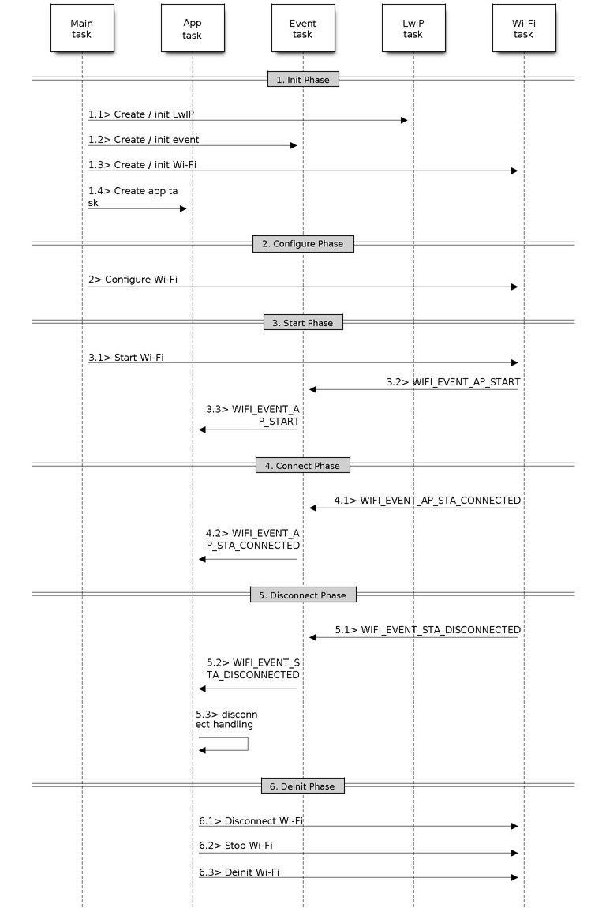

# Lab 2. WiFi in ESP32

## Goals

- Familiarize yourself with the workflow of the WiFi driver in ESP-IDF.
- Understand the difference between *station* and *AP* modes.
- Develop *firmware* that can work as AP for others and as *station* to connect
  to another AP.
- Understand the network scanning mechanisms in ESP-IDF.

## Introduction

The ESP-IDF WiFi libraries and components provide support to configure and
monitor 802.11 connections on ESP32 boards. This includes settings for:

* `Station` mode (WiFi client mode, or *STA*).
  In this case, the ESP32 connects to a preconfigured access point.

* `AP` mode (also called *softAP* or *Access Point* mode). In this case, other
  stations can connect to the ESP32.

* AP-STA combined mode, where ESP32 is concurrently acting as an access point
  and a station connected to another access point.

* Various security modes in both client mode and AP mode (WPA, WPA2, WEP, etc.)

* Access point scanning (active and passive).

* Key provisioning and WPS mode.

* Promiscuous mode for IEEE 802.11 packet monitoring.

In the present lab we will study through basic examples the main features
supported by the WiFi driver. All these characteristics can be used later for
the development of codes and more complex projects with minimal modifications.


### ESP32 Wi-Fi Programming Model

The ESP32 Wi-Fi programming model can be described with the following figure:


The Wi-Fi driver can be considered a black box that knows nothing about
high-layer code, such as the TCP/IP stack, application task, event task, etc.
The application task (code) generally calls Wi-Fi driver APIs to initialize
Wi-Fi and handles Wi-Fi events when necessary. Wi-Fi driver receives API calls,
handles them, and post events to the application.

Wi-Fi event handling is based on the [esp_event
library](https://docs.espressif.com/projects/esp-idf/en/latest/esp32/api-reference/system/esp_event.html).
Events are sent by the Wi-Fi driver to the [default event
loop](https://docs.espressif.com/projects/esp-idf/en/latest/esp32/api-reference/system/esp_event.html#esp-event-default-loops).
Application may handle these events in *callbacks* registered using
`esp_event_handler_register()`. Wi-Fi events are also handled by esp_netif
component to provide a set of default behaviors. For example, when Wi-Fi station
connects to an AP, esp_netif will automatically start the DHCP client by default
(even though this Default behavior can be customized to, for example, assign an
IP address statically).

!!! danger "Note"
	All the API mentioned below is described in depth in
    this [link](https://docs.espressif.com/projects/esp-idf/en/latest/esp32/api-reference/network/esp_wifi.html). It is advisable to have this information during the process
    as well as in this lab document.

### WiFi events

The following list shows the description of the wifi events that are handled in
the example codes we work through in this lab assignment.

* `WIFI_EVENT_SCAN_DONE`

	The scan-done event is triggered by `esp_wifi_scan_start()` and will arise
	in the following scenarios:
	- The scan is completed, e.g., the target AP is found successfully, or all
	  channels have been scanned.
    - The scan is stopped by `esp_wifi_scan_stop()`.
	- The `esp_wifi_scan_start()` is called before the scan is completed. A new
	  scan will override the current scan and a scan-done event will be
	  generated.

	The scan-done event will not arise in the following scenarios:
    - It is a blocked scan.
	- The scan is caused by `esp_wifi_connect()`.

	Upon receiving this event, the event task does nothing. The application
	event callback needs to call `esp_wifi_scan_get_ap_num()` and
	`esp_wifi_scan_get_ap_records()` to fetch the scanned AP list and trigger
	the Wi-Fi driver to free the internal memory which is allocated during the
	scan (do not forget to do this!). Refer to ESP32 Wi-Fi Scan for a more
	detailed description.

* `WIFI_EVENT_STA_START`

	If `esp_wifi_start()` returns ESP_OK and the current Wi-Fi mode is station
	or station/AP, then this event will arise. Upon receiving this event, the
	event task will initialize the LwIP network interface (netif). Generally,
	the application event callback needs to call `esp_wifi_connect()` to connect
	to the configured AP.

* `WIFI_EVENT_STA_STOP`

	If `esp_wifi_stop()` returns ESP_OK and the current Wi-Fi mode is station or
	station/AP, then this event will arise. Upon receiving this event, the event
	task will release the station’s IP address, stop the DHCP client, remove
	TCP/UDP-related connections and clear the LwIP station netif, etc. The
	application event callback generally does not need to do anything.

* `WIFI_EVENT_STA_CONNECTED`

	If `esp_wifi_connect()` returns ESP_OK and the station successfully connects
	to the target AP, the connection event will arise. Upon receiving this
	event, the event task starts the DHCP client and begins the DHCP process of
	getting the IP address. Then, the Wi-Fi driver is ready for sending and
	receiving data.

	This moment is good for beginning the application work, provided that the
	application does not depend on LwIP, namely the IP address. However, if the
	application is LwIP-based, then you need to wait until the got ip event
	`WIFI_EVENT_STA_GOT_IP` comes in.

* `WIFI_EVENT_STA_DISCONNECTED`

	This event can be generated in the following scenarios:

	- When `esp_wifi_disconnect()`, or `esp_wifi_stop()` is called and the
	  station is already connected to the AP.

	- When `esp_wifi_connect()` is called, but the Wi-Fi driver fails to set up
	  a connection with the AP due to certain reasons, e.g. the scan fails to
	  find the target AP, authentication times out, etc. If there are more
	  than one AP with the same SSID, the disconnected event is raised after
	  the station fails to connect all of the found APs.

	- When the Wi-Fi connection is disrupted because of specific reasons,
	  e.g., the station continuously loses N beacons, the AP kicks off the
	  station, the AP’s authentication mode is changed, etc.

	Upon receiving this event, the default behavior of the event task is to:
    - Shut down the station’s LwIP netif.

	- Notify the LwIP task to clear the UDP/TCP connections which cause the
	  wrong status to all sockets. For socket-based applications, the
	  application callback can choose to close all sockets and re-create them,
	  if necessary, upon receiving this event.

	The most common event handle code for this event in application is to call
	`esp_wifi_connect()` to reconnect the Wi-Fi. However, if the event is raised
	because `esp_wifi_disconnect()` is called, the application should not call
	esp_wifi_connect() to reconnect. It’s application’s responsibility to
	distinguish whether the event is caused by `esp_wifi_disconnect()` or other
	reasons.

* `IP_EVENT_STA_GOT_IP` (was `WIFI_EVENT_STA_GOT_IP`)

	This event arises when the DHCP client successfully gets the IPV4 address
	from the DHCP server, or when the IPV4 address is changed. The event means
	that everything is ready and the application can begin its tasks (e.g.,
	creating sockets).

	The IPV4 may be changed because of the following reasons:
	- The DHCP client fails to renew/rebind the IPV4 address, and the station’s
	  IPV4 is reset to 0.
	- The DHCP client rebinds to a different address.
	- The static-configured IPV4 address is changed.

	Whether the IPV4 address is changed or NOT is indicated by field ip_change
	of ip_event_got_ip_t.

	The socket is based on the IPV4 address, which means that, if the IPV4
	changes, all sockets relating to this IPV4 will become abnormal. Upon
	receiving this event, the application needs to close all sockets and
	recreate the application when the IPV4 changes to a valid one.

* `IP_STA_LOST_IP` (was `WIFI_EVENT_STA_LOST_IP`)

	This event arises when the IPV4 address become invalid.

	IP_STA_LOST_IP doesn’t arise immediately after the Wi-Fi disconnects,
	instead it starts an IPV4 address lost timer, if the IPV4 address is got
	before ip lost timer expires, IP_EVENT_STA_LOST_IP doesn’t happen.
	Otherwise, the event arises when IPV4 address lost timer expires.

	Generally the application don’t need to care about this event, it is just a
	debug event to let the application know that the IPV4 address is lost.

* `WIFI_EVENT_STA_START`

	If `esp_wifi_start()` returns ESP_OK and the current Wi-Fi mode is station or
	station/AP, then this event will arise. Upon receiving this event, the event
	task will initialize the LwIP network interface (netif). Generally, the
	application event callback needs to call esp_wifi_connect() to connect to
	the configured AP.

* `WIFI_EVENT_AP_START`

	Similar to `WIFI_EVENT_STA_START`

* `WIFI_EVENT_AP_STACONNECTED`

	Every time a station is connected to ESP32 AP, the
	`WIFI_EVENT_AP_STACONNECTED` will arise. Upon receiving this event, the
	event task will do nothing, and the application callback can also ignore it.
	However, you may want to do something, for example, to get the info of the
	connected STA, etc.

* `WIFI_EVENT_AP_STADISCONNECTED`

	This event can happen in the following scenarios:
	- The application calls `esp_wifi_disconnect()`, or `esp_wifi_deauth_sta()`,
	  to manually disconnect the station.
	- The Wi-Fi driver kicks off the station, e.g. because the AP has not
	  received any packets in the past five minutes, etc. The time can be
	  modified by `esp_wifi_set_inactive_time()`.
	- The station kicks off the AP.

	When this event happens, the event task will do nothing, but the application
	event callback needs to do something, e.g., close the socket which is
	related to this station, etc.

## Station Mode

The figure describes some usual scenarios in station mode:


The main phases in this mode are analyzed below (not all of them have to be
present necessarily in all settings).

**1. WiFi/LwIP Init Phase**

The following 1-5 steps are the recommended sequence to initialize a
Wi-Fi-/LwIP-based application:

1. The main task calls `esp_netif_init()` to create an LwIP core task and
   initialize LwIP-related work.
2. The main task calls `esp_event_loop_create()` to create a system Event
   task and initialize an application event’s callback function. In the
   scenario above, the application event’s callback function does nothing
   but relaying the event to the application task.
3. The main task calls `esp_netif_create_default_wifi_ap()` or
   `esp_netif_create_default_wifi_sta()` to create default network interface
   instance binding station or AP with TCP/IP stack.
4. The main task calls `esp_wifi_init()` to create the Wi-Fi driver task and
   initialize the Wi-Fi driver.
5. The main task calls OS API to create the application task.

However, it is NOT a must-follow sequence, which means that you can create
the application task in step 1 and put all other initializations in the
application task. Moreover, you may not want to create the application task
in the initialization phase if the application task depends on the sockets.
Rather, you can defer the task creation until the IP is obtained.

**2. WiFi Configuración Phase**

Once the Wi-Fi driver is initialized, you can start configuring the Wi-Fi
driver. In this scenario, the mode is station, so you may need to call
`esp_wifi_set_mode()` (`WIFI_MODE_STA`) to configure the Wi-Fi mode as station.
You can call other `esp_wifi_set_xxx` APIs to configure more settings, such as
the protocol mode, country code, bandwidth, etc. Refer to [ESP32 Wi-Fi
Configuration](https://docs.espressif.com/projects/esp-idf/en/latest/esp32/api-guides/wifi.html#esp32-wi-fi-configuration)
for more information on the operation modes.

Generally, we configure the Wi-Fi driver before setting up the Wi-Fi connection,
but this is NOT mandatory, which means that you can configure the Wi-Fi
connection anytime, provided that the Wi-Fi driver is initialized successfully.
However, if the configuration does not need to change after the Wi-Fi connection
is set up, you should configure the Wi-Fi driver at this stage, because the
configuration APIs (such as `esp_wifi_set_protocol()`) will cause the Wi-Fi to
reconnect, which may not be desirable.

The routine `esp_wifi_set_config ()` allows you to configure the basic aspects
of the WiFi connection. For example, the following code performs a basic WiFi
setup by providing SSID, password, and authentication mode before configuring
the connection:

```c
    wifi_config_t wifi_config = {
        .sta = {
            .ssid = EXAMPLE_ESP_WIFI_SSID,
            .password = EXAMPLE_ESP_WIFI_PASS,
	        .threshold.authmode = WIFI_AUTH_WPA2_PSK,

            .pmf_cfg = {
                .capable = true,
                .required = false
            },
        },
    };
    ESP_ERROR_CHECK(esp_wifi_set_mode(WIFI_MODE_STA) );
    ESP_ERROR_CHECK(esp_wifi_set_config(ESP_IF_WIFI_STA, &wifi_config) );
```

**3. WiFi Start Phase**

1. Call `esp_wifi_start()` to start the Wi-Fi driver.
2. The Wi-Fi driver posts `WIFI_EVENT_STA_START` to the event task; then,
   the event task will do some common things and will call the application
   event callback function.
3. The application event callback function relays the `WIFI_EVENT_STA_START`
   to the application task. We recommend that you call `esp_wifi_connect()`.
   However, you can also call `esp_wifi_connect()` in other phrases after
   the `WIFI_EVENT_STA_START` arises.

**4. WiFi Connect Phase**

1. Once `esp_wifi_connect()` is called, the Wi-Fi driver will start the
   internal scan/connection process.
2. If the internal scan/connection process is successful, the
   `WIFI_EVENT_STA_CONNECTED` will be generated. In the event task, it
   starts the DHCP client, which will finally trigger the DHCP process.
3. In the above-mentioned scenario, the application event callback will
   relay the event to the application task. Generally, the application needs
   to do nothing, and you can do whatever you want, e.g., print a log, etc.

In step 2, the Wi-Fi connection may fail because, for example, the password is
wrong, the AP is not found, etc. In a case like this,
`WIFI_EVENT_STA_DISCONNECTED` will arise and the reason for such a failure will
be provided. For handling events that disrupt Wi-Fi connection, please refer to
phase 6.


**5. Wi-Fi `Got IP` Phase**

1. Once the DHCP client is initialized in step 4.2, the got IP phase will
   begin.
2. If the IP address is successfully received from the DHCP server, then
   `IP_EVENT_STA_GOT_IP` will arise and the event task will perform common
   handling.
3. In the application event callback, `IP_EVENT_STA_GOT_IP` is relayed to
   the application task. For LwIP-based applications, this event is very
   special and means that everything is ready for the application to begin
   its tasks, e.g. creating the TCP/UDP socket, etc. A very common mistake
   is to initialize the socket before `IP_EVENT_STA_GOT_IP` is received. DO
   NOT start the socket-related work before the IP is received.

**6. WiFi Disconnect Phase**

1. When the Wi-Fi connection is disrupted, e.g. because the AP is powered
   off, the RSSI is poor, etc., `WIFI_EVENT_STA_DISCONNECTED` will arise.
2. In the scenario described above, the application event callback function
   relays `WIFI_EVENT_STA_DISCONNECTED` to the application task. We
   recommend that `esp_wifi_connect()` be called to reconnect the Wi-Fi,
   close all sockets and re-create them if necessary.

**7. WiFi IP Change Phase**

1. If the IP address is changed, the `IP_EVENT_STA_GOT_IP` will arise with
   `ip_change` field set to true in the `ip_event_got_ip_t` structure passed
   to the event handler.

2. This event is important to the application. When it occurs, the timing is
   good for closing all created sockets and recreating them.

**8. WiFi Deinit Phase**

1. Call `esp_wifi_disconnect()` to disconnect the Wi-Fi connectivity.
2. Call `esp_wifi_stop()` to stop the Wi-Fi driver.
3. Call `esp_wifi_deinit()` to unload the Wi-Fi driver.

### Analysis of an example (`wifi/getting_started/station`)

!!! danger "Task 2.1"
	Analyze the `station` example, compile it and flash it. Study the treatment
	of events that it carries out, and how these are emitted for real cases. To
	do this, try the following things:
	- connect your ESP32 with an existing access point
	- connect your ESP32 with a non-existent access point
	- turn off the access point while the IP is granted
	Do it while you monitor the ESP32 to see the screen messages of the events
	handlers. If there is no message for one of them modify the code to handle
	it. Deliver the code and a brief report commenting your observations (pdf
	format).

## Access Point Mode

The following figure roughly describes some of the main scenarios
that can occur in *AP (access point)* mode:



The workflow is very similar to that of *station* mode, with the difference
basic type of WiFi configuration to perform (`WIFI_MODE_AP`) and obviously
configuration parameters. Take a look at the following configuration example:

```c
    wifi_config_t wifi_config = {
        .ap = {
            .ssid = EXAMPLE_ESP_WIFI_SSID,
            .ssid_len = strlen(EXAMPLE_ESP_WIFI_SSID),
            .channel = EXAMPLE_ESP_WIFI_CHANNEL,
            .password = EXAMPLE_ESP_WIFI_PASS,
            .max_connection = EXAMPLE_MAX_STA_CONN,
            .authmode = WIFI_AUTH_WPA_WPA2_PSK
        },
    };
    if (strlen(EXAMPLE_ESP_WIFI_PASS) == 0) {
        wifi_config.ap.authmode = WIFI_AUTH_OPEN;
    }

    ESP_ERROR_CHECK(esp_wifi_set_mode(WIFI_MODE_AP));
    ESP_ERROR_CHECK(esp_wifi_set_config(ESP_IF_WIFI_AP, &wifi_config));
```

For more information on the configuration parameters of an Access Point, check
[AP Basic Configuration](https://docs.espressif.com/projects/esp-idf/en/latest/esp32/api-guides/wifi.html#ap-basic-configuration).

### Analysis of an example (`wifi/getting_started/softAP`)

!!! danger "Task 2.2"
	Analyze the `softAP` example, compile it and flash it. Study the treatment
	of events that it carries out, and how these are emitted for real cases. To
	do it, connect different clients (*stations*), either ESP32 or any another
	device, and analyze the generated events and their response. If there is no
	message printed for any of them, add the corresponding handling code.
	Deliver the code and a small report documenting your observations (pdf
	format).

## Combined STA and AP Mode

ESP-IDF supports a mixed mode of connection, in which the ESP32 is both
an access point (AP) and a station (*station*). This mode is configured
using the `ESP_MODE_APSTA` parameter in the invocation of the routine
`esp_wifi_set_mode()`.

Obviously, the code will require two independent `wifi_config_t` structures, one
with the data associated with the point access (field `.ap`) mode and another
with the fields associated with the *station* mode (`.sta` field). In addition,
it will be necessary to invoke the configuration routine (`esp_wifi_set_config`)
with each of these structures. And finally, you also need to invoke the
initialization of `netif` both in *station* mode
(`esp_netif_create_default_wifi_sta()`) an in *AP* mode
(`esp_netif_create_default_wifi_ap()`).

### Exercise: develop a *station/AP* mixed node

!!! danger "Task 2.3"
    Modify the `station` example so that the ESP32 behaves at the same time
    as a station and as an access point. Add the necessary configuration options
	to be able to set all the parameters via `menuconfig`. Check that the ESP32
	actually connects to the point access and that at the same time it is
	possible to connect another device to it as a station (for example, your
	mobile phone). Deliver the developed code.

## Scanning WiFi networks

### WiFi Scanning Modes

The WiFi network scanning mode (i.e. invoking the routine
`esp_wifi_scan_start()`) is only supported currently in *station* or
*station/AP* modes. The different types of network scanning modes are:


| Mode                  | Description                                                                                                                                                                                                                 |
| --------------------- | --------------------------------------------------------------------------------------------------------------------------------------------------------------------------------------------------------------------------  |
| Active Scan           | Scan by sending a probe request. The default scan is an active scan.                                                                                                                                                        |
| Passive Scan          | No probe request is sent out. Just switch to the specific channel and wait for a beacon. Application can enable it via the scan_type field of wifi_scan_config_t.                                                           |
| Foreground Scan       | This scan is applicable when there is no Wi-Fi connection in station mode. Foreground or background scanning is controlled by the Wi-Fi driver and cannot be configured by the application.                                 |
| Background Scan       | This scan is applicable when there is a Wi-Fi connection in station mode or in station/AP mode. Whether it is a foreground scan or background scan depends on the Wi-Fi driver and cannot be configured by the application. |
| All-Channel Scan      | It scans all of the channels. If the channel field of wifi_scan_config_t is set to 0, it is an all-channel scan.                                                                                                            |
| Specific Channel Scan | It scans specific channels only. If the channel field of wifi_scan_config_t set to 1-14, it is a specific-channel scan.                                                                                                     |


The scan modes in above table can be combined arbitrarily, so we totally have 8
different scans:

1. *All-Channel Background Active Scan*
2. *All-Channel Background Passive Scan*
3. *All-Channel Foreground Active Scan*
4. *All-Channel Foreground Passive Scan*
5. *Specific-Channel Background Active Scan*
6. *Specific-Channel Background Passive Scan*
7. *Specific-Channel Foreground Active Scan*
8. *Specific-Channel Foreground Passive Scan*


### Scan Configuration

The scan type and other per-scan attributes are configured by
`esp_wifi_scan_start()`. The table below provides a detailed description of
*wifi_scan_config_t*.

| Field       | Description                                                                                                                                                                                                            |
| ----        | ----                                                                                                                                                                                                                   |
| ssid        | If the SSID is not NULL it is only the AP with the same SSID that can be scanned.                                                                                                                                      |
| bssid       | If the BSSID is not NULL it is only the AP with the same BSSID that can be scanned.                                                                                                                                    |
| channel     | If `channel` is 0 there will be an all-channel scan; otherwise there will be a specific-channel scan.                                                                                                                  |
| show_hidden | If `show_hidden` is 0 the scan ignores the AP with a hidden SSID; otherwise the scan considers the hidden AP a normal one.                                                                                             |
| scan_type   | If `scan_type` is `WIFI_SCAN_TYPE_ACTIVE` the scan is `active`; otherwise it is a `passive` one.                                                                                                                       |
| scan_time   | This field is used to control how long the scan dwells on each channel. See [Scan Configuration](https://docs.espressif.com/projects/esp-idf/en/latest/esp32/api-guides/wifi.html#scan-configuration) for more details |

### Scan All APs on All Channels (Foreground)

The following figure describes a basic scan over all channels in foreground
(remember that it can only occur in *station* mode when it is not yet connected
to an AP).


**1. Scan Configuration Phase**

1. Call esp_wifi_set_country() to set the country info if the default
   country info is not what you want, refer to Wi-Fi Country Code.
2. Call esp_wifi_scan_start() to configure the scan. To do so, you can refer to
   Scan Configuration. Since this is an all-channel scan, just set the
   SSID/BSSID/channel to 0.

**2. WiFi Driver's Internal Scan Phase**

1. The Wi-Fi driver switches to channel 1, in case the scan type is
   `WIFI_SCAN_TYPE_ACTIVE`, and broadcasts a probe request. Otherwise, the Wi-Fi
   will wait for a beacon from the APs. The Wi-Fi driver will stay in channel 1
   for some time. The dwell time is configured in min/max time, with default
   value being 120 ms.
2. The Wi-Fi driver switches to channel 2 and performs the same operation as in
   step 2.1.
3. The Wi-Fi driver scans the last channel N, where N is determined by the
   country code which is configured in step 1.1.

**3. Scan-Done Event Handling Phase**

1. When all channels are scanned, WIFI_EVENT_SCAN_DONE will arise.
2. The application’s event callback function notifies the application task that
   `WIFI_EVENT_SCAN_DONE` is received. `esp_wifi_scan_get_ap_num()` is called to
   get the number of APs that have been found in this scan. Then, it allocates
   enough entries and calls `esp_wifi_scan_get_ap_records()` to get the AP
   records. Please note that the AP records in the Wi-Fi driver will be freed,
   once `esp_wifi_scan_get_ap_records()` is called. Do not call
   `esp_wifi_scan_get_ap_records()` twice for a single scan-done event. If
   `esp_wifi_scan_get_ap_records()` is not called when the scan-done event
   occurs, the AP records allocated by the Wi-Fi driver will not be freed. So,
   make sure you call `esp_wifi_scan_get_ap_records()`, yet only once.

### Analysis of an example (`wifi/scan`)

Analyze the scan example, and try to observe the flow detailed above.

!!! danger "Task 2.4"
    Compile, flash and run the scan sample. See if the results are what you
	expected in your home environment. Study and modify the waiting times in the
	scan and see the effect on the scan time. Deliver a brief report with your
	observations (pdf format).
