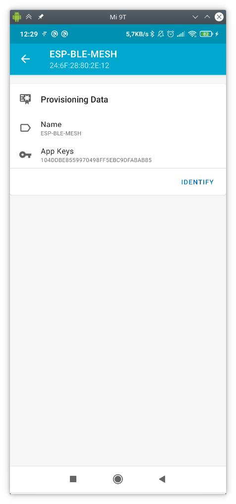
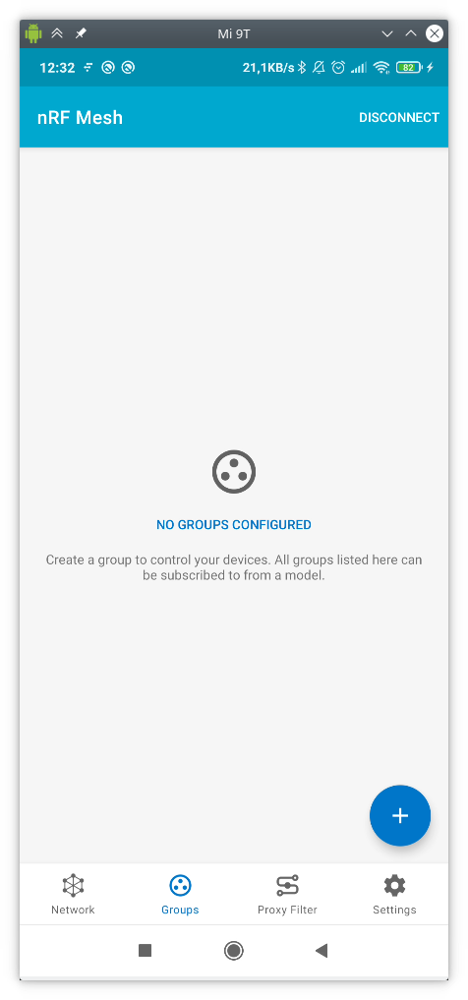
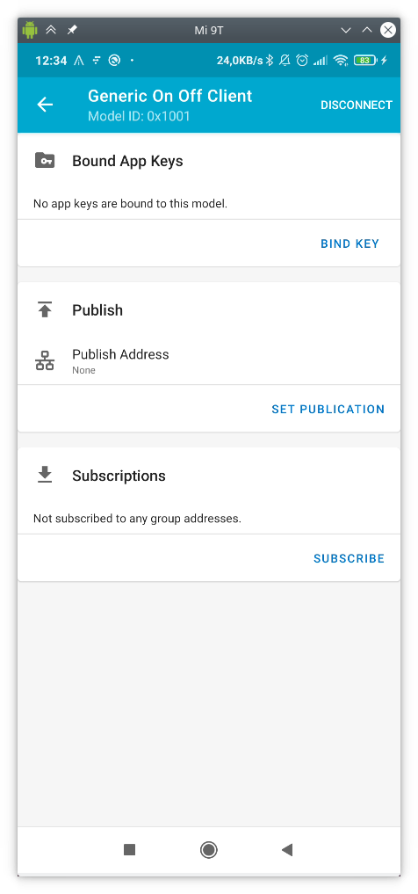

# Lab 5. Bluetooth Mesh (BLE MESH)

## Goals

* Put into practice the concepts studied in theory in relation to BLE MESH,
  specifically the provisioning and client/server models.

* Deploy a provisioning infrastructure for an ONOFF GENERIC model SERVER with
  provisioning from mobile application for remote control of on/off LEDs.

* Deploy a provisioning infrastructure of a GENERIC SENSOR model provisioned
  from ESP32.

## Example for the ON-OFF MODEL

The codes that we will study in this lab assignment are in
`examples/bluetooth/esp_ble_mesh/ble_mesh_node` in the system case *OnOff*
(first part of the assignment) and `ble_mesh_sensor_model` for the
sensor model (second part).

In addition, download and install on your smartphone the application `nRF Mesh`
(available both for Android and IOS). You will use this application to provision
the devices and interact with the mesh.


### The ON-OFF server

This server implements only one element with two models:

- **Configuration Server model**: The role of this model is mainly to configure
  Provisioner device’s AppKey and set up its relay function, TTL size,
  subscription, etc.

- **Generic OnOff Server model**: This model implements the most basic function
  of turning the lights on and off.


The code in `ble_mesh_demo_main.c` contains the following main application
codes, that we can summarize as:
* Initialize Bluetooth Controller stack and Host stack (bluedroid)
* Initialize BLE Mesh stack
* Register the callback function of BLE Mesh provision and BLE Mesh model
* Implement and initialize BLE Mesh element
* Implement and initialize BLE Mesh Configuration Server model and Generic OnOff
  Server model
* Function as BLE Mesh Configuration Server Model Get Opcode and BLE Mesh
  Configuration Server Model Set Opcode
* Declare and define the RGB LED structure.

For better understanding of the code, the following sections provide a detailed
analysis the file `ble_mesh_demo_main.c`.

#### 1. Initializing and Enabling BLE Mesh

When ESP32 system initialization is completed, `app_main` is called. The
code block below demonstrates the implementation of the functions in
`app_main`.

```c
void app_main(void)
{
	int err;

	ESP_LOGI(TAG, "Initializing...");

	board_init();

	err = bluetooth_init();

	if (err) {
		ESP_LOGE(TAG, "esp32_bluetooth_init failed (err %d)", err);
		return;
	}

	/* Initializes the Bluetooth Mesh Subsystem */
	err = ble_mesh_init();
	if (err) {
		ESP_LOGE(TAG, "Bluetooth mesh init failed (err %d)", err);
	}
}
```

In particular, the code includes:
- `err = bluetooth_init()`: initialization related to the Bluetooth protocol
  stack (including Controller and Host)
- `err = ble_mesh_init()`: initialization related to BLE Mesh

Further, the code for initialization of the BLE Mesh protocol stack is
introduced, together with the description of the required actions to
initialize BLE Mesh.

```c
static esp_err_t ble_mesh_init(void)
{
    int err = 0;

    memcpy(dev_uuid + 2, esp_bt_dev_get_address(), BLE_MESH_ADDR_LEN);

    // See comment 1
     esp_ble_mesh_register_prov_callback(esp_ble_mesh_prov_cb);
    esp_ble_mesh_register_custom_model_callback(esp_ble_mesh_model_cb);

    err = esp_ble_mesh_init(&provision, &composition);
    if (err) {
        ESP_LOGE(TAG, "Initializing mesh failed (err %d)", err);
        return err;
    }

    esp_ble_mesh_node_prov_enable(ESP_BLE_MESH_PROV_ADV | ESP_BLE_MESH_PROV_GATT);

    ESP_LOGI(TAG, "BLE Mesh Node initialized");

    board_led_operation(LED_G, LED_ON);

    return err;
}
```

Observet that the code includes the following funtionality:

* `esp_ble_mesh_register_prov_callback(esp_ble_mesh_prov_cb)`: registers the
  provisioning callback function in the BLE Mesh stack. This callback function
  gets executed during the BLE Mesh network configuration process. It allows the
  BLE Mesh stack to generate events and notify the application layer about
  important network configuration processes. This callback function mainly
  implements the following events:

  - `ESP_BLE_MESH_PROVISION_REG_EVT`: Generated when the BLE Mesh initialization
	process is completed after calling the API function `esp_ble_mesh_init`. It
	returns the initialization status of the BLE Mesh application.

  - `ESP_BLE_MESH_NODE_PROV_LINK_OPEN_EVT`: Generated when a Provisioner and an
	unprovisioned device establish a link.

  - `ESP_BLE_MESH_NODE_PROV_LINK_CLOSE_EVT`: Generated to notify the application
	layer that a link has been broken after BLE Mesh bottom-layer protocol sends
	or receives the message `The Link Broken`.

  - `ESP_BLE_MESH_NODE_PROV_OUTPUT_NUMBER_EVT`: Received by the application
	layer if during the configuration process `output_actions` is set as
	`ESP_BLE_MESH_DISPLAY_NUMBER`, and the target peer `input_actions` is set as
	`ESP_BLE_MESH_ENTER_NUMBER`.

  - `ESP_BLE_MESH_NODE_PROV_OUTPUT_STRING_EVT`: Received by the application
	layer if during the configuration process `output_actions` is set as
	`ESP_BLE_MESH_DISPLAY_STRING`, and the target peer `input_actions` is set as
	`ESP_BLE_MESH_ENTER_STRING`.

  - `ESP_BLE_MESH_NODE_PROV_INPUT_EVT`: Received by the application layer if
	during the configuration process `input_actions` is set as anything but
	`ESP_BLE_MESH_NO_INPUT`.

  - `ESP_BLE_MESH_NODE_PROV_COMPLETE_EVT`: Received by the application layer
	when the provisioning is completed.

  - `ESP_BLE_MESH_NODE_PROV_RESET_EVT`: Received by the application layer when
	the network reset is completed.

* `esp_ble_mesh_register_custom_model_callback(esp_ble_mesh_model_cb)`:
  registers the model operation callback function. This callback function is
  used when the target peer operates the model state of the source peer after
  BLE Mesh has completed network configuration. This callback function mainly
  implements the following events:
	- `ESP_BLE_MESH_MODEL_OPERATION_EVT`: Can be triggered by the two scenarios
	  below:
		- Server model receives `Get Status` or `Set Status` from Client model.
		- Client model receives `Status state` from Server model.

	- `ESP_BLE_MESH_MODEL_SEND_COMP_EVT`: Generated after the Server model sends
	  `Status state` by calling the API function
	  `esp_ble_mesh_server_model_send_msg`.

	- `ESP_BLE_MESH_MODEL_PUBLISH_COMP_EVT`: Generated after the application has
	  completed calling the API `esp_ble_mesh_model_publish_msg` to publish
	  messages

	- `ESP_BLE_MESH_CLIENT_MODEL_SEND_TIMEOUT_EVT`: Generated when the Client
	  model calls the API function `esp_ble_mesh_client_model_send_msg`, but
	  fails to receive ACK from the target peer due to timeout

	- `ESP_BLE_MESH_MODEL_PUBLISH_UPDATE_EVT`: Generated after the application
	  sets up the publish function to regularly send messages to the target
	  peer.

* `esp_ble_mesh_node_prov_enable(ESP_BLE_MESH_PROV_ADV |
  ESP_BLE_MESH_PROV_GATT)`: enables the Advertising and Scan functions when the
  BLE Mesh initialization is completed. It makes the devices visible to
  Provisioners for network provisioning.

* `board_led_operation(LED_G, LED_ON)`: initializes the RGB LED.

At this point, initialization and enabling of BLE Mesh as a node port is
completed, which means a Provisioner can identify devices for network
provisioning and data transmission.

#### 2 Implementation of BLE Mesh Element Structure

In this section we shows:
- Things that have to be done before the initialization of the previous section
- How to add an element and a model to ESP BLE Mesh stack
- How to choose a different encryption approach
- How to declare the features of Proxy, Relay, Low Power and Friend

First of all, before calling the API `esp_ble_mesh_init` to initialize BLE Mesh,
an element and a model need to be declared and defined. The code block below
shows the declaration of an element structure.

```c
/*!< Abstraction that describes a BLE Mesh Element.
    This structure is associated with bt_mesh_elem in mesh_access.h */
typedef struct {
    /* Element Address, it is assigned during provisioning. */
    uint16_t element_addr;

    /* Location Descriptor (GATT Bluetooth Namespace Descriptors) */
    const uint16_t location;

    /* Model count */
    const uint8_t sig_model_count;
    const uint8_t vnd_model_count;

    /* Models */
    esp_ble_mesh_model_t *sig_models;
    esp_ble_mesh_model_t *vnd_models;
} esp_ble_mesh_elem_t;
```

The next code block shows the definition of an element structure, build from the
`ESP_BLE_MESH_ELEMENT` macro.

```c
static esp_ble_mesh_elem_t elements[] = {
    ESP_BLE_MESH_ELEMENT(0, root_models, ESP_BLE_MESH_MODEL_NONE),
};
```

Another code block provides the codes needed to implement the macro
`ESP_BLE_MESH_ELEMENT`.

```c
#define ESP_BLE_MESH_ELEMENT(_loc, _mods, _vnd_mods)    \
{                                                       \
    .location         = (_loc),                         \
    .sig_model_count  = ARRAY_SIZE(_mods),              \
    .sig_models       = (_mods),                        \
    .vnd_model_count  = ARRAY_SIZE(_vnd_mods),          \
    .vnd_models       = (_vnd_mods),                    \
}
```

The variables of the element structure are as follows:

- `addr`: stores the element primary address, used by Mesh Stack during the
  configuration process. It can be ignored for the higher level applications.
- `loc`: location descriptor defined by SIG. For this demo, set its value to
  `0`.
- `model_count`: number of SIG models supported in this element.
- `vnd_model_count`: number of the Vendor model supported in this element.
- `models`: pointer to the SIG Models that have already been defined.
- `vnd_models`: pointer to the Vendor Model that has already been defined.


#### 3 Implementation of BLE Mesh Model Structure

The preceding section has introduced the specific ways to implement and define
an element by passing specific model pointers to it. This section explains how
to implement and define a Model structure, which is shown in the code blocks
below.

```c
/** Abstraction that describes a Mesh Model instance.
 *  This structure is associated with bt_mesh_model in mesh_access.h
 */
struct esp_ble_mesh_model {
    /* Model ID */
    union {
        const uint16_t model_id;
        struct {
            uint16_t company_id;
            uint16_t model_id;
        } vnd;
    };

    /* The Element to which this Model belongs */
    esp_ble_mesh_elem_t *element;

    /* Model Publication */
    esp_ble_mesh_model_pub_t *const pub;

    /* AppKey List */
    uint16_t keys[CONFIG_BLE_MESH_MODEL_KEY_COUNT];

    /* Subscription List (group or virtual addresses) */
    uint16_t groups[CONFIG_BLE_MESH_MODEL_GROUP_COUNT];

    /* Model operation context */
    esp_ble_mesh_model_op_t *op;

    /* Model-specific user data */
    void *user_data;
};
```

The block above shows a specific implementation of the model structure. Although
this structure has many variables, only the following four ones are used for
applications:

- `id` and `vnd`: union variables, defining the SIG Model and the Vendor Model
  respectively.

- `op`: structure with a set of variables for the Model Operation, declaring the
  opcode that corresponds to Get, Set, or Status State, as well as the minimum
  value lengths that are supported in this module.

- `pub`: structure that needs to be defined if the Model structure supports the
  Publish function.

- `user_data`: optional variable for storing the application layer data.

The other structures and variables (keys, group, element) get their values
through the BLE Mesh stack during the initialization or configuration stages.
You are not required to initialize them.

The next code block presents the definition of the model structure, and the
`root_models[]` array. This array is used for indicating the number of the
existing model structures. A model is implemented by using a macro.

```c
static esp_ble_mesh_model_t root_models[] = {
    ESP_BLE_MESH_MODEL_CFG_SRV(&config_server),
    ESP_BLE_MESH_SIG_MODEL(ESP_BLE_MESH_MODEL_ID_GEN_ONOFF_SRV, onoff_op,
    &onoff_pub, &led_state[0]),
};
```

Different models require different macros. The existing types of models and
their respective macros needed for implementation are given in the table below
(as we are implementing a Generic OnOff Server model, we use the
`ESP_BLE_MESH_MODEL_ID_GEN_ONOFF_SRV` macro).

| Model Name                                   | Macro Required for its Definition           |
|----------------------------------------------|---------------------------------------------|
| Configuration Server Model                   | `ESP_BLE_MESH_MODEL_CFG_SRV`                |
| Configuration Client Model                   | `ESP_BLE_MESH_MODEL_CFG_CLI`                |
| Generic OnOff Client Model                   | `ESP_BLE_MESH_MODEL_GEN_ONOFF_CLI`          |
| Generic Level Client Model                   | `ESP_BLE_MESH_MODEL_GEN_LEVEL_CLI`          |
| Generic Default Transition Time Client Model | `ESP_BLE_MESH_MODEL_GEN_DEF_TRANS_TIME_CLI` |
| Generic Power OnOff Client Model             | `ESP_BLE_MESH_MODEL_GEN_POWER_ONOFF_CLI`    |
| Generic Power Level Client Model             | `ESP_BLE_MESH_MODEL_GEN_POWER_LEVEL_CLI`    |
| Generic Battery Client Model                 | `ESP_BLE_MESH_MODEL_GEN_BATTERY_CLI`        |
| Generic Location Client Model                | `ESP_BLE_MESH_MODEL_GEN_LOCATION_CLI`       |
| Generic Property Client Model                | `ESP_BLE_MESH_MODEL_GEN_PROPERTY_CLI`       |
| Light Lightness Client Model                 | `ESP_BLE_MESH_MODEL_LIGHT_LIGHTNESS_CLI`    |
| Light CTL Client Model                       | `ESP_BLE_MESH_MODEL_LIGHT_CTL_CLI`          |
| Light HSL Client Model                       | `ESP_BLE_MESH_MODEL_LIGHT_HSL_CLI`          |
| Sensor Client Model                          | `ESP_BLE_MESH_MODEL_SENSOR_CLI`             |
| Scene Client Model                           | `ESP_BLE_MESH_MODEL_SCENE_CLI`              |


Another important structure in a model is the `esp_ble_mesh_model_op_t *op`
pointer. This structure points to the operation structure that defines the
Model state. Generally, there are two types of models in BLE Mesh:

* **Server Model**:
	- Consists of one or multiple states that can exist across different elements
	- Defines the messages sent/received by the model, along with the element's
	  behavior.
		- Example：On/Off switch --- Indicates the On/Off status.
* **Client Model**:
	- Defines the messages used by the client to request, change or use the
	  relevant state of the server.
		- Example：On/Off switch --- Indicates the On or Off message sent by the
		  Client.

The following code block shows the declaration of the Model operation structure.

```c
/*!< Model operation context.
    This structure is associated with bt_mesh_model_op in mesh_access.h */
typedef struct {
    const uint32_t    opcode;   /* Opcode encoded with the ESP_BLE_MESH_MODEL_OP_* macro */
    const size_t      min_len;  /* Minimum required message length */
    esp_ble_mesh_cb_t param_cb; /* The callback is only used for the BLE Mesh stack, not for the app layer. */
} esp_ble_mesh_model_op_t;
```

There are three variables in the declaration of the operation structure:

* `opcode`: opcode corresponding to a state. As specified in BLE Mesh, the SIG
  Model opcode should be 1~2 bytes, and the Vendor Model opcode should be 3
  bytes.
* `min_len`: min length of the messages received by the state. For example,
  OnOff Get state is 0 bytes, and OnOff Set State is 2 bytes.
* `param_cb`: used for the BLE Mesh protocol only. Applications need to set its
  value to `0`.

The definition for our OnOff Server code is:

```c
static esp_ble_mesh_model_op_t onoff_op[] = {
    { ESP_BLE_MESH_MODEL_OP_GEN_ONOFF_GET, 0, 0},
    { ESP_BLE_MESH_MODEL_OP_GEN_ONOFF_SET, 2, 0},
    { ESP_BLE_MESH_MODEL_OP_GEN_ONOFF_SET_UNACK, 2, 0},
    /* Each model operation struct array must use this terminator
     * as the end tag of the operation uint. */
    ESP_BLE_MESH_MODEL_OP_END,
};
```

### The OnOff Client

The design of the client is much easier. In a generic way, it just defines an
ON/OFF Client model and waits to be provisioned. Once the provisioning process
is completed, every time one of the buttons on the board (RESET) is pressed, it
sends a request for a change in the status of the lights to all the nodes in its
mesh network. This behaviour is coded in the following functions defined in the
`board.c` file:

```c
static void button_tap_cb(void* arg)
{
    ESP_LOGI(TAG, "tap cb (%s)", (char *)arg);

    example_ble_mesh_send_gen_onoff_set();
}

static void board_button_init(void)
{
    button_handle_t btn_handle = iot_button_create(BUTTON_IO_NUM, BUTTON_ACTIVE_LEVEL);
    if (btn_handle) {
        iot_button_set_evt_cb(btn_handle, BUTTON_CB_RELEASE, button_tap_cb, "RELEASE");
    }
}

void board_init(void)
{
    board_led_init();
    board_button_init();
}
```

The invoked function, `example_ble_mesh_send_gen_onoff_set`, sends a `SET`
operation to all network members:

```c
void example_ble_mesh_send_gen_onoff_set(void)
{
    esp_ble_mesh_generic_client_set_state_t set = {0};
    esp_ble_mesh_client_common_param_t common = {0};
    esp_err_t err = ESP_OK;

    common.opcode = ESP_BLE_MESH_MODEL_OP_GEN_ONOFF_SET_UNACK;
    common.model = onoff_client.model;
    common.ctx.net_idx = store.net_idx;
    common.ctx.app_idx = store.app_idx;
    common.ctx.addr = 0xFFFF;   /* to all nodes */
    common.ctx.send_ttl = 3;
    common.ctx.send_rel = false;
    common.msg_timeout = 0;     /* 0 indicates that timeout value from menuconfig will be used */
    common.msg_role = ROLE_NODE;

    set.onoff_set.op_en = false;
    set.onoff_set.onoff = store.onoff;
    set.onoff_set.tid = store.tid++;

    err = esp_ble_mesh_generic_client_set_state(&common, &set);
    if (err) {
        ESP_LOGE(TAG, "Send Generic OnOff Set Unack failed");
        return;
    }

    store.onoff = !store.onoff;
    mesh_example_info_store(); /* Store proper mesh example info */
}
```

Observe that the destination address is for all nodes in the network
(`common.ctx.addr = 0xFFFF;`).

### Provisioning and control from a mobile application

You will use the two ESP nodes you have, one programmed as an OnOff Server and
the other programmed as an OnOff Client. If you have three LEDs available, you
can place the server node on a breadboard and connect the anodes of the LEDs to
the pins where the server node expects the lights to be connected (you can find
those in the `board.h` file, mainly the pins 25, 26 and 27). It is convenient
that you also place in series a current limmitng resistor, a 220 ohm resistor
should be fine.

You can run the two nodes and monitor its output (use the idf.py command). Once
both are up and running you will use the *nRF Mesh* app on your smartphone to
complete the provisioning of both nodes, creating a ble mesh for thme. To
complete the provisioning you have to proceed as follows:


* *STEP 1*: the initial screen will show you the nodes that are already
  provisioned (initially none).


* *STEP 2*: you will click on *ADD NODE* and provision (one by one) your two
  nodes:


* *STEP 3*: you have to generate the network information for the new node
  (*identify* it), pressing *IDENTIFY*:



* *STEP 4*: once the network information has been generated, you can provision
  the node (pressing *PROVISION*):


* *STEP 5*: if everything went well, a success message like the following one
  will be shown:


* *STEP 6*: after repeating this step with the two nodes in our group, you will
  see a screen like the following. Observe and write down the unicast addresses
  of each node. The node with one item is the OnOff Client; the node with three
  elements is the OnOff Server.


  Next, you will generate a group of nodes. This will allow you to subscribe the
  models to it, and publish messages that will be broadcasted to all models in
  the group.

* *STEP 7*: Create a new group by pressing the `+` button. Give it the name and
  address you want, for example, *Living Room*, `0xC000`. If everything went
  well, you will see a single valid group with no nodes associated/subscribed to it.



* *STEP 8*: Next, you will subscribe each *Generic On Off Server* and *Generic
  On Off Client* models to the group you just created. You have to do it node by
  node, first by clicking on the concrete model:


  And then associate an application key (*BIND KEY*) and subscribe (*SUBSCRIBE*)
  to the desired group:





Now, if all went well, if you go to the group description tab, you will see an
icon with a picture for the lights, and another icon for the client (a swithc).


At this point, if you are monitoring the output of all ESP32s, you will see that
the state of the LED changes at the request of the application (pressing the
light icon). In addition, you will see that it also changes if you press the
corresponding button of the switch (*RESET*) on the board. If you did connect
the LEDs to the server board as mentioned above, you will see how they change
their on/off state when you press the light icon in the smartphone or the button
in the client board.

!!! danger "Task 5.1"
	The client sends, after pressing the button, the message of type `SET` to
	all the nodes of the network. Modify it so that it is only sent to the nodes
	that belong to its group. Try to subscribe/unsubscribe a model from the
	group, and you will see how it no longer receives the status change request
	messages. Deliver the modified code.

## Example for the SENSOR MODEL

In this part of the assignment, we implement a sensor model client that is also
a provisioner, and a configurable sensor model server. We will work with the
code in `examples/bluetooth/esp_ble_mesh/ble_mesh_sensor_model`.

The *Sensor Server* model is a model that allows exposing series of
sensorization data.

The *Sensor Client* model is used to consume sensorization values (*Sensor states*)
exposed by the server.

These models are made up of the following parts:

* Status *Sensor Descriptor*. It describes the sensor data, and is immutable
  throughout its life.
* Status *Sensor Setting*. Controls the sensor parameters. For example, it could
  indicate its sensitivity, that could be remotely adjusted to prevent a motion
  sensor from tripping on small movements.
* Status *Sensor Cadence*. Controls the cadence of sensing.
* Status *Sensor Data*. It contains the sensed values. It is actually
  represented by one or more *Property ID* - *Value* pairs.
* Status *Sensor Series Column*. Only used if each of the values is considered
  as belonging to a data series.

In the *client* example, the device is both a provisioner and a client. Once the
server device is provisioned and configured, users can press the button on the
board to send requests to the server that, successively, will return the next
status of the sensor in order (*Descriptor*, *Setting*, *Cadence*, ...).

In the *server* example, the non-provisioned device implements a *Sensor Server*
model. The server supports two state instances: the first (*Property ID 0x0056*)
would represent *Indoor* temperature; the second (*Property ID 0x005B*) would
represent the *Outdoor* temperature. All data, in these examples, is
pre-initialized.

### Running the example

First, start the client/provider node and monitor its output. Then stat the
server node, you will see that it is provisioned by your client, granting it a
unicast address. Write it down.

The general operation of the system is:

1. Device A runs the *client* example, and device B runs the *server* example.
2. A acts as a provider. After receiving a request from B, he provisions it and
   stores his address. You will see the MAC BLE (UUID) of B in the provisioning
   process from A.
3. In A, each press of the button will make a request to node B.
4. Successively, these requests will be, in order and for each press:
    - *Sensor Descriptor*.
    - *Sensor Cadence*.
    - *Sensor Settings*.
    - *Sensor Data*.
    - *Sensor Series*.


!!! note "Task"
	Study the client and server code, and see to which node is the client
	sending the requests, what operations are requested on each button press,
	and what data the returns the server in each case.

!!! danger "Task 5.2"
	Modify the client and/or server code so that insted of requesting
	iteratively **all** the values from the **last** provided node, it request
	only the sensor data (*Sensor Data State*) of **all** the provisioned nodes.
	So if there are three provisioned nodes, each press would return the
	sensorization value of one of them, in the provisioning order.  You will
	find the `esp_ble_mesh_provisioner_get_node_table_entry` function usefull
	to get a list/table of all connected nodes.

	As an additional functionality, modify the code so that only those
	authorized nodes will be automatically provisioned (those that belong to
	your room, for example).

	A final **optional** modification would be to periodically change randombly
	the sensed data on the server, with a predetermined cadence (remote
	modification of the cadence remains an advanced exercise).

	Deliver the resulting code.


