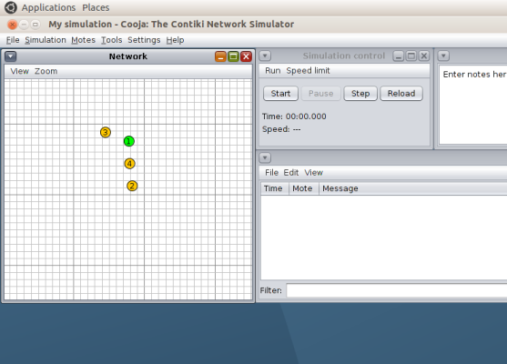

# Lab 6. 6LowPAN and RPL

## Introduction and goals

Edge routers are routers that can be found on the edge of a network, routing the
traffic of that network to a second external network. Its function, in short, is
to connect one network to another.

In this lab, we will see how to build a simulation using an edge router in
Contiki. More specifically, we will see how a Contiki edge router can be used to
route traffic between an RPL network (a Contiki sensor network with routing
protocol RPL over IPv6) and an external IPv4 network, following the diagram
below:


The goal of the lab is to provide an overview of how to deploy both an RPL
network with Contiki in the Cooja simulator, as well as making it interact with
a second real external network using the tool `tunslip`.

## Installation of software requirements

The basic installation of Contiki (in its version 2.7) is in the
`/home/ubuntu/contiki` directory of your virtual machine.

Before you begin, you will need to install some support software:

```sh
sudo apt install -y openjdk-8-jdk openjdk-8-jre
```
Next, be sure to select Java version 8 for a correct functioning of the Cooja
compilation process, run the following command and make sure that the option
`/usr/lib/jvm/java-8-openjdk-amd64/jre/bin/java` is selected:

```sh
ubuntu@ubuntu2004:~/contiki/tools/cooja$ sudo update-alternatives --config java
```

Finally, you will need to install the compiler that will allow you to generate
the images for the simulated nodes:

```sh
sudo apt install gcc-msp430 gdb-msp430
```

## Contiki Code

In the development of the lab assignment, we will use the following files, all
located in the `examples/ipv6/rpl-border-router` subdirectory of the Contiki
installation path:

* `border_router.c`: code that we will use for the edge router.
* `udp-client.c` or` udp_server.c` (in the `examples/ipv6/rpl-udp` directory):
  that will we will use for the nodes in our RPL network (its functionality is
  not relevant for the moment).
* `slip-bridge.c`: contains the *callback* functions to process a SLIP
  connection request.
* `httpd-simple.c`: it contains a simple web server that will allow us check the
  routing tables of the edge router.

Nodes that implement the `udp-client.c` or `border_router.c` code will form a
DAG, with the edge router configured as root. The edge router will receive the
network prefix via an SLIP connection (*Serial Line Interface Protocol*) and
will communicate it to the rest of the nodes of the RPL network so that they can
build their corresponding global IPv6 addresses.

The following code snippets, taken from the edge router, show the point where it
waits for the network prefix. Once received, the edge router is configured as
the root of the DAG and sends the prefix to all other nodes of the network:

```c
/* Request prefix until it has been received */ 
 while(!prefix_set) { 
   etimer_set(&et, CLOCK_SECOND); 
   request_prefix(); 
   PROCESS_WAIT_EVENT_UNTIL(etimer_expired(&et)); 
 } 


 dag = rpl_set_root(RPL_DEFAULT_INSTANCE,(uip_ip6addr_t *)dag_id); 
 if(dag != NULL) { 
   rpl_set_prefix(dag, &prefix, 64); 
   PRINTF("created a new RPL dag\n"); 
 }
```

By default, the edge router hosts a simple web page that will allows us to check
the status of its routing table. This page will be displayed by introducing in a
web browser of the virtual machine the IPv6 address of the edge router. The use
or not of this page is controlled with the macro `WEBSERVER` in the
`http-simple.c` file:

```c
PROCESS(border_router_process, "Border router process");
#if WEBSERVER==0
/* No webserver */
AUTOSTART_PROCESSES(&border_router_process);
#elif WEBSERVER>1
/* Use an external webserver application */
#include "webserver-nogui.h"
AUTOSTART_PROCESSES(&border_router_process,&webserver_nogui_process); 
```

## Code compilation

The code for the edge router can be found in the path
`examples/ipv6/rpl-border-router`. In a terminal, use the following command to
perform the compilation:

```sh
cd examples/ipv6/rpl-border-router
make TARGET=z1
```

Once executed, a file called `border-router.z1` will be created, which will be
used to program the mote (simulated device) for the edge router in the cooja
simulator.

To demonstrate the functionality of the edge router, we will create a network of
nodes with the edge router as root. For the rest of the nodes, we will use
UDP client code, implemented in the file `udp-client.c`. Prepare images for
these motes as follows:

```sh
cd examples/ipv6/rpl-udp
make TARGET=z1
```

As before, you will obtain a file named `udp-client.z1`, that will that shall be
used to program the rest of the motes of the DAG.

## Simulation with Cooja

After compiling the images, it is time to configure the complete simulation in
Cooja. Start the simulator using the following command:

```sh
cd tools/cooja
ant run
```

Once cooja starts follow these steps to create a new simulation:

1. Select the `File->New Simulation` option. Then the `UDGM` option and enter
   the name of the simulation. Press `Create`.
2. In the `Motes` menu, select` Add New Motes->Create new motes` and select
   `Z1` as the type of mote.
3. Find the location of the image for the border router
   (`examples/ipv6/rpl-border-router`) and select the file
   `rpl-border-router.z1`. Click on `Create` and add *one* mote of this type.
4. Repeat steps 2 and 3, but this time with the UDP client image that you
   created earlier. Add *four* or *five* motes of this type (selecting four
   instead one in step 3) and manually distribute them throughout the
   simulation, so that not all of them can be directly reached from the edge
   router.



Select the `View` menu options as shown in the figure. This will allow you to
easily create your topology (you can temporarily add the IP address as
well, although it might overload the figure with too much information):


Next, create a bridge between the simulated RPL network in Cooja and
the local machine by  This can be done by selecting `Tools` and `Serial Socket
(SERVER)` on the edge router mote (identify it with its numeric value). If every
thing went well you will get a message like the one in the figure below (note
that the message indicates *Listening on port 60001*):


Then *start the simulation* (`Start` button).

## The tunslip tool

As we have said, an edge router acts as a link to connect a network to another
network. In this example, the edge router is used to route data between the RPL
network and an external network. So far, we have only created the RPL network,
so we need to simulate a scenario where this RPL network connects to an external
network. To do this, we use the tunslip utility provided with Contiki. It will
create a bridge between the RPL network and the local machine.

The code `tunslip6.c` is located in the` tools` directory of the contiki
installation path, and it can be compiled with the following command:

```sh
make tunslip6
```

Then we can establish a connection between the RPL network and the local
machine by running the following command:

```sh
sudo ./tunslip6 -a 127.0.0.1 aaaa::1/64
```

If the execution was correct, you will see an output in the terminal similar to
this one:

```sh
ubuntu@ubuntu2004:~/contiki/tools$ sudo ./tunslip6 -a 127.0.0.1 aaaa::1/64
slip connected to ``127.0.0.1:60001''
opened tun device ``/dev/tun0''
ifconfig tun0 inet `hostname` mtu 1500 up
ifconfig tun0 add aaaa::1/64
ifconfig tun0 add fe80::0:0:0:1/64
ifconfig tun0

tun0: flags=4305<UP,POINTOPOINT,RUNNING,NOARP,MULTICAST>  mtu 1500
        inet 127.0.1.1  netmask 255.255.255.255  destination 127.0.1.1
        inet6 aaaa::1  prefixlen 64  scopeid 0x0<global>
        inet6 fe80::1  prefixlen 64  scopeid 0x20<link>
        inet6 fe80::ace4:dadf:8e12:be05  prefixlen 64  scopeid 0x20<link>
        unspec 00-00-00-00-00-00-00-00-00-00-00-00-00-00-00-00  txqueuelen 500  (UNSPEC)
        RX packets 0  bytes 0 (0.0 B)
        RX errors 0  dropped 0  overruns 0  frame 0
        TX packets 0  bytes 0 (0.0 B)
        TX errors 0  dropped 0 overruns 0  carrier 0  collisions 0

*** Address:aaaa::1 => aaaa:0000:0000:0000
Got configuration message of type P
Setting prefix aaaa::
Server IPv6 addresses:
 aaaa::c30c:0:0:1
 fe80::c30c:0:0:1
```

The program has created a bridge interface `tun0` with IPv4 127.0.1.1, and has
sent, via serial, a configuration message to the edge router indicating the
desired IPv6 prefix for the RPL network nodes (`aaaa`). The last two lines are
part of the output of the edge router, and indicate their IPv6 addresses after
the reception of the prefix.

Note that in the Cooja window a message with the text *Client connected:
/127.0.0.1* has appeared.

## Simulation analysis

It is possible to verify the address of the edge router through a command
ping from your virtual machine:

```sh
ubuntu@ubuntu2004:~/contiki/tools$ ping aaaa::c30c:0:0:1
PING aaaa::c30c:0:0:1(aaaa::c30c:0:0:1) 56 data bytes
64 bytes from aaaa::c30c:0:0:1: icmp_seq=1 ttl=64 time=21.5 ms
64 bytes from aaaa::c30c:0:0:1: icmp_seq=2 ttl=64 time=7.44 ms
64 bytes from aaaa::c30c:0:0:1: icmp_seq=3 ttl=64 time=8.57 ms
64 bytes from aaaa::c30c:0:0:1: icmp_seq=4 ttl=64 time=62.7 ms
64 bytes from aaaa::c30c:0:0:1: icmp_seq=5 ttl=64 time=15.2 ms
--- aaaa::c30c:0:0:1 ping statistics ---
5 packets transmitted, 5 received, 0% packet loss, time 4015ms
rtt min/avg/max/mdev = 7.442/23.066/62.661/20.427 ms
```

So as with any other node in the RPL network, for instance with node 4:

```sh
ubuntu@ubuntu2004:~/contiki/tools$ ping aaaa::c30c:0:0:4
PING aaaa::c30c:0:0:4(aaaa::c30c:0:0:4) 56 data bytes
64 bytes from aaaa::c30c:0:0:4: icmp_seq=1 ttl=62 time=116 ms
64 bytes from aaaa::c30c:0:0:4: icmp_seq=2 ttl=62 time=106 ms
64 bytes from aaaa::c30c:0:0:4: icmp_seq=3 ttl=62 time=108 ms
64 bytes from aaaa::c30c:0:0:4: icmp_seq=4 ttl=62 time=111 ms
64 bytes from aaaa::c30c:0:0:4: icmp_seq=5 ttl=62 time=79.0 ms
^C
--- aaaa::c30c:0:0:4 ping statistics ---
5 packets transmitted, 5 received, 0% packet loss, time 4016ms
rtt min/avg/max/mdev = 79.002/104.028/115.794/12.937 ms
```

The address of each node can be obtained by filtering the log screen
based on the destination node (mote) ID.

In addition you can open a web browser on the virtual machine and browse the IP
address of the edge router to observe its routing table:


!!! danger "Task 6.1"
	Follow the steps detailed above to create an RPL network with a reduced
	number of nodes (between 5 and 10), connecting it to your local network.
	Make sure that not all nodes fall in range of the edge router, and begin
	your simulation. Study the RPL traffic generated while the DAG is being
	constructed, and check connectivity with all of the nodes via `ping6`.  Move
	one mote that is in the reach of the edge router out of its reach. With
	`ping6` active on that mote, observe how the mote converges to the DODAG
	again (selecting a new upstrem node). You can also move other motes or
	create new ones, and study, through the web interface of the edge router,
	the time to establish new routes.

	Finally, you can anaylaze the RPL trafic with wireshark by exporting a PCAP
	file. You have to enable them opening the radio messages tool from the Tools
	menu and selecting Analyzer->6LoWPAN Analyzer with PCAP. Then you can export
	the PCAP file with the radio mesagges tool and import it in whireshark,
	where you can filter the mesagges by protocol or address as usual. A
	convenient step here is to eliminate duplicated packages from the PCAP file
	before opening it in whireshark. That can be done with the editcap command:

	```
	editcap -d original_capture_file.cap output_capture_file.cap
	```

	You can then easily trace the routes followed by the messages sent from each
	node and generate a figure that represent the topology of the network.

	The student should prepare a small pdf report documenting all these analysis
	and observations, showing all the experiments conducted on the network.


