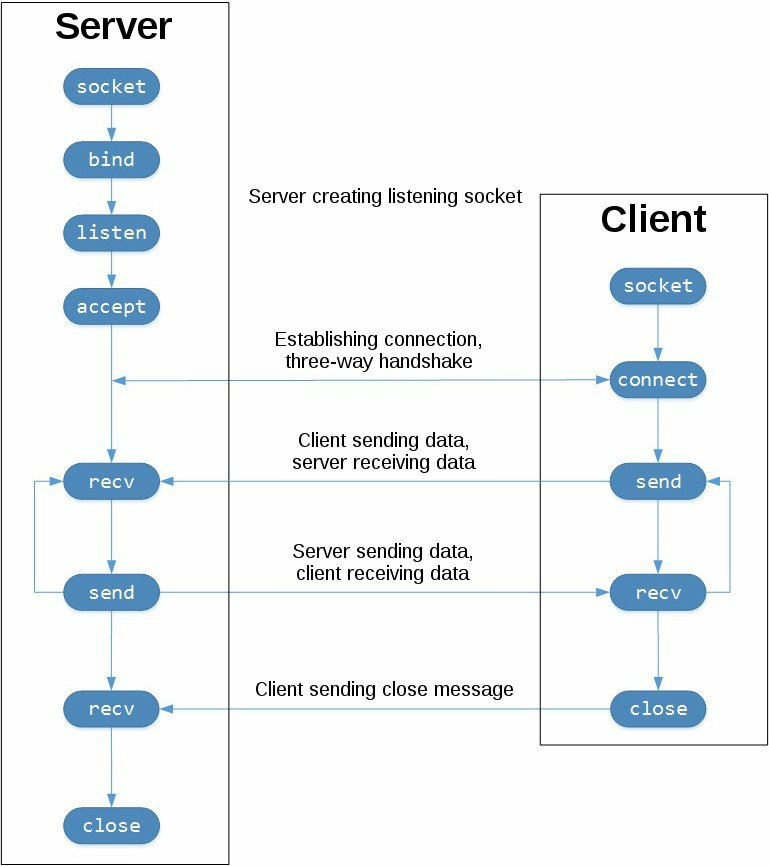

# Laboratory 1. Python socket programming

## Goals

* To get familiar with the Python sockets API.
* To develop basic client/server setups based on TCP and UDP using Python.
* To be able to analyze traffic generated by a TCP and UDP connection via Wireshark.
* To design an application-layer protocol to simulate a client/server application using TCP and UDP.
* To observe the difference in generated traffic between UDP and TCP for an equivalent application.
* (Optionally) To implement multi-threaded servers in Python.

## Introduction

The history of sockets begins with the origin of ARPANET, in 1971, and their
standardization by means of an API within the BSD operating system, released
in 1983, under the name *Berkeley Sockets*.

With the popularization of Internet in the 90s, and together with the *World Wide Web*,
network programming suffered a relevant evolution.
Web servers and browsers were not (and are not) the only applications based on 
sockets. Actually, client/server systems are, as of today, ubiquitous, and include
all high-level protocols that give support to IoT. Today, even though high-level 
protocls have evolved till unprecedented sophistication levels, the underlying low-level
interface remains unchanged.

The most common application type based on sockets is built on top of the 
client/server paradigm, where one of the parts acts as a **server**, passively
waiting for external connection/requests from a set of one or more **clients**.
In the following, we will study how to develop this type of paradigm from 
Python, using *Berkeley sockets*. There also exist the so-called 
*Unix domain sockets*, that allow a direct communication across processes at 
the same *host*; they are, however, of of the scope of IoT and we will not
study them.

## The Python sockets API

The Python [socket module](https://docs.python.org/3/library/socket.html)
provides a complete interface to work with the 
[Berkeley sockets API](https://en.wikipedia.org/wiki/Berkeley_sockets). 
In this laboratory, we will exclusively work with this API to develop 
client/server applications using the TCP and UDP protocols.

The main functions and methods of the sockets API are:

* `socket()`.
* `bind()`.
* `listen()`. 
* `accept()`.  
* `connect()`. 
* `connect_ex()`.
* `send()`.
* `recv()`.
* `close()`.

Python provides a consistent and complete API mapped directly to the 
aforementioned system calls, typically written in C. As a part of its
standard library, Python also provides classes to ease working with low-level
functions. We will not cover it in detail, but the 
[socketserver module](https://docs.python.org/3/library/socketserver.html)
provides an easy way to create network servers. There also exist many 
modules available to implement high-level protocols (e.g. HTTP or SMTP), 
see [this link](https://docs.python.org/3/library/internet.html).

## TCP sockets

In Python, TCP sockets are created using `socket.socket()`,
specifying the socket type as `socket.SOCK_STREAM`. 
The Transmision Control Protocol (TCP) features two main characteristics:

* **It is reliable**: loss detection methods are implemented that detect datagram
losses and force lost package resubmission.

* **Guarantees in-order package delivery**: data are delivered to higher-levels
(applications) in the same order as they were sent.

Contrary, UDP sockets are created by means of `socket.SOCK_DGRAM`, and
they are neither reliable nor guarantee in-order data delivery. 
Hence, it is a responsibility of the application developer to implement
those mechanisms manually if desired.

The following picture shows the typical API invocation sequence for TCP:



In the figure, the left column illustrates the serve, and the right column shows
the client of the TCP connection. Observe the necessary invocations to configure
a socket listening for incoming connections:

* `socket()`
* `bind()`
* `listen()`
* `accept()`

At the server, a socket *listens* for potential incoming connections from clients.
When a client rquests a connection, the server *accepts* the request, completing 
the connection.

The client invokes `connect()` to establish a connection with a server, and initiates
the *three-way handshaking* protocol to establish the connection.

Upon establishment, data are exchanged among client and server via 
`send()` and `recv()`. 

Finally, the socket is destroyed (the connection is closed) via a 
`close()` invocation at each end.

## TCP client/server *echo* example

Let us study a simple example to create a client-server pair. In this case,
the server just responds to the client with the same string as that received
from the client.

### *echo* server

```python
#!/usr/bin/env python3

#### server_echo.py

import socket

HOST = '127.0.0.1'  # Loopback interface (localhost)
PORT = 65432        # Listen port (ports higher than 1023 are non-privileged)

with socket.socket(socket.AF_INET, socket.SOCK_STREAM) as s:
    s.bind((HOST, PORT))
    s.listen()
    conn, addr = s.accept()
    with conn:
        print('Conectado ', addr)
        while True:
            data = conn.recv(1024)
            if not data:
                break
            conn.sendall(data)
```

!!! note "Note"
    By now, do not worry if you do not understand all lines in the code. This
    is just an starting point to develop a simple server. However, it is a good
    idea to copy the code in a text file (e.g. `server_echo.py`) so we can test it
    afterwards.

Let as study line by line the main parts of the code:

`socket.socket()` creates a socket object. Note that, as it is created
via a `with` construction, it is not necessary to explicitly invoke
to `s.close()`, even though you need to realize that the object is destroyed
after the construction:

```python
with socket.socket(socket.AF_INET, socket.SOCK_STREAM) as s:
    pass
```

The arguments provided to `socket()` specify the address family 
(`AF_INET`) 
and socket type (`SOCK_STREAM`). 
`AF_INET` is the address family of the Internet for IPv4. 
`SOCK_STREAM` is the type of socket that allows for the creation of TCP connections.

`bind()` is used to associate the socket to a network interface and port number:

```python
HOST = '127.0.0.1'  # Loopback interface (localhost)
PORT = 65432        # Listen port

# ...

s.bind((HOST, PORT))
```

The values proviede to `bind()` depend on the address family selected for the
socket. In the example, as `AF_INET` is used, the routine
expects a tuple with just two values *(host, port)*.

To determine the *host*, it is possible to use a host name, an IP address or an
empty string. If we use an IP address, it needs to be specified by means of a string
containing a well-formed address.  The address 127.0.0.1 is the standard IPv4 address
for the loopback interface, so that only local processes (running at the same host) 
will be able to communicate with the server. If we provide an empty string, the server
will accept incoming connections by via all IPv4 interfaces in the system.


The port number (*port*) is specified with an integer value between 1 and 65535,
and specifies the port (in this case, TCP) that the server will use to accept incoming
client connection. Many systems require superuser privilege to listen via privileged
ports (with values between 1 and 1023).

Following with the example, `listen()` allows for a server to accept, in the future,
incoming connections via `accept()`. In other words, it transforms the socket into a
listening socket:

```python
s.listen()
conn, addr = s.accept()
```

Invoking `accept()` **blocks** the process and waits for an incoming connection.
Upon a client connection, it returns a `socket` object that represents
the connection, and a tupple (`addr`) that contains the address of the client.
This tuple contains the values `(host, port)` that store the 
IPv4 adress and client port that requests for the connection.

Note that, in the example, `conn`  is the *socket* object that we will 
use to communicate with the client:

```python
conn, addr = s.accept()
with conn:
    print('Connected ', addr)
    while True:
        data = conn.recv(1024)
        if not data:
            break
        conn.sendall(data)
```

After obtaining the object returned by `accept()`, 
we design the server as an infinite loop that repeatedly invokes
to **blocking** `conn.recv()`. 
This way, we read data sent by the client and we resend them without
modification using `conn.sendall()`.


If `conn.recv()` returns an empty object of type `bytes` (`b''`), it means
that the client closed the conection, in which case the loop finishes, destroying
the socket after the `with` construction.

### *echo* client

Let us observe the general structure of the client (you can use, for example
`client_echo.py` as a name for the file):

```python
#!/usr/bin/env python3

### client_echo.py

import socket

HOST = '127.0.0.1'  # Server IP
PORT = 65432        # Listen server port 

with socket.socket(socket.AF_INET, socket.SOCK_STREAM) as s:
    s.connect((HOST, PORT))
    s.sendall(b'Hello, world')
    data = s.recv(1024)

print('Received ', repr(data))
```

Compared with the server, the client structure is simpler; it just
creates a new socket object, connects with the server and invokes 
`s.sendall()` to send the message. Finally, it waits for the
response using `s.recv()` and prints it on screen.

## Echo client and server execution

Next, we will execute the client and server programs to observe the
status of the connection troughout their life cycle.

Execute in a terminal the server:

```bash
$ python3 ./server-echo.py
```

You will see that the terminal blocks (actually, the server process remains in 
a blocked state) in the invocation:

```python
conn, addr = s.accept()
```

Actually, the server is waiting for incoming connections from a client. Open
a sencond terminal and execute the client:

```bash
$ python3 client-echo.py
Received 'Hello, world'
```

On the server screen, you should see something similar to:

```bash
$ python3 ./server-echo.py
Connected ('127.0.0.1, 61234')
```

In this output, the server reports the tuple returned by 
`s.accept()`, that includes the IP address and the TCP port. 
That port number (in the example, 61234) is seleted randomly 
by the operating system and can vary in your execution.

## Tools to analyze the socket status

We can use the *netstat* tool to observe the current status of the 
sockets in any OS (macOS, Linux and even Windows). 
For example, this would be the output of `netstat` in Linux
after executing the server:

```bash
netstat -an | grep 65432
Active connections
Proto  Recv  Sent   Local address           Remote address         Status
tcp        0      0 127.0.0.1:65432         0.0.0.0:*              LISTEN
```

Note that we have filtered the output of the `netcat` command
to match the used port. 
Also observe the value of all columns, and try to understand if it makes sense
to you.

!!! note "Note"
    Another way to observe the status of the connections is via the command 
    `lsof -i -n`. Execute it and observe its output.

## Capturing network traffic via Wireshark

Wireshark is an open-source tool widely used to analyze network communication
protocols at any layer of the TCP/IP stack (and also other protocols). Wireshark 
implements a wide range of filters to define search criteria in the traffic
captures. However, in our case, it will not be necessary to use advanced
filters.

To execute the took in the virtual machine (or in any basic Linux setup), 
just type in your terminal:

```bash
$ sudo wireshark
```

Upon booting, we can start a new traffic capture via the 
menu `Capture`, option `Start`. 
The interface selection screen allows for the definition of the 
interface we need to intercept. In our case, as we are communicating
two processes on the same machine, we will choose the  
*Loopback* (lo) interface and we will start the capture.

!!! note "Task 1.1"
    Start wireshark and prepare a capture on the *loopback* interface. 
    Execute the TCP *echo* server and the corresponding client, and analyze
    the generated traffic. Specifically, observe the connection establishment
    procedure, use of ACK packages and, in general any other aspect that is of
    your interest. **Write a short report with screenshots of your observations.**

## UDP sockets

The creation and management of UDP sockets in Python is even simpler. Observe the
following code, that creates a UDP server using the Python sockets API:

```python
import socket

udp_socket = socket.socket(socket.AF_INET, socket.SOCK_DGRAM)
udp_socket.bind(("localhost", 5005))

data = udp_socket.recv(512)
print(data)
```

First, we import the `socket` module, as for TCP. Obviously, in this case
the socket type is of type 
`socket.DOCK_DGRAM`, to indicate that we need to use UDP in the communication.

The program waits for the reception of a packet using the blocking 
`recv` method, with only one parameter: the maximum number of bytes
we would like to receive.

When a packet arrives to the socket, the `recv` method will return 
a byte *array*, that will be stored in the desired variable.

The submission of data is also simple:

```python
import socket

udp_socket = socket.socket(socket.AF_INET, socket.SOCK_DGRAM)
udp_socket.bind(("localhost", 0))

data = b"Hello, world!"
udp_socket.sendto(data,("localhost", 5005))
```

Note how, in this case, we associate (*bind*) the socket to a port specifyed 
as 0. This special value indicates to the OS that it needs to choos for the 
transmission a random source port between those available in the system.

Next, we create the data to sumbit, and send them using the method
`sendto()`. This method takes two arguments: data to send, and
destination address. Data sent through the socket must be part of a bytes array
de un *array de bytes* (hence, the string to submit needs to be preceeded by
the character `b`).

!!! note "Task 1.2"
    Check that the codes for sending and receiving via UDP work as expected.
    **Write a short report with your observations**

!!! warning "Note"
    From version 3 on, strings in Python are coded using UNICODE.
    Contrary from ASCII, where each character has a direct byte representation,   
    UNICODE uses integers to represent each character, that need to be encoded
    to obtain a byte representation. One of these schemas is UTF-8. For example,,
    the following code shows how to encode a UNICODE string onto a bytes 
    representation:

    ```
    c= "Hello"
    data = c.encode("UTF-8")
    print(data, type(data))
    ```

    That generates:

    ```
    b"Hello" <class 'bytes'>
    ```

    that can be sent directly through the network.

Up to this point, the UDP programs have been completely unidirectional in the
submission/reception of data, but obviously, a UDP socket is a bi-directional
communication channel.

!!! note "Task 1.3"
    Implement a similar functionality than that of the *echo* that we 
    studied for TCP, but using UDP. Provide a traffic capture via Wireshark
    and observe the differences between the data transmission in TCP and UDP.
    Provide a discussion about the benefits (or lack of them) of UDP compared
    with TCP for IoT.

## Sending binary data via sockets

Up to this point, we have studied how to send text strings via TCP or UDP
sockets, but it is common to find a necessity to send data directly in 
binary format (e.g. numeric values in floating point or integers). Using the
`struct` Python module, we can specify which type or types of data are stored
in a sequence of bytes, and how to decode them. It is also possible to specify
in which place of the sequence are those data stored, allowing for packing
multiple data of different types in a simple manner, and its decoding at the
other side of the communication channel.

!!! note "Note"
    Check all details of the `struct` module on its official
    [documentation](https://docs.python.org/3/library/struct.html) page.

The `struct` module provides two interesting methods: `pack` and `unpack`.

The following sentence:

```python
struct.pack(">iii", 1, 2, 3)
```
uses the `pack` method to perform data packing. 
Specifically, observe how the method receives two parameters:

* First, the format parameter *">iii"*. It defines how each value in the sequence
  need to be encoded.  The first character indicates the *endianness*, 
  in this case *big endian* 
  (we should use ">" for big endiand, "<" for little endian, and "=" for network endianness).

* Second, the values to pack.


Note that the format, in addition, includes the number and type of data to pack
(in this case three integer values). For other data types, check the module's documentation.

Unpacking data on the other side of the cahnnel is intuitive:

```python
a, b, c = struct.unpack( ">iii" )
```

Next, we show an example of a client/server TCP setup that leverages the
`struct` to send two integer numbers and a floating point number between a client
and a server:

```python

# Client

import binascii                                                                             
import socket                                                                               
import struct                                                                               
import sys                                                                                  
                                                                                             
# Socket TCP                                                                                
sock = socket.socket(socket.AF_INET, socket.SOCK_STREAM)                                    
server_address = ('localhost', 10001)                                                       
sock.connect(server_address)                                                                
                                                                                             
packed_data = struct.pack("=iif", 1, 4, 2.7)                                                
                                                                                             
try:                                                                                        
    # Sending data
    print('Sending "%s"' % binascii.hexlify(packed_data))                                  
    sock.sendall(packed_data)                                                               
                                                                                             
finally:                                                                                    
    print('Closing socket')                                                                
    sock.close()                                                                            
```

```python

# Server

import binascii                                                                             
import socket                                                                               
import struct                                                                               
import sys                                                                                  
                                                                                             
# Socket TCP                                                                                
sock = socket.socket(socket.AF_INET, socket.SOCK_STREAM)                                    
server_address = ('localhost', 10001)                                                       
sock.bind(server_address)                                                                   
sock.listen(1)                                                                              
                                                                                             
while True:                                                                                 
    print('Waiting for incoming connections')                                                 
    connection, client_address = sock.accept()                                              
    try:                                                                                    
        data = connection.recv(1024)                                                        
        print('Received "%s"' % binascii.hexlify(data))                                     
                                                                                            
        unpacked_data = struct.unpack("=iif", data)                                         
        print('Unpacked:', unpacked_data)                                             
                                                                                            
    finally:                                                                                
        connection.close()
```

!!! note "Task 1.4"
    Execute the client/server system and analyze the generated traffic. Look for 
    the binary packed data. Experiment with other types of data and *endianness*
    and observe the differences.

## Deliverable task

!!! danger "Deliverable task 1"
    Design a client/server system and implement it using Python. The system
    will simulate a client sending a number of pieces of data sensed to a server.
    The protocol to use (format of each packet sent to the server at the application
    layer) needs to be designed and proposed by the student and described 
    prior to starting the coding effort.
    The final mark will consider positively the use of multiple data types, 
    both in ths sent data and responses from the server. 
    The student will develop a TCP and a UDP version of the solution. The client will submit data in a periodic fashion, and data will be generated randomly.

    **The deliverable will include the developed codes, and an analysis of the generated
    traffic, with comments about the overhead (in bytes) introduced by each protocol
    of the transport layer.**

## Multi-threaded client/server example

The previous examples are perfectly valid and functional, but lack in their design
of a basic functionality: the server stops attending new incoming requests while
a request from a client is processed. The following examples show simple implementations
with multi-threaded support for a client/server system written in Python.

```python
# Concurrent TCP server

import socket, threading

class ClientThread(threading.Thread):
    def __init__(self,clientAddress,clientsocket):
        threading.Thread.__init__(self)
        self.csocket = clientsocket
        print ("New connection added: ", clientAddress)
    def run(self):
        print ("Connection from: ", clientAddress)
        #self.csocket.send(bytes("Hi, This is from Server..",'utf-8'))
        msg = ''
        while True:
            data = self.csocket.recv(2048)
            msg = data.decode()

            if msg=='bye':
              break

            print ("From the client", msg)
            self.csocket.send(bytes(msg,'UTF-8'))

        print ("Client ", clientAddress , " disconnected...")

LOCALHOST = "127.0.0.1"
PORT = 8080

server = socket.socket(socket.AF_INET, socket.SOCK_STREAM)
server.setsockopt(socket.SOL_SOCKET, socket.SO_REUSEADDR, 1)
server.bind((LOCALHOST, PORT))

print("Server started...")
print("Waiting for client requests...")

server.listen(1)

while True:
    clientsock, clientAddress = server.accept()
    newthread = ClientThread(clientAddress, clientsock)
    newthread.start()
```

```python
# TCP client. The string *end* indicates disonnection request.

import socket

SERVER = "127.0.0.1"
PORT = 8080

client = socket.socket(socket.AF_INET, socket.SOCK_STREAM)
client.connect((SERVER, PORT))
client.sendall(bytes("Hello, I am a client!!",'UTF-8'))

while True:
  in_data =  client.recv(1024)

  print("From the server:" ,in_data.decode())
  out_data = input()
  client.sendall(bytes(out_data,'UTF-8'))

  if out_data=='end':
    break

client.close()
```

!!! note "Task 1.5"
    Study the codes for the concurrent server and observe how it manages
    the creaton of threads to handle an incoming request. Connect simultaneously
    multiple clients and observe the status of the sockets using the corresponding 
    tools. **Write a short report with your observations**.

## Optional deliverable

!!! danger "Optional deliverable task 1"
    Modify your first deliverable to consider a multi-threaded implmentation
    of the TCP server, following the guidelines of the example codes.

## Optional deliverable

!!! danger "Optional deliverable task 1"
    Modify the sending protocol so that your UDP applications guarantees
    as much as possible the reception of UDP packages sent from the client,
    and an in-order reception.
    Analyze again the necessary network traffic in this case compared with a
    TCP scheme.
