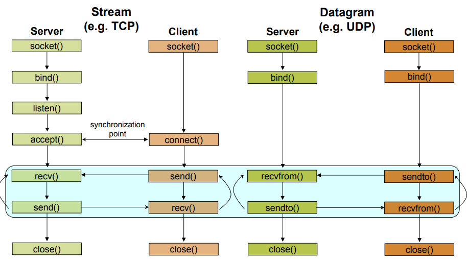

# Laboratory 2. TCP and UDP Sockets in ESP-IDF

## Goals

* To familiarize with the sockets API in C.   
* To develop basic schemas for client/server systems based con TCP and UDP using C.
* To be ablo to analyze generated traffic in a TCP and UDP connection via Wireshark.
* To design a an application-layer protocol to simulate an application based on
  the client/server paradigm using TCP and UDP to interact between a host and the
  ESP32 board.

## Introduction

In the previous laboratory, we studied how to develop simple client/server
systems using Python, both for TCP and for UDP.
In this lab, we will study and develop network components (TCP and UDP 
clients and servers) that can execute on the ESP32 leveraging the facilities
offered by ESP-IDF. Also, we will demonstrate that it is possible to interact
clients and servers executing on the virtual machine (programmed via Python) and
on the board (using the C sockets API).

## The C sockets API      

### Funtions for byte ordering

As TCP/IP is a universal standard, and it allows for communicating across virtually
any platform and architecture, it is necessary to get a byte ordering method so that
big-endian and little-endian machines can communicate in a transparent and correct way.
To accomplish this requirement, routines are usually provided to reorder and adapt
byte ordering. In platforms in which data are already correctly ordered, these functions 
do not present any special functionality, but anyway, its usage is necessary so that the 
communication among pairs is correct.

Typical functions for data reordering are:
`htons`, `htonl`, `ntohs` y `ntohl`. 
Their name explains their semantics: 
*host to network (short)*
*host to network (long)*, 
*network to host (short)* and 
*network to host (long)*,
converting datatypes *short* and *long* from the format used in network
transmissions (*network*) to a *host* representation. 
Hence, when we send binary data over the network, it will need to be transformed using 
`hton*` and upon receiving it, using `ntoh*`.

### Data structures

Before studyin the sockets API, it is necessary to show the goal of a set of data 
structures used in all of them. The most important is 
`sockaddr_in`, defined as follows:

```c
struct sockaddr_in
{
    short          sin_family;
    u_short        sin_port;
    struct in_addr sin_addr;
    char           sin_zero[8];
};
```

The structure `in_addr` used in `sockaddr_in` is defined as:

```c
struct in_addr
{
    u_long s_addr;
};
```

This one consists on a field of type `unsigned long int` that contains the 
IP address associated with the socket.

The structure `sockaddr_in` contains two important fields:

* `sin_family`: indicating that the socket belongs to a specific family of protocols
  (we will use the constant `AF_INET` for IPv4).
* `sin_port`: the port associated to the socket.

### Basic API

#### `socket()`

* Prototype:

```c
int socket(int family, int type, int protocol);
```

* Description: Creates a communication *endpoint* and returs a file descriptor to handle it. 

* Parameters: 
    - `family`:  `AF_INET` (IPv4), `AF_INET6` (IPv6).
    - `type`: `SOCK_DGRAM` (UDP), `SOCK_STREAM` (TCP), `SOCK_RAW`.
    - `protocol`: Typically 0 (not used in Internet sorckets).

* Return value: On success, returns a socket descriptor. 
                    Returns `-1` if error.

* Details: `man socket`.

#### `bind()`

* Prototype:

```c
int bind(int sockfd, const struct sockaddr *addr, socklen_t addrlen);
```

* Description: Binds a *socket* to an address specified by `addr`.
  Usually, it is necessary to assign a local addres via this function before
  a TCP socket can receive connections.

* Parameters: 
    - `sockfd`:  *socket* descriptor (returned by `socket`).
    - `addr`: address to bind (see structure in previous section).
    - `addrlen`: length (in bytes) of the previous structure.

* Return value: On success, returns 0.  Returns `-1` if error.

* Details: `man bind`.


#### `listen()`

* Prototype:

```c
int listen(int sockfd, int backlog);
```

* Description: Marks the *socket* as *passive*, that is, 
  a *socket* that will be used to accept incoming connections using `accept`.

* Parameters: 
    - `sockfd`:  *socket* descriptor (returned by `socket`).
    - `backlog`: maximum length for the pending connections queue for the socket.

* Return value: On success, returns 0.  Returns `-1` if error.

* Details: `man listen`.

#### `accept()`

* Prototype:

```c
int accept(int sockfd, struct sockaddr *addr, socklen_t *addrlen);
```

* Description: In connection-oriented *sockets*, extracts the first request for connection 
  from the pending connection queue for the *socket*,
  creates a new *connected socket* and returns its descriptor. 

* Parameters: 
    - `sockfd`: *socket* descriptor (returned by `socket`).
    - `addr`:  pointer to a structure of type `sockaddr`, whose fields
      will be filled with the date of the remote socket address.
    - `addrlen`: size fo the `addr` structure.

* Return value: On success, returns 0.  Returns `-1` if error.

* Details: `man accept`.

#### `connect()`

* Prototype:

```c
int connect(int sockfd, const struct sockaddr *addr, socklen_t addrlen);
```

* Description: Connects the *socket* to the address specified by 
  `addr`. If the *socket* is UDP, `addr` will be the only addres to which data will be sent
  by default, and the only one from which datagrams will be received.
  For TCP, this call intiates the connection procedure to the specified address.

* Parameters: 
    - `sockfd`:  *socket* descriptor (returned by `socket`).
    - `addr`:  pointer to a `sockaddr` structure, whose fields
      indicate the address of the destination connection.
    - `addrlen`: size of the `addr` structure.

* Return value: On success, returns 0.  Returns `-1` if error.

* Details: `man connect`.

#### `send()`

* Prototype:

```c
ssize_t send(int sockfd, const void *buf, size_t len, int flags);
```

* Description: In a connected *socket* (that is, with a known recepient)
  transmits messages to a remote socket.

* Parameters: 
    - `sockfd`:  sending socket descriptor.
    - `buf`:  sending *buffer* where message is stored.
    - `len`: number of bytes to send.

* Return value: On success, returns the amount of bytes sent. `-1` if error.

* Details: `man send`.


#### `recv()`/`recvfrom()`

* Prototype:

```c
ssize_t recv(int sockfd, void *buf, size_t len, int flags);

ssize_t recvfrom(int sockfd, void *buf, size_t len, int flags,
                 struct sockaddr *src_addr, socklen_t *addrlen);

```

* Description: Receive messages from a *socket*, both in connection-oriented and 
  connectionless sockets. `recvfrom` receives output parameters that store information 
  about the origin of the message.

* Parameters: 
    - `sockfd`:  socket descriptor.
    - `buf`:  reception *buffer* where the received message will be stored.
    - `len`: number of bytes to receive.
    - `src_addr`: address of the remote end of th socket (communication origin).
    - `addrlen`: `src_addr` structure size.

* Valor de retorno: If success, number of received bytes. `-1` if error.

* Details: (`man recv` and `man recv_from`).


#### `close()`

* Prototype:

```c
int close(int fd);
```

* Description: Closes a socket.

* Parameters: 
    - `fd`:  *socket* descriptor.

* Details: `man close`.


## Examples

In the following, we propose a number of complete examples that illustrate the
use of the sockets API in C for the development of client/server systems. For each
one, check that, effectively, the use and sequence of application of each call follows
the directives in the figure:



!!! note "Task 1.1"
    Compile (`gcc example.c -o example.x`) and execute (`./example.x`) each pair
    of codes and check its correct functionality. Study carefully the use of each
    routine and how the previous directives are followed.

### Example: a TCP client

```c
#include <arpa/inet.h>
#include <stdio.h>
#include <string.h>
#include <sys/socket.h>
#include <unistd.h>
#include <netinet/in.h>


int main() {
        const int server_port = 9000;

        struct sockaddr_in server_address;
        memset(&server_address, 0, sizeof(server_address));
        server_address.sin_family = AF_INET;

        server_address.sin_addr.s_addr = inet_addr("127.0.0.1");
        server_address.sin_port = htons(server_port);

        int sock;
        if ((sock = socket(PF_INET, SOCK_STREAM, 0)) < 0) {
                printf("Error in socket\n");
                return 1;
        }

        if (connect(sock, (struct sockaddr*)&server_address,
                    sizeof(server_address)) < 0) {
                printf("Error in connect\n");
                return 1;
        }

        const char* data_to_send = "Hello, NP2!!";
        send(sock, data_to_send, strlen(data_to_send), 0);

        int n = 0;
        int len = 0, maxlen = 100;
        char buffer[maxlen];
        char* pbuffer = buffer;

        while ((n = recv(sock, pbuffer, maxlen, 0)) > 0) {
                pbuffer += n;
                maxlen -= n;
                len += n;

                buffer[len] = '\0';
                printf("Received: '%s'\n", buffer);
        }

        close(sock);
        return 0;
}
```

### Example: a TCP server

```c
#include <arpa/inet.h>
#include <netinet/in.h>
#include <stdbool.h>
#include <stdio.h>
#include <string.h>
#include <unistd.h>

int main(int argc, char *argv[]) {
        int SERVER_PORT = 9000;

        struct sockaddr_in server_address;
        memset(&server_address, 0, sizeof(server_address));
        server_address.sin_family = AF_INET;

        server_address.sin_port = htons(SERVER_PORT);

        server_address.sin_addr.s_addr = htonl(INADDR_ANY);

        int listen_sock;
        if ((listen_sock = socket(PF_INET, SOCK_STREAM, 0)) < 0) {
                printf("Error in socket\n");
                return 1;
        }

        if ((bind(listen_sock, (struct sockaddr *)&server_address,
                  sizeof(server_address))) < 0) {
                printf("Error in bind\n");
                return 1;
        }

        int wait_size = 16;  

        if (listen(listen_sock, wait_size) < 0) {
                printf("Error in listen\n");
                return 1;
        }

        struct sockaddr_in client_address;
        int client_address_len = 0;

        while (true) {
                int sock;
                if ((sock =
                         accept(listen_sock, (struct sockaddr *)&client_address,
                                &client_address_len)) < 0) {
                        printf("Error in accept\n");
                        return 1;
                }

                int n = 0;
                int len = 0, maxlen = 100;
                char buffer[maxlen];
                char *pbuffer = buffer;

                printf("Cliente conectado con IP: %s\n",
                       inet_ntoa(client_address.sin_addr));

                while ((n = recv(sock, pbuffer, maxlen, 0)) > 0) {
                        pbuffer += n;
                        maxlen -= n;
                        len += n;

                        printf("Received: '%s'\n", buffer);

                        send(sock, buffer, len, 0);
                }

                close(sock);
        }

        close(listen_sock);
        return 0;
}
```

!!! note "Task 1.2"
    Reproduce the logic of the previous client/server *echo* system using UDP.

### Message construction

In order to send messages that encapsulate different types of data in 
one invocation, you can define a message as follows:

```c
typedef struct {
  int x;
  int y;
} message;
```

Giving value to each field and sending the structure offering the address of the
structure:

```c
message.x = x; message.y = y;
send( socketfd, &message, sizeof( message ), 0 );
```

!!! note "Task 1.3"
    Modify the UDP client to encapsulate and send a structure with different
    fields (for example, two integers), that will be received by a Python server 
    following the directives of Lab 1. In this case, do not use fields of 
    floating point type (we will see how to do it in the future). The goal of the
    Task is to demonstrate that a client programmed in C and a server programmed
    in Python can communicate transparently. Hence, it is not expected from you to
    develop a complex system.

## Client/server systems on the ESP32

The reason behind the previous exercises lies on the fact that the TCP/IP
stack implemented in ESP-IDF ([Lightweight TCP/IP (lwIP)](https://docs.espressif.com/projects/esp-idf/en/latest/esp32/api-guides/lwip.html)) 
implements almost at 100% that API. Hence, the basic
firmware structure for a client/server and its API remains unmodified.

In this last section, we will work with two basic examples of implementation of 
client/server systems TCP and UDP on the ESP32, with the goal of studying its functionality,
check its interoperability and perform modifications to adapt them to a hypothetical IoT application.

## UDP client/server on the ESP32


In this part, you will work with two examples provided within the examples collection
from ESP-IDF. Hence, copy in your workspace (out of the main ESP-IDF tree) both examples:

* **Server UDP**: `examples/protocols/sockets/udp_server/`
* **Cient UDP**: `examples/protocols/sockets/udp_client/`

### General structure

Observe the codes (`udp_server.c` for the server, and `udp_client.c` for the client). 
Check that both the basic structure of both components and the invocations
to the sockets API match with those seen for the *echo* system programmed in C.

Regarding the main task (function `app_main`) observe that it performs a series
of invoations to configuration APIs of some subsystems from FreeRTOS, mainly:

```c
// Initializes the NVS (Non-volatile storage) by default.
ESP_ERROR_CHECK(nvs_flash_init());
// Initializes the ESP-NETIF infrastructure.
ESP_ERROR_CHECK(esp_netif_init());
// Creates the main default event loop.
ESP_ERROR_CHECK(esp_event_loop_create_default());

/* This funtion configures WiFi or Ethernet, as selected via menunconfig.
*/
ESP_ERROR_CHECK(example_connect());

xTaskCreate(udp_server_task, "udp_server", 4096, NULL, 5, NULL);
```

* `example_connect()`, function outside ESP-IDF, that establishes a WiFi or Ethernet connection. The function is blocking, and returns when a connection has been established.

* The features of the WiFi connection (SSID and password) must be provided via `menuconfig`.

* The goal of ESP-NETIF is to provide an abstraction layer on top of the TCP/IP stack, so that it can be migrated without modifications on user codes. You can check the documentation in the 
  [oficial webpage](https://docs.espressif.com/projects/esp-idf/en/latest/esp32/api-reference/network/esp_netif.html).

* Last, a task is created that executes the server logic (same for the client).

* Observe that, in the code, the error messages are annotated using the macro
  `ESP_LOGE` and the informative ones with `ESP_LOGI`; try to follow this mechanism in your codes.

### Deployment. Option 1

In this case, you will deploy a client on an ESP32 and a server in the other.
Obviously, both ESP32s must be part of the same wireless network,
so they will be connected to the same access point (at home or at class, you can
use a mobile phone for that). Configure the following point in the infrastructure:

* Configure the SSID and password of the access point via `menuconfig` before compiling
and flashing the code both in the client and in the server.

* In the server, configure via `menuconfig` the listen port.

* Boot first the server node and take note of the proposed IP by the access point; use it in the client to configure the destintation IP of the communication. Do not forget to also configure the destination port using that configured for the server.

At this point, you can boot the client and you should be communicating two ESP32 nodes via UDP.

### Deployment. Option 2

If you only have one node, or just want to test other way of communication
between a PC node and an ESP32, you can use any of the system tools:

!!! danger "Note"
    Take into account that your PC (that is, the virtual machine) and the ESP32
    must be part of the same network. To accomplish it, stop your virtual machine and
    add a new network interface of type *bridge* connected to the WiFi interface of your PC.
    Proceeding this way, you will have an interface with IP within the network, granted 
    directly by your access point.

* To receive a UDP packge via a port /that is, emulate a UDP server):

```sh
nc -ul -p 3333
```

* To send a UDP package to a remote IP/port (that is, emulate a client):

```sh
nc -u IP_REMOTE 3333
```

In the `scripts` folder of the examples folder, you can find small client/server UDP 
Pythhon exmaples that you can also use.

## TCP client/server on the ESP32

The deployment of the client and server in their TCP version is equivalent to UDP.

* To receive a TCP package via a port (that is, to emulate a TCP server):

```sh
nc -l IP -p 3333
```

* To send a TCP package to a remote IP/port (that is, emulate a client):

```sh
nc IP 3333
```

Again, you can find TCP Python scripts to use on the `scripts` folder.

!!! note "Task"
    Experiment with the examples provide in ESP-IDF (client/server
    TCP and UDP) and execute them on the ESP32.

!!! danger "Deliverable task"
    At this point, you will have a set of codes that implement client/server systems both
    in a host (using Python and/or C) and on the ESP32 (using C and ESP-IDF), and you should
    have checked their correct functioning.

    Specifically, you should have developed:

    * A client/server system developed for Lab1, written in Python and implementing a basic application-level protocol proposed by you.

    * Basic C code for the implementation of a client/server *echo* system, with codes given in this Lab.

    * Basic C/ESP-IDF codes to implement client/servers *echo* on the ESP32.

    As a deliverable task, you need to adapt your deliverable of Lab 1 so that both
    client and server can work on the host (using Python or C) and on the ESP32. You will
    deliver the developed codes and a short report with screen capture and explanations 
    that demonstrate the correctness of the system.
