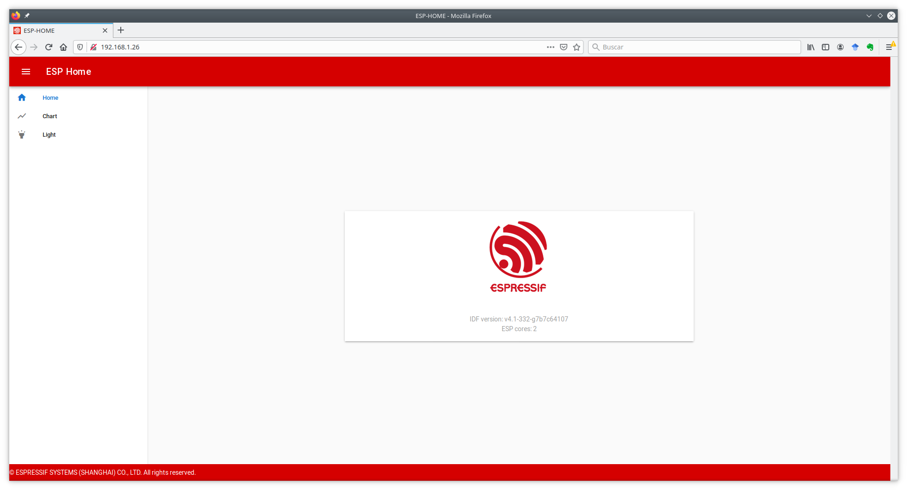

# Laboratory 3. REST servers and information representation. JSON and CBOR

## Goals

* To understand the mechanisms offered by ESP-IDF for the creation of
a REST HTTP server.

* To implement, via the mechanisms offered by ESP-IDF, a REST API extended for the ESP32.

* To understand the basic concepts to represent data via JSON.

* To implement, via de `cJSON` library, a message type personalized for the
exchanges of data between client and server.

* To undrestand the basic concepts to represent information via CBOR, and to 
evaluate the advantages compared with JSON.

* To implement, via the `tinycbor` library, a message type personalized for the 
data exchanges between client an server, comparing the payload sizes w.r.t. JSON.

## Development of a REST server in ESP-IDF

In the first part of the laboratory, we will see how to develop, using the
functionalities offered by ESP-IDF, a HTTP server that exposes an API REST. We will
be able to interact, in read and write modes, with a server (in our case, a ESP32).

Specifically, we will work with the example
`example/protocols/http_server/rest_server` of the IDF distribution.

### API description

The example builds a simple interface (API) with three *endpoints* that allow an
interaction with different functionality of the ESP32. Note that, both the URLs and the
functionality associated with them is totally tunable, and can be extended according to
the needs of our application.

The next table summarizes the functionality of each *endpoint*, and possible examples
of values sent or returned by the server:


| API                        | Method | Example of read/write resource                        | Description                                                                              | URL |
| -------------------------- | ------ | ----------------------------------------------------- | ---------------------------------------------------------------------------------------- | -------- |
| `/api/v1/system/info`      | `GET`  | {<br />version:"v4.0-dev",<br />cores:2<br />}        | Used by the clients to obtaine information of the board (version, core numbers, ...)    | `/`      |
| `/api/v1/temp/raw`         | `GET`  | {<br />raw:22<br />}                                  | Used by the clients to obtain temperature data from a sensor (unavailable in the ESP32) | `/chart` |
| `/api/v1/light/brightness` | `POST` | { <br />red:160,<br />green:160,<br />blue:160<br />} | Used by the clients to wirte on the board control values to control luminosity of LEDS  | `/light` |

### Configuration and compilation of the example

First, configure, compile and flash the example. In this case, the instructions
are divided in two parts: compilation of the *firmware* for the ESP32, and preparation
of a web client that will allow us to interact with it. This last part is not strictly
necessary, but it will help us in the interaction with the device in a visual manner until
we study how to do it via command line.

Through the configuation menu, configure a name for your device (e.g., 'esp_home_yourname'),
and configure the deploy mode (`Website deploy mode`) to 
*Deploy website to SPI Nor Flash*. Finally, configure the credentials 
of the WiFi access point, using the same methodology as that used in Lab 2.

Second, you will need to install the necessary components to deploy the web 
client. For that, navigate to the 
`front/web-demo` folder, where
the source code for the client resides. Execute the following commands:

```sh
sudo apt-get update
sudo apt-get install npm node-vue*
npm install
npm run build 
```

At this point you can execute, from the base directory of the example, the orders for compilation and flashing:

```sh
idf.py build
idf.py flash
idf.py monitor
```

### Interaction with the device via web interface

If everything is correct, you will be able to observe in the output of the monitorization
the IP provided to the ESP32. Open a web browser on the virtual machine or your PC (connected in the
same network as that of the ESP32), navigate to the IP of the ESP32, and you should observe a page like
the following:



This is a web page served by the ESP32, that will allow you to interact with it. Specifically, the
page offers two functionalities:

* **Chart**: periodically checks the temperature value returned by the ESP32 via the *endpoint* `/api/v1/temp/raw`.

* **Light**: allows to send to the ESP32 new values for the three components of luminosity that could (hypothetically) equip the ESP32.

!!! note "Task 1.1"
    Interact with the light sensor of the ESP32 sending different values. Observe how the
    the output of the monitorization on the ESP32 responds showing the received values. Analyze the
    generated traffic for one of those requests using Wireshark. How are the submitted values encoded?
    How are the periodic data for temperature encoded?

### Interaction with the device via command line (`curl`)

`curl` is a tool oriented to the transfer of files through the networ. 
Among others (many) functionalities, `curl` supports the
`GET` and `PUT` methods from HTTP, just the necessary tools to perform read and write
requests on our HTTP REST server.

Specifically, in order to perform an HTTP 
`GET` request on our server:

```sh
curl http://IP/URI
```

For example, the request:

```sh
curl http://192.168.1.26/api/v1/temp/raw
```
(being `192.168.1.26` the IP of the ESP32)
will respond with the value of instantaneous temperature.

Similarly, to write (method `POST`) on the server, we will use the 
parameter `-d`, followed by the resource to submit. Take into account that it is responsibility
of the client to send a resource well-formed and that can be interpreted by the device:

```sh
curl -d '{"red":70,"green":80,"blue":99}' -H "Content-Type: application/json" 
-X POST http://192.168.1.26/api/v1/light/brightness
```

Note that we have included the type of resource submitted (`JSON`) and the requested operation
(`POST`). We will come back to this shortly.

!!! note "Task 1.2"
    Check that the traffic generated for each order is the same that you observed in the case of the web client. Note what happens if you check a non-existant *checkpoint*, or if you submit an incorrect JSON.

### Implementation of a HTTP server with REST API

The implementation of a HTTP server in ESP-IDF is delegated to the 
*HTTP Server* component, that implements all the functionality required for 
that end in an efficient and light way. The construction of a server can be summarized
in three main functions (study the implementation of the 
`start_rest_server` function in `rest_server.c`):

* `httpd_start`: creates an instance of a HTTP server, and allocates resources fo it
according to a configuration. Depending on the generated traffic (URIs requested), specific
hanlders will be used defined by the programmer to analyze it and, if necessary, to send
back responses to the client.

* `httpd_stop`: finalizes the HTTP server, closing any previously establised connections with clients.

* `httpd_register_uri_handler`: registers a handler (a function defined by the user) to serve a request on a
specific URI. The structure provided has fields to indicate the target URI
(`uri`), 
the method that is expected to receive (`method`, for example `HTTPD_GET`
or `HTTPD_POST`) and a pointer to a function that will process the request
received via the indicated URI. That function will only be executed if the
method matches with that requested.

The function `start_rest_server` of the example provides the necessary basic mechanisms
for the creation of the previously described API. Hence, to create the
*endpoint* `/api/v1/system/info` we will, first, register it on the server, 
preparing previously a structure of type `httpd_uri_t`:

```c
httpd_uri_t system_info_get_uri = {
        .uri = "/api/v1/system/info",
        .method = HTTP_GET,
        .handler = system_info_get_handler,
        .user_ctx = rest_context
    };
    httpd_register_uri_handler(server, &system_info_get_uri);
```

In this case, the operation associated to the invocation of the handler will be, exclusively, 
`GET`; actually, if we invoce a `POST` method on this *endpoint*, the
server will respond automatically with a warning statint that the method is not supported.

The procedure to process the funtion 
`GET` is performed via the function
`system_info_get_handler`, and the schema is, anyway, simple:

```c
static esp_err_t system_info_get_handler(httpd_req_t *req)
{
    // Setup response.
    httpd_resp_set_type(req, "application/json");

    // Setup response buffer.
    char * buffer = // In the example prepare a JSON response.

    // Sending response.
    https_resp_sendstr( req, buffer  );

    return ESP_OK;
```

Alternatively, if the response is binary, we could use the method
`https_resp_send( req, buffer, buffer_len  )` to process it and send it
(you will need this to send a binary CBOR buffer).

The creation of an *endpoint* with support for the `POST` method is a little
bit longer, but the registration is the same as in the previous example:

```c
    /* URI handler for light brightness control */
    httpd_uri_t light_brightness_post_uri = {
        .uri = "/api/v1/light/brightness",
        .method = HTTP_POST,
        .handler = light_brightness_post_handler,
        .user_ctx = rest_context
    };
    httpd_register_uri_handler(server, &light_brightness_post_uri);
```

Note that the body of the function `light_brightness_post_handler`. The reception
of the object sent by the client is performed based on multiple invocations
to `httpd_req_recv`:

```c
/* Simple handler for light brightness control */
static esp_err_t light_brightness_post_handler(httpd_req_t *req)
{
    int total_len = req->content_len;
    int cur_len = 0;
    char *buf = ((rest_server_context_t *)(req->user_ctx))->scratch;
    int received = 0;
    if (total_len >= SCRATCH_BUFSIZE) {
        /* Respond with 500 Internal Server Error */
        httpd_resp_send_err(req, HTTPD_500_INTERNAL_SERVER_ERROR, "content too long");
        return ESP_FAIL;
    }
    while (cur_len < total_len) {
        received = httpd_req_recv(req, buf + cur_len, total_len);
        if (received <= 0) {
            /* Respond with 500 Internal Server Error */
            httpd_resp_send_err(req, HTTPD_500_INTERNAL_SERVER_ERROR, "Failed to post control value");
            return ESP_FAIL;
        }
        cur_len += received;
    }
    buf[total_len] = '\0';

    /// A partir de este punto, disponemos en buf del objeto recibido vía HTTP.
    /// ... 
```

!!! danger "Task 1.3"
    Observe and study the codes of the handlers implemented in the example. 
    Extend the API offered to create a new *endpoint* that allows to obtain 
    the temperature (random number), but transforming it to Fahrenheit degrees. In this cas, 
    the value returned in the JSON file will be a number in floating point format 
    (you will see how to do this in the next section. By now, you can use an integer value).

## Information representation. JSON

JSON is a data representation format based on text for the exchange of
data between systems. It was created originally as a literal notation
for Javascript objects, but given its adoption (as of today, it is a real
alternative for XML), it is considered an independent component from the
language. 

The datatypes supported by JSON include:

* Numeric values: allowing numbers with and without sign, and with decimal
part in dot-separated notation.

* Strings: sequences of zero or more characters.

* Booleans: `true` and `false`.

* Arrays: ordered lists of zero or more values of any type, separated by commas with
`[ ]` signs.

* Objects: unordered collections of pairs `<name>:<value>`, separated by commas with
`{ }` signs.

ESP-IDF includes the [cJSON](https://github.com/DaveGamble/cJSON)
component to parse and build objects of JSON type in a simple and consistent way.
The cJSON library represents JSON data using a simple structure:

```c
/* The cJSON structure: */
typedef struct cJSON
{
    struct cJSON *next;
    struct cJSON *prev;
    struct cJSON *child;
    int type;
    char *valuestring;
    /* writing to valueint is DEPRECATED, use cJSON_SetNumberValue instead */
    int valueint;
    double valuedouble;
    char *string;
} cJSON;
```

The `type` field inforems about the type of data contained in the object:

* `cJSON_False` (`cJSON_IsFalse()`): false boolean value.
* `cJSON_True` (`cJSON_IsTrue()`): true boolean value.
* `cJSON_NULL` (`cJSON_IsNULL()`): null value.
* `cJSON_Number` (`cJSON_IsNumber()`): numeric value. This value is stored in the field
`valuedouble` as a floating point and at `valueint` as an integer.
* `cJSON_String` (`cJSON_IsString()`): string value, stored in the field 
`valuestring` as an array of bytes terminated by null character ('\0').
* `cJSON_Array` (`cJSON_IsArray()`): array of values. In the field
`child`, it stores a linked list with the elements of the array, terminated by NULL.
* `cJSON_Object` (`cJSON_IsObject()`): object value. 
Its values are stored in the same manner than in the previous array, but in this case in the field 
`string` it stores the keys of the object as a list.

### Creataion and parsing of a JSON structure

For each datatype, there exists a routine associated with the name
`cJSON_Create...` that allows to create an item of the corresponding type. 
All these functions allocate enough memory to host the created data.

Given a JSON object as a string, it is possible to analyze it (parse it) 
using the function `cJSON_Parse`:

```c
cJSON * json = cJSON_Parse( string );
```

In order to print the contents of a JSON structure in in text mode, we can use the
function `cJSON_Print(json)`:

```c
char * string = cJSON_Print( json );
```

### Examples

Observe again the contents of the handler funtions in the REST server. Specifically, 
focus on the funtion `system_info_get_handler`, that builds
a JSON object with two fields, of type string ("version") y numeric ("cores"):

```c
/* Simple handler for getting system handler */
static esp_err_t system_info_get_handler(httpd_req_t *req)
{
    // Preparation of the datatype of the response.
    httpd_resp_set_type(req, "application/json");

    // Creation of the JSON object.
    cJSON *root = cJSON_CreateObject();

    // Obtention of the data.
    esp_chip_info_t chip_info;
    esp_chip_info(&chip_info);

    // Add a string field.
    cJSON_AddStringToObject(root, "version", IDF_VER);

    // Add a numeric field.
    cJSON_AddNumberToObject(root, "cores", chip_info.cores);

    // Print the string prior to submission.
    const char *sys_info = cJSON_Print(root);

    // Send header + JSON object in text mode via HTTP.
    httpd_resp_sendstr(req, sys_info);

    // Free resources.
    free((void *)sys_info);

    // Free resources for JSON. 
    cJSON_Delete(root);

    return ESP_OK;
}
```

The funtion `light_brightness_post_handler` parsess the received JSON object. Analyze its body:

```c
    // buf contains the string received via HTTP (method POST).
    // ...
    // Parse the JSON object.
    cJSON *root = cJSON_Parse(buf);

    // Obtain three numeric values (RGB).
    int red = cJSON_GetObjectItem(root, "red")->valueint;
    int green = cJSON_GetObjectItem(root, "green")->valueint;
    int blue = cJSON_GetObjectItem(root, "blue")->valueint;

    // Show on screen the parsed values.
    ESP_LOGI(REST_TAG, "Light control: red = %d, green = %d, blue = %d", red, green, blue);

    // Free JSON resources.
    cJSON_Delete(root);

    // Submit a generic response in text mode.
    httpd_resp_sendstr(req, "Post control value successfully");

    return ESP_OK;
```

!!! danger "Task 1.4"
    Extend the previous task to add the data in floating point format about the Fahrenheit temperature.

!!! danger "Task 1.5"
    Create a new *endpoint* that uses a more complex object format (in JSON), including 
    different types of data that can give response to a hypothetical IoT environment.
    Document the generated API and the format of the objects. If you consider it necessary, include
    Wireshark captures to illustrate the exchange of messages. Specifically, it will be interesting
    to analyze the number of bytes transported to send/receive JSON messages.

## Information representation. CBOR

CBOR (*Concise Binary Object Representation*) is the recommended serialization
format in many IoT stacks, specifically in those based on CoAP. 
Even though it is a binary format, CBOR is similar in many ways with JSON, as it
follows the same data model: numeric values, strings, arrays, maps (objects in JSON)
and null/boolean values.

However, differently from JSON, a CBOR object is autodescriptive, and this is
one if its advantages: it is possible to exchange data between a client and a server
without using a pre-defined schema of data known by both parties.

The fact of being a binary format implies improvements w.r.t. JSON, for example when 
transporting binary data (cipher keys, graphics, floating point values, among others); these
data were encoded in JSON using, for example base64 format, adding complexity in the 
process of codification/decodification. 
In general, the use of a binary format implies less complexity when integrating in applications, 
and this is why it is considered to be optimum in low-power devices, such as IoT devices. 

The CBOR format is documented in [RFC 7049](https://tools.ietf.org/html/rfc7049),
so it is considered to be a well documented standard, and stable for the future.

### CBOR on the ESP32

ESP-IDF includes the library `tinyCBOR` that 
helps with the encoding of data into CBOR format, parsing
CBOR structures and convering those structures bot to text format and to JSON.
TinyCBOR is maintained as a free software project by Intel, and its documentation
(that you should read as a reference) is available at [enlace](https://intel.github.io/tinycbor/current/).

Let us study the logics of `tinyCBOR` through an example (you can find it
in the `examples/protocols/cbor` folder of IDF). The example
shows the necessary mechanisms to, first, create a CBOR object using the library and,
second, to convert the object to a JSON representation and parse it:

Compile, flash and execute the example. You should see that the output is similar to: 

```sh
I (320) example: encoded buffer size 67
I (320) example: convert CBOR to JSON
[{"chip":"esp32","unicore":false,"ip":[192,168,1,100]},3.1400001049041748,"simple(99)","2019-07-10 09:00:00+0000","undefined"]
I (340) example: decode CBOR manually
Array[
  Map{
    chip
    esp32
    unicore
    false
    ip
    Array[
      192
      168
      1
      100
    ]
  }
  3.14
  simple(99)
  2019-07-10 09:00:00+0000
  undefined
]
```

Note that the structure of a CBOR objct is complex: it is composed by an array with five elements:

1. A *map* (unnordered set of pairs *key-value*) combining strings, booleans and a second array to specify an IP address.
2. A floating point value (3.14).
3. A numeric "simple" value (99).
4. A date (as a string)
5. An undefined value.

The *firmware* proceeds in three stages:

### Stage 1: creation (codification) of a CBOR object

Observe the body of the main task (`app_main`). The encoder for CBOR is based on two variables:

```c
CborEncoder Root_encoder; // CBOR encoder.
uint8_t buf[100];         // Buffer to allocate the CBOR object (array of bytes).
```

Second, and as we will use an array and a map, we will need constructors specifically desinged for those objects:

```c
// Array creation.
CborEncoder array_encoder;
CborEncoder map_encoder;

cbor_encoder_create_array(&root_encoder, &array_encoder, 5); // [
  // 1. Map creation.
  cbor_encoder_create_map(&array_encoder, &map_encoder, 3); // {
```

From this point on, we can proceed with the construction of the objects following the desired schema:

```c
  // chip: esp32 (string:string)
  cbor_encode_text_stringz(&map_encoder, "chip");
  cbor_encode_text_stringz(&map_encoder, "esp32");

  // unicore: false (string:boolean)
  cbor_encode_text_stringz(&map_encoder, "unicore");
  cbor_encode_boolean(&map_encoder, false);

  // IP:[192,168,1,100] (string:array)
  cbor_encode_text_stringz(&map_encoder, "ip");

    CborEncoder array2;

    cbor_encoder_create_array(&map_encoder, &array2, 4); // [

    // Numeric values.
    cbor_encode_uint(&array2, 192);
    cbor_encode_uint(&array2, 168);
    cbor_encode_uint(&array2, 1);
    cbor_encode_uint(&array2, 100);

    cbor_encoder_close_container(&map_encoder, &array2);        // ]

 cbor_encoder_close_container(&array_encoder, &map_encoder); // }

// 2. Flotanting point
cbor_encode_float(&array_encoder, 3.14);

// 3. Simple value 
cbor_encode_simple_value(&array_encoder, 99);

// 4. String 
cbor_encode_text_stringz(&array_encoder, "2019-07-10 09:00:00+0000");

// 5. Undefined value.
cbor_encode_undefined(&array_encoder);
cbor_encoder_close_container(&root_encoder, &array_encoder); // ]

// Show the size of the created buffer.
ESP_LOGI(TAG, "encoded buffer size %d", cbor_encoder_get_buffer_size(&root_encoder, buf));
```

### Stage 2: conversion to JSON

The conversion to JSON (typically to visualize or debug) can be done as follows:

```c
    // Initialize the cbor parser and the value iterator
    cbor_parser_init(buf, sizeof(buf), 0, &root_parser, &it);

    ESP_LOGI(TAG, "convert CBOR to JSON");
    // Dump the values in JSON format
    cbor_value_to_json(stdout, &it, 0);
```

### Stage 3: manually parsing a CBOR object

Last, the manual parsing of a CBOR object is left as an exercise for the student,
and it is implemented in the funtion `example_dump_cbor_buffer` of the example.
Basically, the function iterates over each one of the elements of the CBOR object,
checking each element and acting consequently. 
For those types that are complex (e.g. arrays or maps), the function is invoked recursively
till finding a basic datatype. In this case, it just prints on screen its value (e.g. in the case
of an integer, case `CborIntegerType`).

!!! danger "Task 1.5"
    Extend the REST API with a new *endpoint* that allows obtaining the same information than 
    the JSON *endpoint* developed in the last task, but in this case, using CBOR. The goal of the
    task is to compare the amount of generated traffic in each representation, so it is suggested to
    use a relatively complex object (different numeric types, arrays or maps). Next, we include 
    additional notes that will help you in the solution for debugging purposes, observing the returned
    values by the HTTP server.
   
### Additional notes: creation and query of a CBOR *endpoint* in the REST API

The modifications to carry out in the handler funtion of the endpoint to answer with a CBOR
object are minimal. Actually, they are focused simply on the type of response and the mechanism to send it, namely:

```c
static esp_err_t system_info_get_handler(httpd_req_t *req)
{
    // Response type. 
    httpd_resp_set_type(req, "application/cbor");

    CborEncoder root_encoder;
    uint8_t buf[100];

    // CBOR encoder
    cbor_encoder_init(&root_encoder, buf, sizeof(buf), 0);

    // Encoding CBOR.
    // ...

    // Send response, checking previously the size of the encoded buffer.
    httpd_resp_send(req, (char*)buf, cbor_encoder_get_buffer_size( &root_encoder, buf));

    return ESP_OK;
```

To query from command line on this endpoint, we can use directly `curl`, redirecting the received
output to a file (e.g.  `output.cbor`):

```sh
curl http://192.168.1.26/api/v1/system/info > output.cbor
```

If we visualize the contents of the file, we can observe that it contains binary data, 
dificult to analayze. In the following, we well see different visualization mechanisms.

### Additional notes: visualizing CBOR data

A visualization option consists on using the web [cbor.me](http://cbor.me/).
In the right panel, you can paste the binary contents read. If you need to 
perform a conversion before pasting on the web, you can do it with:

```sh
xxd -ps output.cbor
```

An output example (to be pased on the right panel of the web), could be:

```sh
$ xxd -ps output.cbor 
85a3646368697065657370333267756e69636f7265f46269708418c018a8
011864fa4048f5c3f8637818323031392d30372d31302030393a30303a30
302b30303030f7
```

You shouls see a similar output as the one shown next (take into accounnt that
the tools automatically indents the contents of the right panel; rememebre that you need to just paste the output generated by `xxd`):


Other visualization option can be a Python program (it could actually be integrated 
within your TCP/UDP client/server, for example) that makes use of the 
`cbor2` module ([documentation](https://pypi.org/project/cbor2/)). To check
how it works, first install it:

```sh
pip install cbor2
```

And theck if it effectively works using the following Python program:

```python
from cbor2 import dumps, loads, dump, load

with open('output.cbor', 'rb') as fp:
    obj = load(fp)

print(obj)
```

When executed, you will observe the contents of the object:

```sh
python cbor.py
[{'chip': 'esp32', 'unicore': False, 'ip': [192, 168, 1, 100]}, 3.140000104904175, CBORSimpleValue(value=99), '2019-07-10 09:00:00+0000', undefined]
```
