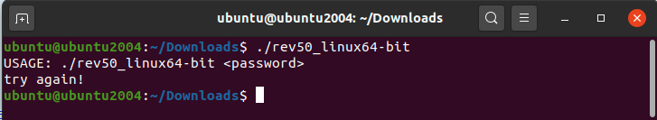
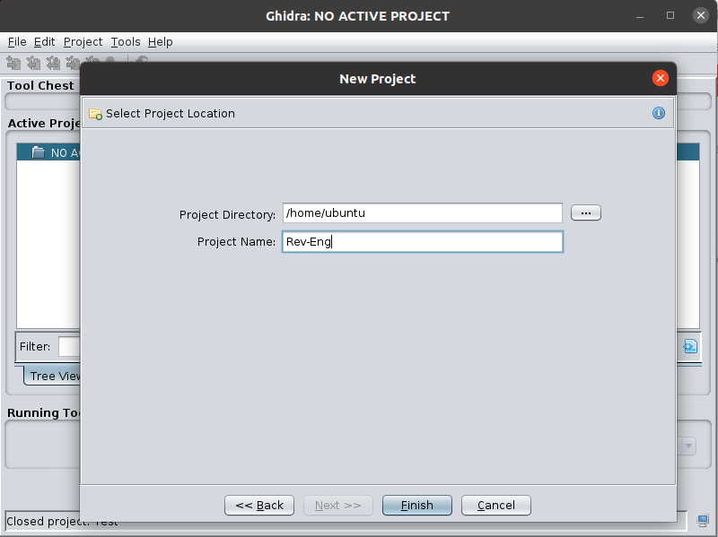
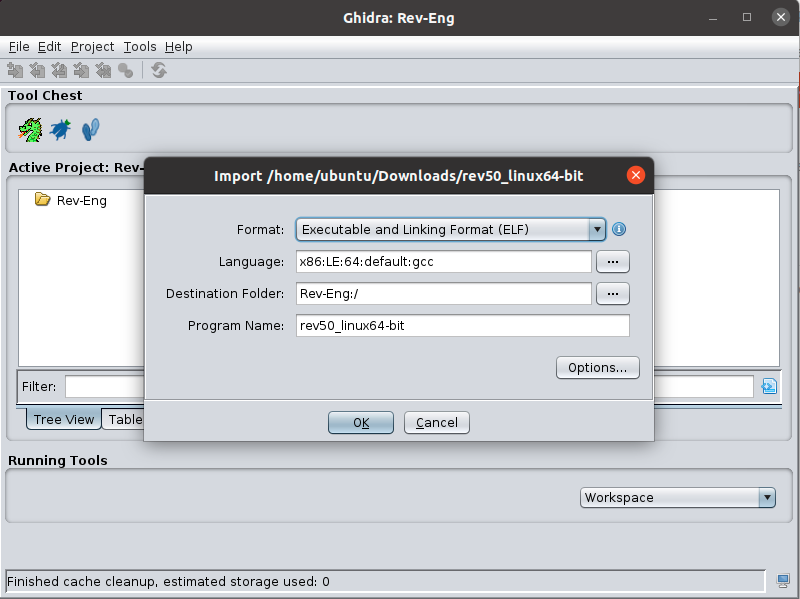
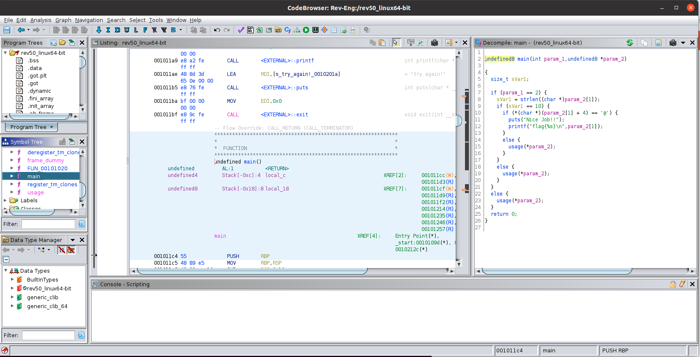
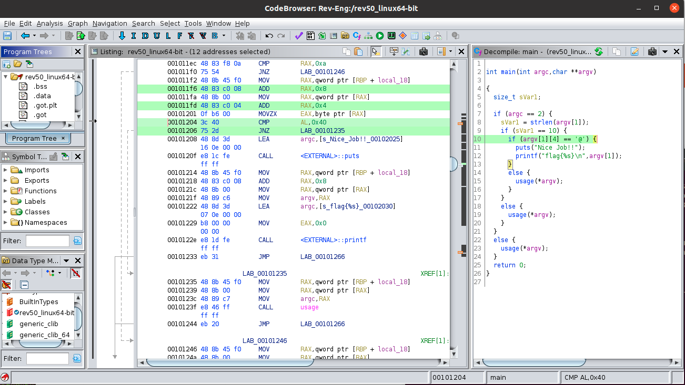
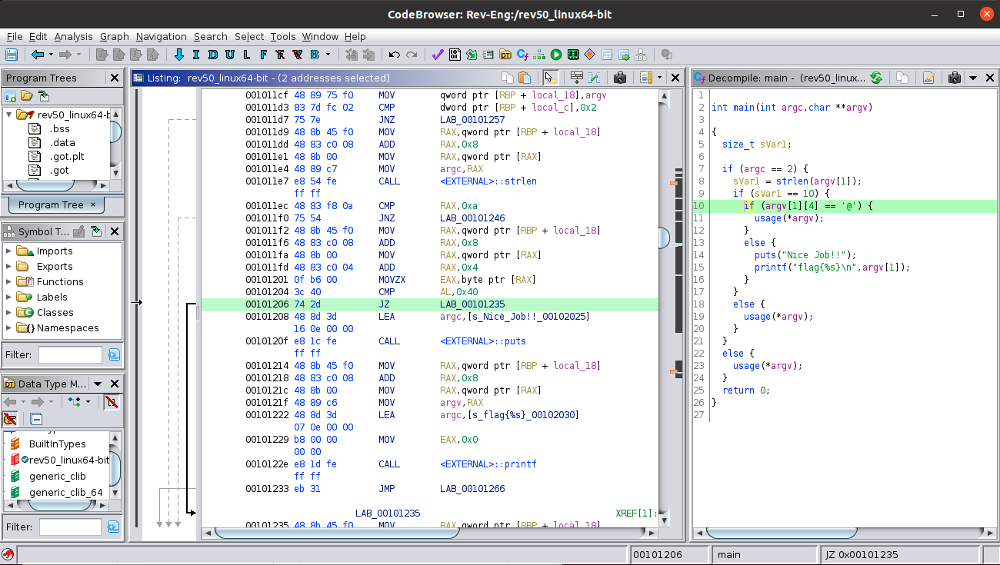
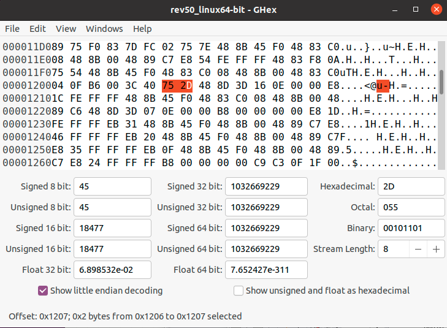

# Laboratory 1. IP Camera Pentest

## Introduction

The objective of this laboratory session is to put into practice the knowledge on how to carry out a penetration test (*pentest*) on a specific device, such as an IP camera. 

!!! note "Task 0"
    To carry out the laboratory we will need the following software elements:

1. IOTNA Ubuntu Virtual Machine ([Download & Instructions](../../IOTNA/demo/index.md))

2. IP Camera firmware:
    1. SPI extracted version ([spi_firmware.bin](spi_firmware.bin))
    2. Micro SD extracted version ([usd_firmware.zip](usd_firmware.zip))

3. [Binwalk](#binwalk)

4. [Ghidra](#ghidra)

### Binwalk

[Binwalk](https://github.com/ReFirmLabs/binwalk) is a fast, easy to use tool for analyzing, reverse engineering, and extracting firmware images.

Minimal installation instructions inside Ubuntu VM:
```bash
git clone https://github.com/ReFirmLabs/binwalk.git
cd binwalk
sudo python3 setup.py install
```
Dependencies:
```bash
# Install sasquatch to extract non-standard SquashFS images
sudo apt-get install zlib1g-dev liblzma-dev liblzo2-dev
git clone https://github.com/devttys0/sasquatch
(cd sasquatch && ./build.sh)

# Install jefferson to extract JFFS2 file systems
sudo apt-get install pip
sudo pip install cstruct
git clone https://github.com/sviehb/jefferson
(cd jefferson && sudo python3 setup.py install)

# Entropy study
sudo pip install matplotlib
```

### Ghidra

[Ghidra](https://github.com/NationalSecurityAgency/ghidra/releases): A Software Reverse Engineering (SRE) suite of tools developed by NSA's Research Directorate in support of the Cybersecurity mission.

Dependencies:

```bash
sudo apt-get install default-jre default-jdk
```

Download [Hidra 10.1.2](https://github.com/NationalSecurityAgency/ghidra/releases/download/Ghidra_10.1.2_build/ghidra_10.1.2_PUBLIC_20220125.zip), unzip and execute (`./ghidraRun`).

## Familiarise with Ghidra: `easy_reverse`

!!! note "Task 1.1"

    Once we have Ghidra installed in the Virtual Machine, we will follow the [tutorial](https://www.youtube.com/watch?v=fTGTnrgjuGA&ab_channel=stacksmashing) example to reverse engineer a linux executable file to obtain a secret password: 

1. Get the executable file from [easy_reverse](https://crackmes.one/crackme/5b8a37a433c5d45fc286ad83) (zip password: `crackmes.one`) or use directly the binary inside file [rev50.zip](rev50.zip)

2. Execute the binary:

    

3. Create a new Ghidra project by executing `./ghidraRun` in the command line inside hidra folder(`File -> New Project -> Non-Shared Project`:

    

4. Add the binary file (`File -> Import File`):

5. Double click in the binary file to start the code browser and select analyze the file now using the default parameters.

6. Locate the `main` function

    

7. For a better understanding of the code, modify the prototype of the `main` function, by right-clicking on it and selecting `Edit Function Signature`, to use the standard definition:

    ```
    int main(int argc, char **argv)
    ```

8. Analyse the code and extract the password

9. Try again `./rev50_linux64-bit` to see if you know a valid password.

!!! note "Task 2.1: Patch `easy_reverse`"
    Modify the binary file to accept any password of length 10 without an `@` at the fifth position:

1. Locate the line in which the content of the password is checked:

    

2. Right click on the interaction that rejects the password located in `0x0010-1206` (`JNZ LAB_00101235`) to `Patch Instruction` and change it to `JZ LAB_00101235`. And analyse the code again (`Analysis->Auto Analyse...`):

     

The bytecode of the instruction located in `0x0010-1206` has changed from `0x752d` to `0x742d` and also the decompiled code has changed. Now the program rejects passwords that do **NOT** contain an `@` ant the fifth position. 

The patching functionality of Ghidra does not work correctly, so we will patch it using a binary editor as Ghex:

1. Install Ghex: `sudo apt-get install ghex`

2. Open the binary file and locate the line (`0x1206`) that contains the instruction `0x752D`:

     

3. Change it for `0x742d`, save as `rev50_linux64-bit_hacked` and test it:

```bash
buntu@ubuntu2004:~/Downloads$ ./rev50_linux64-bit_hacked 1234567890
Nice Job!!
flag{1234567890}
```

Is it possible to completely remove the password verification?

## Analyze IP Camera Firmware
!!! note "Task 2.1"
    Once we have Binwalk installed in the Virtual Machine:

1. Download the firmware `ip_cam_attify.bin` and use `binwalk` to extract its content.

2. Locate the `npc.tar.gz` and extract its content

!!! note "Task 2.1"
    Analyze the `npc` binary file with Ghidra:

1. Execute `ghidra_10.1.2_PUBLIC/ghidraRun`

2. Create a project, import the `npc` file and analyse it.

3. The camera rejects modified Firmwares with the message: `Md5 err!`. Find the string and locate the functions in which it is used.

4. Which line should we modify to accept any firmware?
